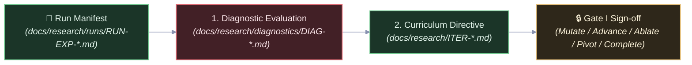

# Sci: Evaluation Skill

## Overview

The **`sci-evaluation`** skill enables the lead agent to ingest experiment results, perform rigorous dynamical diagnostics, and formulate curriculum iteration directives within a single conversational context. By reading directly from the Markdown **Run Manifest** (`docs/research/runs/RUN-EXP-*.md`), this skill eliminates out-of-band JSON dependencies and redundant subagent cold starts.

---

## The 2-Step Evaluation Workflow

---

### Step 1: Diagnostic Evaluation & Falsification Auditing

Ingest the Markdown Run Manifest and evaluate results against pre-registered hypotheses:

1. Open the target Run Manifest: `docs/research/runs/RUN-EXP-YYYY-NNNa-NN.md`.
2. Inspect the **Telemetry Data Reduction Summary** section:
   - Compare observed metrics against hypothesis falsification thresholds.
   - Verify invariant preservation (e.g., zero defect, legality rates).
3. Draft `docs/research/diagnostics/DIAG-YYYY-NNNa.md` using [`docs/templates/diagnostic-template.md`](../../docs/templates/diagnostic-template.md).
4. Assign a formal diagnostic verdict:
   - `SUPPORTED`: All falsification gates passed, invariants preserved.
   - `PARTIAL_SUPPORT`: Core invariants preserved, but secondary thresholds or bounds missed.
   - `REFUTED`: Primary claim disproven by empirical evidence.
   - `ANOMALOUS`: Run invalid due to apparatus failure, bugs, or unhandled exceptions.

---

### Step 2: Curriculum Iteration Directive

Determine the next logical progression on the campaign's complexity ladder:

1. Draft `docs/research/ITER-YYYY-NNNa-NN.md` using [`docs/templates/iteration-template.md`](../../docs/templates/iteration-template.md).
2. Select one of the five canonical lifecycle actions:
   - **`MUTATE`**: Algorithmic or structural mutation to overcome limitations identified in `PARTIAL_SUPPORT`.
   - **`ADVANCE`**: Advance to the next rung on the complexity ladder after a `SUPPORTED` run.
   - **`ABLATE`**: Strip components to verify necessity and measure individual contributions.
   - **`PIVOT`**: Escalate to strategic reform after repeated `REFUTED` outcomes.
   - **`COMPLETE`**: Certify campaign completion when all milestones are formally verified.
3. Update [`docs/research/CAMPAIGN.md`](../../docs/research/CAMPAIGN.md) with the iteration outcome, Git tags, and resource/token accounting.

---

## Gate I: Sign-Off

Present the Diagnostic Evaluation Report and Iteration Directive to the operator:

- Empirical Verdict & Evidence.
- Recommended Action (`MUTATE`, `ADVANCE`, `ABLATE`, `PIVOT`, or `COMPLETE`).
- Await user sign-off at **Gate I** before initiating the next research cycle.
