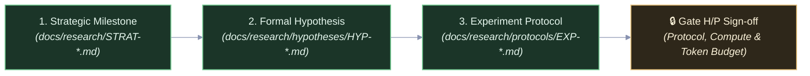

# Sci: Formulation Skill

## Overview

The **`sci-formulation`** skill enables the lead agent to execute the theoretical and experimental design stages in a single conversational context. By keeping the strategic framing, mathematical formalization, and protocol design within one context window, this skill eliminates redundant subagent cold starts and file-reading overhead.

---

## The 3-Step Formulation Workflow

---

### Step 1: Strategic Framing & Milestone Alignment

If initiating a new campaign or executing a strategic pivot:

1. Inspect the complexity ladder in [`docs/research/CAMPAIGN.md`](../../docs/research/CAMPAIGN.md).
2. Frame the research milestone in `docs/research/STRAT-YYYY-NNN.md` using [`docs/templates/strategic-directive-template.md`](../../docs/templates/strategic-directive-template.md).
3. State the theoretical capability rung targeted, the falsification litmus test, and resource budgets.

---

### Step 2: Mathematical Hypothesis Formulation

Transform the strategic milestone into a mathematically formalized, falsifiable hypothesis:

1. Draft `docs/research/hypotheses/HYP-YYYY-NNN.md` using [`docs/templates/hypothesis-template.md`](../../docs/templates/hypothesis-template.md).
2. Define the formal state space $\mathcal{S}$, update operator $\mathcal{T}$, and conservation laws / invariants.
3. Explicitly state the Null Hypothesis ($\mathcal{H}_0$) and Alternative Hypothesis ($\mathcal{H}_1$).
4. Define observable mathematical criteria that unambiguously disprove $\mathcal{H}_1$.

---

### Step 3: Experiment Protocol & Implementation Specification

Operationalize the hypothesis into a concrete, reproducible protocol and execution package:

1. Draft `docs/research/protocols/EXP-YYYY-NNNa.md` using [`docs/templates/protocol-template.md`](../../docs/templates/protocol-template.md).
2. Specify independent variables (factors), dependent variables (observables), and control baselines.
3. Part II: Include the concrete **Experiment Implementation Specification**:
   - **Target Package**: `python/experiments/exp_YYYY_NNNa_[slug]/` or Rust module/crate `exp_YYYY_NNNa_[slug]` (lowercase snake_case for dual Python/Rust compatibility, additive and isolated).
   - **Parent Lineage**: Declare parent experiment or baseline.
   - **CLI Entry Point**: Exact command syntax to run the sweep.
   - **Parameter Search Space**: Bounds, seeds, and adaptive discovery strategy.
   - **Telemetry Targets**: Emission directory under `data/telemetry/`.
   - **Telemetry Reduction Command**: `python/scripts/reduce_telemetry.py --experiment-id EXP-YYYY-NNNa --manifest docs/research/runs/RUN-EXP-*.md` (The reduction tool MUST inject/append verified metrics directly into the Run Manifest as a GitHub-Flavored Markdown table; loose JSON handoff files are strictly prohibited).
   - **Resource Ceilings**: Wall-clock timeouts, memory limits, and **Token Budget Cap**.

---

## Gate H/P: Hand-off & Sign-Off

Present the completed protocol and resource budget to the operator:

- Target Package & Implementation Spec.
- Compute Budget (seconds / hours).
- **Token Budget Cap** (estimated subagent invocations & token limit).
- Await user approval at **Gate H/P** before dispatching the execution worker (`swe`).
