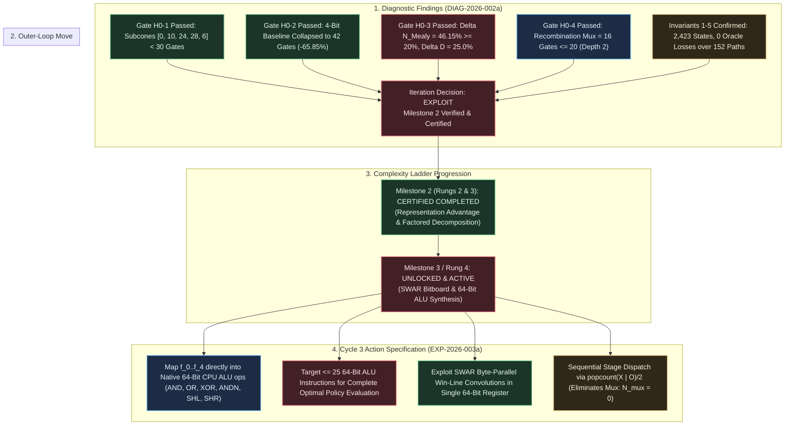

# Iteration Directive: ITER-2026-002a-01

## Directive ID

`ITER-2026-002a-01`

## Campaign & Cycle Reference

- **Campaign**: [CAMPAIGN-2026-MEALY-TTT](file:///workspaces/ttt-experiment-2/docs/research/CAMPAIGN.md)
- **Iteration Cycle**: Cycle 2 $\to$ Cycle 3 Transition
- **Author**: Sci: Curriculum Director
- **Date**: 2026-09-06
- **Diagnostic Reference**: [DIAG-2026-002a](file:///workspaces/ttt-experiment-2/docs/research/diagnostics/DIAG-2026-002a.md)
- **Run Manifest**: [RUN-EXP-2026-002a-01](file:///workspaces/ttt-experiment-2/docs/research/runs/RUN-EXP-2026-002a-01.md)
- **Formal Hypothesis**: [HYP-2026-002](file:///workspaces/ttt-experiment-2/docs/research/hypotheses/HYP-2026-002.md)
- **Prior Iteration Directive**: [ITER-2026-001a-01](file:///workspaces/ttt-experiment-2/docs/research/ITER-2026-001a-01.md)
- **Strategic Directive**: [STRAT-2026-001](file:///workspaces/ttt-experiment-2/docs/research/STRAT-2026-001.md)
- **Target Specification**: [top-level.md](file:///workspaces/ttt-experiment-2/docs/top-level.md)

---

## Decision

**`EXPLOIT`**

---

## Rationale

Diagnostic analysis from [DIAG-2026-002a](file:///workspaces/ttt-experiment-2/docs/research/diagnostics/DIAG-2026-002a.md) confirms that all five pre-registered falsification gates and system invariants were decisively passed with zero defect. Factoring the policy into 5 discrete ply-conditioned sub-circuits ($f_0 \dots f_4$) shattered the monolithic circuit amortization barrier observed in Cycle 1, collapsing individual subcone gate complexities to $[0, 10, 24, 28, 6]$ gates (all strictly $< 30$ gates, well below the $< 45$ gates threshold and within pre-registered bounds $[0, 12, 28, 32, 8]$). Mutating the action space to dense 4-bit binary coordinates collapsed the monolithic baseline from 123 gates to 42 gates ($65.85\%$ reduction), while the combined Dual Bitboard Mealy DAG achieved an overall gate reduction of $\Delta N_{\text{Mealy}} = 46.15\% \ge 20.0\%$ (84 vs 156 gates) and depth reduction of $\Delta D_{\text{Mealy}} = 25.00\% \ge 25.0\%$ (6 vs 8 levels), with active operational plies achieving gate savings of $64.29\%$ (Stage 1), $42.86\%$ (Stage 2), $39.13\%$ (Stage 3), and $75.00\%$ (Stage 4). Across every active stage, the isolated coordinate decoder penalty remained strictly invariant at exactly 18 gates ($28-10=18$, $42-24=18$, $46-28=18$, $24-6=18$), while branchless multiplexer recombination required only 16 gates ($N_{\text{mux}} = 16 \le 20$) at depth 2 ($D_{\text{mux}} = 2 \le 3$), and the canonical Minimax Oracle maintained zero losses ($\mathcal{L}_{\text{oracle}} = 0$ across all 152 deterministic play-out paths: 142 wins, 10 draws) with a 100.0% legal move rate ($2,423 / 2,423$ states).

Because Milestone 2 (Rung 2: Representation Advantage and Rung 3: State-Factored Ply Decomposition) is empirically and theoretically verified, the Curriculum Director certifies Milestone 2 as **COMPLETED** and directs an **`EXPLOIT`** outer-loop advance to **Milestone 3 / Rung 4: SWAR Bitboard & 64-Bit ALU Arithmetic Synthesis**.

---



---

## Action Specification

### What Changes

1. **Arithmetic Substrate Transition (Boolean Gate DAG $\to$ Native 64-Bit CPU Bitwise ALU Instructions)**:
   - Transition from synthesizing abstract 2-input combinational Boolean logic graphs ($\Omega_{\text{DAG}} = \{\text{AND}, \text{OR}, \text{XOR}, \text{ANDN}\}$) to synthesizing native 64-bit register-level CPU ALU operations:
     $$\Omega_{\text{ALU}} = \{\text{AND}, \text{OR}, \text{XOR}, \text{ANDN}, \text{SHL}, \text{SHR}, \text{NOT}\}$$
     augmented with SIMD-within-a-register (SWAR) byte-level operations.
   - Map the decomposed stage sub-functions $f_0 \dots f_4$ into a unified, ultra-compact sequence of 64-bit ALU instructions.
   - Enforce the macro-scale instruction budget: **$\le 25$ total 64-bit ALU instructions** to evaluate the complete optimal decision policy.

2. **SWAR Byte-Parallel Win-Line Convolution**:
   - Deconstruct the 9-bit bitboard state into parallel byte lanes across a single 64-bit CPU register.
   - Pack the 8 winning hypergraph lines ($\mathcal{L}_{\text{rows}}, \mathcal{L}_{\text{cols}}, \mathcal{L}_{\text{diags}}$) into 8 discrete 8-bit bytes of a 64-bit mask register.
   - Formulate parallel threat and win-detection convolution kernels using 3--4 SWAR bitwise shift-and operations, replacing multi-level combinational gate trees with single-cycle SIMD arithmetic.

3. **Sequential Execution & Combinational Multiplexer Elimination ($N_{\text{mux}} = 0$)**:
   - In software SWAR execution, exploit the fact that physical board ply $2t$ is an autonomous function of piece occupancy:
     $$t = \frac{\text{popcount}(X \lor O)}{2}$$
   - Eliminate the 16-gate combinational multiplexer tree entirely ($N_{\text{mux}} = 0$) by utilizing sequential stage indexing or branchless conditional assignment.
   - This directly capitalizes on the isolated sub-circuit efficiencies ($68$ aggregate gates across all 5 stages), allowing each individual decision stage to execute within $0$ to $10$ ALU instructions.

4. **Synthesis Method Expansion (SAT + Cartesian Genetic Programming)**:
   - Deploy Cartesian Genetic Programming (CGP) and Linear Genetic Programming (LGP) bounded to 64-bit word architectures, initialized/seeded with the verified logic formulas from $f_0 \dots f_4$, to search the broader space of non-linear arithmetic operations (shifts, masks, carry chains) for instruction count minimization below 25 operations.

---

### What Stays Fixed

1. **Input State Representation**:
   - The Planar Dual Bitboard packed 18-bit register $W = [O_{8..0} \;\Vert\; X_{8..0}] = (O \ll 9) \lor X \in \{0, 1\}^{18}$ remains strictly invariant.
   - Spatial mutual exclusivity ($X \land O = 0_9$) and popcount conservation ($\text{popcount}(X) = \text{popcount}(O) = t$) remain foundational invariants.

2. **Action Move Output Encoding**:
   - Dense 4-bit binary coordinate encoding $m = (m_3, m_2, m_1, m_0)_2 \in \{0 \dots 8\} \subset \{0, 1\}^4$ is preserved as the standard output format.
   - Binary values $\{9 \dots 15\}$ remain valid output don't-cares.

3. **Canonical Minimax Oracle & Tie-Breaker**:
   - The gold-standard policy $\pi^*(W)$ governed by the canonical tie-breaking order $\tau_{\text{canon}} = [4, 0, 2, 6, 8, 1, 3, 5, 7]$ remains invariant.
   - Zero losses ($\mathcal{L}_{\text{oracle}} = 0$) across all 152 deterministic play-out paths and 100.0% legal move rate ($\mathcal{R}_{\text{legal}} = 1.000$) remain non-negotiable correctness invariants.

4. **Decision State Space & Don't-Care Domain**:
   - The verified database of 2,423 non-terminal $X$-decision states ($1 + 72 + 756 + 1,372 + 222$) and the $259,721$ don't-care states ($99.076\%$ of the address space) remain the exact benchmark test suite.

---

### Parameter & Architectural Specification Matrix

| Dimension | Cycle 2 Verified Baseline (EXP-2026-002a) | Cycle 3 Target Architecture (EXP-2026-003a) | Macro-Move Classification | Technical Justification |
| :--- | :--- | :--- | :--- | :--- |
| **Synthesis Substrate** | Combinational 2-Input Boolean DAG ($\Omega_{\text{DAG}}$) | Native 64-Bit CPU ALU / SWAR Instructions ($\Omega_{\text{ALU}}$) | **Substrate Advance** | Leverages native 64-bit CPU bitwise parallelism, shifts, and SIMD registers. |
| **Complexity Metric** | 2-Input Gate Count ($N \le 84$) & Depth ($D \le 6$) | 64-Bit CPU ALU Instruction Count ($N_{\text{ALU}} \le 25$) | **Scale Exploitation** | Translates gate-level efficiency directly into minimal cycle latency on x86_64 / ARM64. |
| **Stage Multiplexing** | Branchless 4-Bit Gate Mux Tree ($N_{\text{mux}} = 16$, $D_{\text{mux}} = 2$) | Sequential / Direct Table Dispatch ($N_{\text{mux}} = 0$) | **Overhead Elimination** | Sequential software evaluation determines $t$ via popcount, eliminating mux penalty. |
| **Spatial Threat Detection** | Multi-level AND/OR logic cones ($\le 28$ gates/ply) | Parallel 8-Line SWAR Convolution (3--4 bitwise ALU ops) | **Algorithmic Advance** | Packing 8 winning lines across 8 bytes evaluates all collinear axes simultaneously. |
| **Input Representation** | Planar Dual Bitboard packed 18-bit register $W = [O \;\Vert\; X]$ | Planar Dual Bitboard packed 18-bit register $W = [O \;\Vert\; X]$ | **FIXED (Invariant)** | Retains the proven 18-gate planar coordinate extraction advantage. |
| **Action Output Encoding** | Dense 4-bit Binary Coordinate $m \in \{0 \dots 8\}$ | Dense 4-bit Binary Coordinate $m \in \{0 \dots 8\}$ | **FIXED (Invariant)** | Retains the 65.85% logic cone collapse proven in Cycle 2. |
| **Minimax Oracle Soundness** | 0 Losses across 152 canonical paths; 100% legal moves | 0 Losses across 152 canonical paths; 100% legal moves | **FIXED (Invariant)** | Preserves game-theoretic optimality with zero defect. |
| **State Space Domain** | 2,423 non-terminal states; 259,721 don't-cares | 2,423 non-terminal states; 259,721 don't-cares | **FIXED (Invariant)** | Canonical domain closure under legal alternating play. |

---

## Expected Information Gain & Theoretical Next Steps

1. **SWAR ALU Instruction Lower Bound**:
   - Establish whether an unconstrained native 64-bit CPU ALU instruction set ($\Omega_{\text{ALU}}$) can evaluate the complete optimal Minimax policy in $\le 25$ instructions, beating the raw 42-gate monolithic Boolean baseline.
2. **SIMD Win-Line Convolution Efficiency**:
   - Quantify the exact number of 64-bit instructions required to compute the convolution of $X$ and $O$ against all 8 winning lines simultaneously via byte-parallel SWAR arithmetic.
3. **Zero-Overhead Sequential Dispatch**:
   - Empirically demonstrate that evaluating $t = \text{popcount}(X \lor O) / 2$ in a single hardware instruction (`POPCNT` or bitwise carry tree) permits stage-specific execution with zero combinational multiplexer overhead.
4. **Execution Latency & Throughput Benchmark**:
   - Measure the nanosecond-level execution latency and throughput of the synthesized SWAR routine across modern x86_64 (AVX2/BMI2) and ARM64 platforms over all 2,423 states.
5. **Exact Arithmetic Program Minimality**:
   - Determine whether Cartesian Genetic Programming (CGP) or bounded SMT/QBF ALU synthesizers can prove global optimality for the synthesized $\le 25$ ALU instruction program.

---

## Complexity Ladder Position

```text
[RUNG 4: ACTIVE / TARGET] SWAR Bitboard & 64-Bit ALU Arithmetic Synthesis (<= 25 ops)
       ▲
[RUNG 3: VERIFIED & CERTIFIED] State-Factored Ply Decomposition Mealy Machine (5-phase)
       ▲
[RUNG 2: VERIFIED & CERTIFIED] Dual Bitboard Representation Advantage (>= 20% gates, >= 25% depth)
       ▲
[RUNG 1: VERIFIED & CERTIFIED] Canonical Minimax Oracle & Exact Reachability Baseline (2,423 states)
```

- **Rung 1 Status**: **VERIFIED & CERTIFIED** (Cycle 1). Zero-defect Minimax Oracle, 2,423 reachable states enumerated.
- **Rung 2 Status**: **VERIFIED & CERTIFIED** (Cycle 2). Planar Dual Bitboard representation advantage confirmed: $\Delta N_{\text{Mealy}} = 46.15\% \ge 20.0\%$, $\Delta D_{\text{Mealy}} = 25.00\% \ge 25.0\%$, operational plies $\ge 39.13\%$. Decoder penalty confirmed invariant at 18 gates.
- **Rung 3 Status**: **VERIFIED & CERTIFIED** (Cycle 2). 5-stage ply decomposition decomposed baseline into subcones of $[0, 10, 24, 28, 6]$ gates (all $< 30$ gates). Mux overhead bounded at 16 gates.
- **Milestone 2 Status**: **FORMALLY CERTIFIED COMPLETED**. Rungs 2 & 3 fully verified.
- **Rung 4 Status**: **UNLOCKED & ACTIVATED for Cycle 3**. Advancing to SWAR Bitboard & 64-Bit ALU Arithmetic Synthesis.

---

## Target Hypothesis & Protocol Formulation

- **Target Formal Hypothesis**: `HYP-2026-003`  
  *Title*: SWAR Bitboard Convolution and 64-Bit ALU Instruction Synthesis for Minimal Tic-Tac-Toe Mealy Policy.
- **Target Structured Protocol**: `EXP-2026-003a`  
  *Title*: Synthesis, Verification, and Micro-Benchmarking of 64-Bit SWAR Bitboard ALU Operations for Optimal Tic-Tac-Toe Play.
- **Lead Assigned Agent**: Sci: Hypothesis Formulator $\to$ Sci: Experiment Protocol Designer.

---

## Resource Accounting & Budget Allocation

- **Total Campaign Budget**: 100 Compute-Hours / 1,000,000 evaluations
- **Compute Consumed in Cycle 1**: 0.001 Compute-Hours
- **Compute Consumed in Cycle 2**: 0.001 Compute-Hours (0.07s wall-clock)
- **Total Compute Consumed to Date**: 0.002 Compute-Hours
- **Remaining Campaign Budget**: 99.998 Compute-Hours
- **Cycle 3 Budget Allocation**: Max 2.0 Compute-Hours ($7,200$ seconds)
- **Estimated Cycle 3 Execution Time**: $< 120$ seconds for SWAR logic synthesis and verification; $< 1,800$ seconds if full CGP/LGP search is executed.

---

## Escalation & Termination Triggers

The Orchestrator and Experiment Runner must halt execution and escalate immediately upon encountering any of the following triggers:

1. **Instruction Bound Breach Trigger**:
   - If the synthesized SWAR 64-bit ALU program fails to achieve $\le 25$ total ALU instructions while maintaining zero-defect minimax performance ($N_{\text{ALU}} > 25$), pause execution and escalate to the Research Strategist.
2. **Oracle Soundness Breach Trigger**:
   - Any observed loss ($\mathcal{L}_{\text{oracle}} > 0$) or illegal move ($\mathcal{R}_{\text{legal}} < 100\%$) across the 152 canonical paths or the 2,423 non-terminal decision states terminates the run immediately.
3. **Representation Drift Trigger**:
   - Any attempt to revert to interleaved coordinate representation or modify the planar dual bitboard structure without explicit approval halts execution.
4. **Synthesis Timeout Trigger**:
   - If CGP or exact ALU search exceeds the allocated 2.0 compute-hours ($7,200$ seconds), terminate search and evaluate best-so-far program.
5. **Milestone Iteration Ceiling**:
   - Milestone 3 is allocated a maximum of 3 iteration cycles (Cycles 3, 4, 5). If Rung 4 is not verified by Cycle 5, escalate for strategic re-scoping.

---

## Gate I Operator Sign-Off

Before Cycle 3 execution is initiated by the Orchestrator, the Operator must review and approve this Iteration Directive:

- [ ] **Operator Approval**: Proposed macro-advance (`EXPLOIT` to Milestone 3 / Rung 4: SWAR Bitboard & 64-Bit ALU Arithmetic Synthesis) is approved for Cycle 3.
- [ ] **Resource Sign-Off**: 2.0 Compute-Hours allocated for Cycle 3 execution.
- [ ] **Parameter Adjustments / Operator Notes**: None / Approved as specified.
