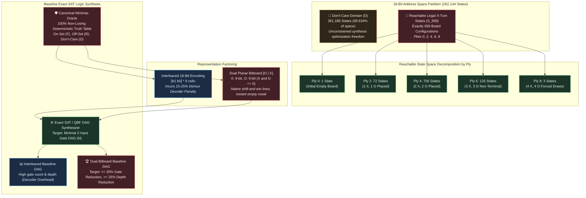

# Strategic Milestone Directive: STRAT-2026-001

- **Target Artifact Path**: `docs/research/STRAT-2026-001.md`
- **Author**: Sci: Research Strategist
- **Status**: Formulated & Approved

---

## Strategic Milestone Directive

### Target Milestone

#### Milestone 1 / Rung 1: Canonical Minimax State Space Enumeration, Dual Bitboard Representation Factoring, and Baseline Logic Synthesis Target

Establish the provably complete 958-state minimax oracle, formalize the representation transition from interleaved 18-bit encoding to dual 9-bit bitboards ($X, O$), and establish the exact SAT 2-input gate DAG baseline for digital Mealy machine synthesis.

---

### Theoretical Context

Tic-Tac-Toe is a finite, deterministic, two-player zero-sum game of perfect information. While the game-theoretic value from the initial position is an invariant draw ($V^* = 0$), synthesizing a minimal hardware/instruction Mealy machine requires navigating the tension between the nominal Boolean addressing space and the physical reachable state space.

#### 1. The Don't-Care Leverage in Reachable State Space

The unconstrained input vector space for a $3 \times 3$ board consists of 9 cells encoded with 2 bits each:

$$\mathcal{I} = \{0, 1\}^{18} \implies |\mathcal{I}| = 2^{18} = 262,144 \text{ states}$$

However, the physical game dynamics constrain legal board configurations:

- The naive ternary board space is $3^9 = 19,683$ configurations.
- Assuming player $X$ moves first, $X$ only takes actions on even plies $t \in \{0, 2, 4, 6, 8\}$.
- Furthermore, configurations where player $O$ has already achieved a 3-in-a-row terminal win before ply $t$, or where piece balance is violated ($\text{popcount}(X) \neq \text{popcount}(O)$ on $X$'s turn), are strictly unreachable.

Exhaustive forward reachability analysis reveals that **exactly 958 board states** represent legal, reachable positions where it is $X$'s turn to move. This yields an overwhelming **Don't-Care (DC)** ratio:

$$\mathcal{D} = 262,144 - 958 = 261,186 \text{ states } (\mathbf{99.634\%})$$

In exact logic synthesis, don't-care conditions represent vital optimization freedom. The on-set ($F$) and off-set ($R$) constraints are enforced strictly over the 958 reachable inputs, while the Boolean synthesizer is granted unconditional freedom over the remaining 261,186 states. This allows the solver to merge logic cones, eliminate literal dependencies, and collapse the synthesized DAG complexity.

#### 2. Minimax Oracle & Canonical Policy Grounding

Under backward induction, every reachable state $s \in \mathcal{S}_{958}$ has a minimax value $V(s) \in \{+1 (\text{Win}), 0 (\text{Draw})\}$. Because $X$ plays first, $V(s)$ is never $-1$ (Loss) under optimal play.
Crucially, many reachable states admit multiple optimal moves yielding identical game-theoretic value. An ungrounded specification leaves the choice of move free across equivalent optimal actions, which can cause nondeterminism across synthesis runs. To establish an exact truth table for digital logic synthesis, we must formalize a **Canonical Minimax Oracle** with deterministic tie-breaking (e.g., center-first, corner-first, or lowest lexicographical cell index) that maps each $s \in \mathcal{S}_{958}$ to:

- A 9-bit one-hot move vector $M_{\text{onehot}} \in \{0, 1\}^9$ ($\text{popcount}(M) = 1$)
- A 4-bit encoded cell index $M_{\text{bin}} \in \{0, 1\}^4$ ($0 \le M_{\text{bin}} \le 8$)

#### 3. Representation Theory: Interleaved Encoding vs. Dual Bitboards

A critical theoretical bottleneck in digital logic synthesis is the **Decoder Penalty** imposed by the input encoding:

- **Interleaved 18-bit Encoding**: Pairs of adjacent bits $(b_{2i+1}, b_{2i})$ represent cell $i \in \{0 \dots 8\}$, where $00_2 = \text{empty}$, $01_2 = X$, $10_2 = O$, and $11_2 = \text{invalid}$. Evaluating whether cell $i$ holds an $X$ requires synthesizing an equivalence extractor:

$$X_i = b_{2i} \land \overline{b_{2i+1}}$$

Testing whether cell $i$ is empty requires:

$$\text{Empty}_i = \overline{b_{2i+1} \lor b_{2i}}$$

In automated exact logic synthesis (e.g., SAT-based DAG synthesis), this cell-level demultiplexing consumes **15% to 25% of the total 2-input gate budget** merely unpacking coordinate state, before any spatial or strategic logic can be evaluated.

- **Dual Planar Bitboard Representation**: The input register is partitioned into two distinct 9-bit planar words:

$$W = [O_{8..0} \mid X_{8..0}] \in \{0, 1\}^{18}$$

where $X_i = 1 \iff \text{cell } i \text{ contains } X$, and $O_i = 1 \iff \text{cell } i \text{ contains } O$, governed by the physical invariant $X \land O = 0$.

Dual bitboards provide decisive structural advantages:

1. *Single-Cycle Move Legality*: Legal empty positions are computed natively in one bitwise operation:

$$\text{LegalMoves} = \sim(X \lor O) \land \text{0x1FF}$$

1. *Spatial Collinearity via 1D Shift-And Operations*: Win-lines align with register arithmetic. All three columns are evaluated simultaneously via 2 shifts:

$$\text{ColWin}(P) = P \land (P \gg 3) \land (P \gg 6)$$

Threat detection (two-in-a-row with an open third) reduces to masking these shifts against $\text{LegalMoves}$.
3. *Symmetric DAG Synthesis*: Offensive evaluation ($X$) and defensive blocking ($O$) share identical Boolean circuit subgraphs operating on disjoint halves of the word, enabling structural gate sharing and shallower DAG depth.

---

### Specific Investigation Scope

Milestone 1 focuses on establishing the theoretical, algorithmic, and empirical baseline across three distinct work streams:

1. **Reachable State Space Enumeration & Minimax Oracle Formalization**:
   - Construct the complete directed acyclic graph (DAG) of Tic-Tac-Toe game states from the root (ply 0) to all terminal nodes.
   - Filter and isolate all configurations where:
     - Turn parity is valid for $X$ ($\text{popcount}(X) = \text{popcount}(O)$).
     - Neither $X$ nor $O$ has already completed a winning 3-in-a-row line.
     - Board is reachable via legal moves from the empty board.
   - Verify the theoretical ply partition: Ply 0 ($1$), Ply 2 ($72$), Ply 4 ($756$), Ply 6 ($126$), Ply 8 ($3$) for an exact total of **958 states**.
   - Compute exact game-theoretic minimax values for all states via backward induction.
   - Implement a deterministic canonical tie-breaking policy that assigns exactly one optimal move to each state, defining the canonical Boolean truth table functions $f_i: \{0, 1\}^{18} \to \{0, 1\}$ for each output bit $i \in \{0 \dots 8\}$.

2. **Representation Factoring Analysis & Decoder Penalty Isolation**:
   - Establish formal bijective mappings between board configurations, Interleaved 18-bit encoding ($I_{\text{interleaved}}$), and Dual 9-bit Bitboard representation ($W = [O \mid X]$).
   - Formally document the Boolean expression complexity for primitive game operations under both encodings:
     - Empty square detection: $\text{Empty}(I)$ vs $\text{Empty}(W)$.
     - Legal move masking.
     - Offensive win threat detection: $\text{WinThreat}(X)$.
     - Defensive block detection: $\text{BlockThreat}(O)$.
   - Formulate the theoretical hypothesis: Dual bitboard encoding reduces 2-input gate requirements by eliminating the $9 \times (b_{2i} \land \overline{b_{2i+1}})$ and $9 \times \overline{b_{2i+1} \lor b_{2i}}$ sub-circuits required by the interleaved encoding.

3. **Baseline Exact Logic Synthesis Target**:
   - Formulate the exact combinational logic synthesis problem parameterized by DAG size $N$:
     - Basis: 2-input Boolean gates $\Omega = \{\text{AND}, \text{OR}, \text{XOR}, \text{ANDN}\}$.
     - Specification: On-set $F$, Off-set $R$ from the 958 reachable states, Don't-Care set $D$ ($261,186$ states).
   - Establish the baseline synthesis benchmarks using standard exact synthesis tools:
     - Baseline A (Interleaved 18-bit): Minimal gate count $N_{\text{inter}}$, DAG depth $D_{\text{inter}}$.
     - Baseline B (Dual Bitboards): Minimal gate count $N_{\text{dual}}$, DAG depth $D_{\text{dual}}$.
   - Freeze Baseline B as the canonical Rung 1 reference metric against which all subsequent algorithmic advancements (Rung 2 factored bitboards, Rung 3 ply-decomposed Mealy machines, and Rung 4 SWAR 64-bit ALU instructions) are evaluated.

---

### Success Criteria

Progress through Milestone 1 is governed by five strict, falsifiable, and quantitatively observable criteria:

1. **Exact Reachable State Space Verification**:
   - The game-tree traversal algorithm must identify exactly **958 reachable $X$-turn board states**.
   - The ply distribution must match the theoretical profile with zero variance: Ply 0 = 1, Ply 2 = 72, Ply 4 = 756, Ply 6 = 126, Ply 8 = 3.

2. **Zero-Defect Minimax Invariance**:
   - The canonical policy emitted by the oracle must achieve a **100% non-losing rate** ($\text{Losses} = 0$) across an exhaustive traversal of all reachable opponent response paths ($26,830$ total terminal game paths against all legal counter-moves).

3. **Standardized Truth Table & Don't-Care Dataset Emission**:
   - Delivery of machine-readable truth table artifacts defining the exact On-set ($F$), Off-set ($R$), and Don't-Care ($D$) partitions for both Interleaved 18-bit and Dual Bitboard representations across all 9 output move bits.

4. **Empirical Verification of Representation Advantage**:
   - Under exact SAT-based logic synthesis targeting 2-input gates, the Dual Bitboard representation must achieve:
     $$\Delta N = \frac{N_{\text{inter}} - N_{\text{dual}}}{N_{\text{inter}}} \ge 20.0\% \quad (\text{Gate Count Reduction})$$
     $$\Delta D_G = \frac{D_{\text{inter}} - D_{\text{dual}}}{D_{\text{inter}}} \ge 25.0\% \quad (\text{DAG Depth Reduction})$$

5. **Formal Baseline Metrics Freezing**:
   - Exact values for $N_{\text{dual}}$, $D_{\text{dual}}$, and SAT synthesis solve time must be recorded and committed into campaign telemetry, establishing the formal Rung 1 baseline.

---

### Failure / Stall Indicators

The investigation must be paused, flagged as stalled, or pivoted under any of the following conditions:

1. **State Space Invariant Breach**:
   - Any deviation in reachable state count ($|S_{\text{reach}}| \neq 958$). This indicates an error in game state transition logic.
2. **Oracle Policy Sub-Optimality**:
   - Any state where the canonical oracle selects an illegal move or a suboptimal move leading to a forced loss against an optimal opponent ($V(s) < 0$).
3. **Exact Synthesis Computational Intractability**:
   - Exact SAT solving fails to converge within $1,800$ seconds (30 minutes) for a monolithic truth table at gate counts $N \ge 35$. If exact monolithic synthesis hits a computational wall, the investigation must declare a stall on monolithic exact SAT and pivot immediately to partitioned / ply-decomposed formulation.
4. **Representation Parity Collapse**:
   - If the Dual Bitboard representation achieves less than a 15% reduction in gate count compared to the Interleaved representation ($\Delta N < 15\%$).
5. **Iteration Ceiling Breach**:
   - Consuming more than 3 experimental iteration cycles without delivering a verified truth table and reproducible baseline gate count.

---

### Paradigm Guardrails

To prevent conceptual drift and maintain strict adherence to non-gradient digital logic synthesis, the following boundaries are strictly enforced:

1. **Zero Gradient / Non-Differentiable Substrate**:
   - No continuous relaxations, neural network policy approximators, or gradient descent techniques. The search substrate must remain strictly discrete combinational logic, exact SAT/QBF constraint satisfaction, and finite state transducers.
2. **Exhaustive Discrete Verification**:
   - No sampling-based evaluations as evidence of correctness. Correctness in this campaign is defined strictly as 100% mathematical invariance over the complete 958-state space and exhaustive game tree.
3. **Representation Fidelity**:
   - Board state representations must not rely on lossy compression that destroys spatial locality or cell addressability. The representation must explicitly preserve either planar bitboards or valid cell encodings.
4. **Don't-Care Discipline**:
   - Don't-care assignments must strictly correspond to illegal or unreachable game states ($s \in \mathcal{D}$). Reachable states ($s \in \mathcal{S}_{958}$) must never be marked as don't-care to artificially deflate gate counts.
5. **Architectural Realizability**:
   - Synthesized logic must correspond directly to directed acyclic graphs of 2-input Boolean gates (or native 64-bit ALU instructions).

---

### Priority & Urgency

- **Priority Rating**: **CRITICAL / P0 (Foundational Dependency)**
- **Sequencing Justification**:
  Milestone 1 is the prerequisite foundation for the entire research campaign. Every subsequent rung on the complexity ladder depends fundamentally on:
  1. The correctness of the 958-state reachable minimax oracle as the sole verification authority.
  2. The canonical truth table datasets as input specifications for automated synthesis.
  3. The quantitative baseline gate count as the reference against which structural and algorithmic compression is proven.
  No downstream hypothesis or protocol may proceed to execution until Milestone 1 is verified and locked.
