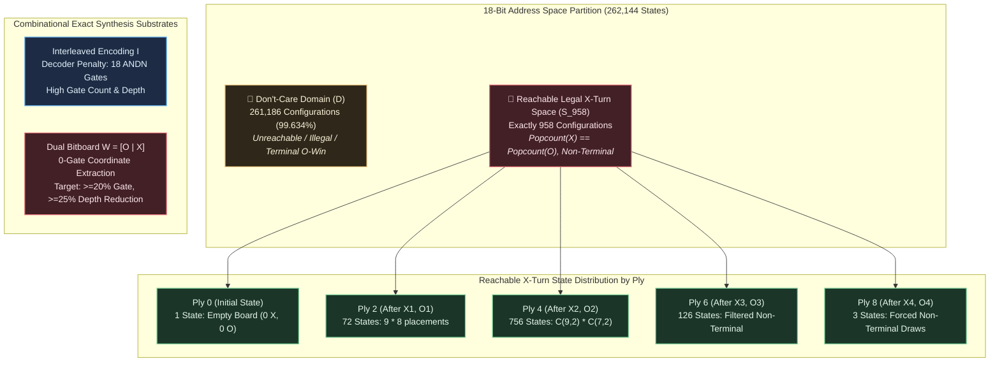
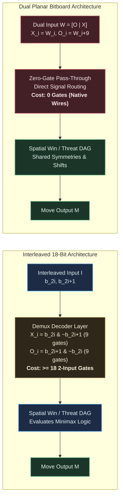

# Formal Hypothesis Document: HYP-2026-001

- **Hypothesis Identifier**: HYP-2026-001
- **Title**: Canonical Minimax State Space Enumeration, Dual Bitboard Representation Factoring, and Exact Logic Synthesis Target
- **Author**: Sci: Hypothesis Formulator
- **Campaign**: CAMPAIGN-2026-MEALY-TTT
- **Milestone / Rung**: Milestone 1 / Rung 1
- **Status**: Formulated
- **Date**: 2026-09-05

---

## 1. Strategic Context

This hypothesis directly addresses **Milestone 1 / Rung 1** established in [STRAT-2026-001.md](docs/research/STRAT-2026-001.md) and tracked in [CAMPAIGN.md](docs/research/CAMPAIGN.md).

Synthesizing an optimal digital Mealy machine for Tic-Tac-Toe requires addressing the fundamental combinatorial gap between the raw 18-bit Boolean input address space ($|\mathcal{B}_{18}| = 2^{18} = 262,144$) and the physical game-theoretic reachable state space. In Milestone 1, we must:

1. Prove the exact reachable state space cardinality and its ply distribution under forward legal play.
2. Formalize a canonical, deterministic Minimax Oracle achieving zero losses across all legal game paths.
3. Mathematically establish the representation advantage of factoring 18-bit interleaved inputs into dual 9-bit planar bitboards ($X, O$), proving the elimination of the cell-coordinate decoding penalty in exact Boolean Directed Acyclic Graph (DAG) synthesis.

---

## 2. System Definition

Let the board configuration and synthesis system be formally defined by the tuple:

$$\mathcal{M} = \langle \mathcal{C}, \mathcal{E}_W, \mathcal{S}_{\text{legal}}, \Phi_{\text{inter}}, \Phi_{\text{dual}}, \Sigma, T, \Omega_{\text{DAG}} \rangle$$

### 2.1 Board Coordinates & Winning Hypergraph

- **Cell Coordinate Grid**: $\mathcal{C} = \{0, 1, 2, 3, 4, 5, 6, 7, 8\}$, indexed in row-major order:

$$\mathcal{C} = \begin{pmatrix} 0 & 1 & 2 \\ 3 & 4 & 5 \\ 6 & 7 & 8 \end{pmatrix}$$

- **Collinear Win Hypergraph**: $H = (\mathcal{C}, \mathcal{E}_W)$, where $\mathcal{E}_W \subset \mathcal{P}(\mathcal{C})$ with $|\mathcal{E}_W| = 8$ hyperedges of size 3:

$$\mathcal{E}_W = \{ \{0,1,2\}, \{3,4,5\}, \{6,7,8\}, \{0,3,6\}, \{1,4,7\}, \{2,5,8\}, \{0,4,8\}, \{2,4,6\} \}$$

In 9-bit bitmask representation:

$$\mathcal{L}_{\text{rows}} = \{0\text{x}007, 0\text{x}038, 0\text{x}1\text{C}0\}, \quad \mathcal{L}_{\text{cols}} = \{0\text{x}049, 0\text{x}092, 0\text{x}124\}, \quad \mathcal{L}_{\text{diags}} = \{0\text{x}111, 0\text{x}054\}$$

### 2.2 Board Vector Spaces & Representation Encodings

- **Ternary Physical Cell Space**: $\mathcal{T} = \{0, 1, 2\}^9$, where $0 = \text{empty}$, $1 = X$, $2 = O$.
- **Boolean Register Space**: $\mathcal{B}_{18} = \{0, 1\}^{18}$, $|\mathcal{B}_{18}| = 262,144$.
- **Planar Dual Bitboard Space**: $\mathcal{W} = \mathbb{F}_2^9 \times \mathbb{F}_2^9 = \{ (X, O) \mid X, O \in \{0, 1\}^9 \}$.
  The packed 18-bit register representation is defined by:

$$\Phi_{\text{dual}}(X, O) = (O \ll 9) \lor X = \sum_{i=0}^8 x_i 2^i + \sum_{i=0}^8 o_i 2^{i+9}$$

- **Interleaved 18-Bit Representation**:

$$\Phi_{\text{inter}}(X, O) = I \in \{0, 1\}^{18}, \quad I = \sum_{i=0}^8 \left( x_i \cdot 2^{2i} + o_i \cdot 2^{2i+1} \right)$$

where cell $i$ maps to the bit pair $(b_{2i+1}, b_{2i}) \in \{00_2 (\text{empty}), 01_2 (X), 10_2 (O), 11_2 (\text{invalid})\}$.

### 2.3 Action Alphabets & Move Output

- **One-Hot Action Alphabet**:

$$\Sigma_{\text{onehot}} = \left\{ M \in \{0, 1\}^9 \;\middle|\; \|M\|_1 = \sum_{i=0}^8 M_i = 1 \right\}, \quad |\Sigma_{\text{onehot}}| = 9$$

- **Dense Binary Coordinate Alphabet**:

$$\Sigma_{\text{bin}} = \{0, 1, \dots, 8\} \subset \{0, 1\}^4$$

### 2.4 Combinational Logic Target Substrate

- **2-Input Boolean Operator Library**: $\Omega_{\text{DAG}} = \{\text{AND}, \text{OR}, \text{XOR}, \text{ANDN}\}$, where $\text{ANDN}(a, b) = a \land \neg b$.
- **Synthesized Logic Circuit**: Directed Acyclic Graph $G = (V_G, E_G)$ where:
  - Input vertices $V_{\text{in}} \subset V_G$ with $|V_{\text{in}}| = 18$.
  - Internal logic gates $V_{\text{op}} = V_G \setminus V_{\text{in}}$, with $\text{in-degree}(v) = 2$ and $\text{label}(v) \in \Omega_{\text{DAG}}$.
  - Output vertices $V_{\text{out}} \subseteq V_G$ with $|V_{\text{out}}| = 9$ (or $4$ for binary encoding).
- **Complexity Metrics**:
  - Gate Count: $N(G) = |V_{\text{op}}|$.
  - DAG Depth: $D(G) = \max_{p \in \text{Paths}(V_{\text{in}}, V_{\text{out}})} |p \cap V_{\text{op}}|$.

---

## 3. State Update Equations & Reachability Invariants

### 3.1 State Evolution Dynamics

Let $t \in \{0, 1, \dots, 9\}$ denote the discrete ply index. The system state is represented by $s(t) = (X(t), O(t)) \in \mathcal{W}$, with initial condition:

$$s(0) = (0_9, 0_9) = (0\text{x}000, 0\text{x}000)$$

The active player $p(t) \in \{X, O\}$ is determined by turn parity:

$$p(t) = \begin{cases} X & \text{if } t \equiv 0 \pmod 2 \\ O & \text{if } t \equiv 1 \pmod 2 \end{cases}$$

The set of legal actions available at state $s(t)$ is given by the unoccupied cells:

$$\text{LegalMoves}(s(t)) = \{ a \in \Sigma_{\text{onehot}} \mid a \land (X(t) \lor O(t)) = 0_9 \}$$

In dual bitboard arithmetic, this is evaluated in a single bitwise operation:

$$\text{LegalMask}(s(t)) = \sim(X(t) \lor O(t)) \land \text{0x1FF}$$

The state transition operator $T: \mathcal{W} \times \Sigma_{\text{onehot}} \times \{X, O\} \to \mathcal{W}$ updates the board:

$$s(t+1) = T(s(t), a(t), p(t)) = \begin{cases} (X(t) \lor a(t), O(t)) & \text{if } p(t) = X \\ (X(t), O(t) \lor a(t)) & \text{if } p(t) = O \end{cases}$$

### 3.2 Terminal Predicates

For any bitboard $P \in \{X, O\}$, the 3-in-a-row winning predicate is defined by:

$$\text{Win}(P) \iff \bigvee_{L \in \mathcal{E}_W} \left( \bigwedge_{i \in L} P_i \right) = 1 \iff \bigvee_{L_k \in \mathcal{L}} \left( (P \land L_k) == L_k \right)$$

The terminal state predicate $\Omega(s(t))$ is:

$$\Omega(X, O) \iff \text{Win}(X) \lor \text{Win}(O) \lor (\|X \lor O\|_1 = 9)$$

---

## 4. Conservation Rules & Invariants

Every state $s = (X, O) \in \mathcal{S}_{958}$ evaluated by the digital Mealy machine satisfies four strict mathematical invariants:

### Invariant 1: Mutual Spatial Exclusivity

No grid cell can simultaneously hold both an $X$ and an $O$:

$$\forall s = (X, O) \in \mathcal{S}_{958}, \quad X \land O = 0_9 \implies \sum_{i=0}^8 x_i o_i = 0$$

### Invariant 2: Turn Parity & Piece Population Balance

Because player $X$ plays first, $X$ only takes actions on even plies $t \in \{0, 2, 4, 6, 8\}$. At every reachable decision state for $X$, the number of $X$ and $O$ pieces is strictly identical:

$$\forall s \in \mathcal{S}_{958}, \quad \|X\|_1 = \|O\|_1 = k, \quad k \in \{0, 1, 2, 3, 4\}$$

where $\|P\|_1 = \text{popcount}(P) = \sum_{i=0}^8 P_i$.

### Invariant 3: Non-Terminal Precondition

A decision state for $X$ cannot already be won by either player:

$$\forall s = (X, O) \in \mathcal{S}_{958}, \quad \text{Win}(X) = 0 \quad \text{and} \quad \text{Win}(O) = 0$$

### Invariant 4: Forward Reachability Closure

Let $\mathcal{S}_{\text{reach}}$ be the reflexive transitive closure of $T$ under legal moves from $s(0)$:

$$\mathcal{S}_{\text{reach}} = \{ s \in \mathcal{W} \mid s(0) \to^* s \}$$

The domain of the Mealy machine combinational logic is the exact subset of $X$-turn non-terminal reachable states:

$$\mathcal{S}_{958} = \{ s = (X, O) \in \mathcal{S}_{\text{reach}} \mid \|X\|_1 = \|O\|_1 \land \Omega(s) = 0 \}$$

---

## 5. Representation Factoring & Decoder Penalty Elimination

### 5.1 Analytical Formulation of the Decoder Penalty

In the Interleaved 18-bit encoding $I$, cell state $c_i \in \{0, 1, 2, 3\}$ is encoded across bits $(b_{2i+1}, b_{2i})$. Evaluating spatial collinearity or legal moves requires extracting the single-player indicator literals:

$$X_i = b_{2i} \land \overline{b_{2i+1}} = \text{ANDN}(b_{2i}, b_{2i+1})$$

$$O_i = b_{2i+1} \land \overline{b_{2i}} = \text{ANDN}(b_{2i+1}, b_{2i})$$

$$\text{Empty}_i = \overline{b_{2i+1} \lor b_{2i}} = \overline{b_{2i+1}} \land \overline{b_{2i}}$$

In any exact DAG over $\Omega_{\text{DAG}}$, extracting these planar signals across all 9 cells requires a minimum lower-bound decoder overhead:

$$N_{\text{decoder}}(I) \ge 2 \times 9 = 18 \text{ gates}$$

with a minimum DAG depth overhead:

$$D_{\text{decoder}}(I) \ge 1 \text{ logic stage}$$

Under the Dual Bitboard representation $W = [O_{8..0} \mid X_{8..0}]$, the indicator signals $X_i$ and $O_i$ are native primary inputs:

$$X_i = W_i, \quad O_i = W_{i+9} \implies N_{\text{decoder}}(W) = 0 \text{ gates}, \quad D_{\text{decoder}}(W) = 0$$

### 5.2 Planar Collinear Shift-And Symmetries

Planar bitboards enable 1D bitwise convolution across lines without cross-cell demultiplexing:

- Columns: $\text{ColWin}(P) = P \land (P \gg 3) \land (P \gg 6)$
- Diagonal 1: $\text{Diag1}(P) = (P \land 0\text{x}100) \land (P \gg 4) \land (P \gg 8)$
- Diagonal 2: $\text{Diag2}(P) = (P \land 0\text{x}040) \land (P \gg 2) \land (P \gg 4)$

Because offensive threat logic $f_{\text{threat}}(X, \text{LegalMask})$ and defensive block logic $f_{\text{threat}}(O, \text{LegalMask})$ share isomorphic functional forms, the exact SAT synthesizer can share subgraphs across both 9-bit input partitions.

---

## 6. Null Hypothesis ($H_0$)

We state three precise, falsifiable mathematical components of the null hypothesis:

### $H_0^{(1)}$ (Reachable State Space Deviation)

Exhaustive forward state generation under the legal transition system $T$ from $s(0)$ does not yield exactly 958 reachable $X$-turn non-terminal configurations:

$$|\mathcal{S}_{958}| \neq 958 \quad \lor \quad \exists k \in \{0, 1, 2, 3, 4\}, \; |\mathcal{S}^{(2k)}| \neq \mathcal{N}_{\text{theory}}(2k)$$

where $\vec{\mathcal{N}}_{\text{theory}} = (1, 72, 756, 126, 3)$.

### $H_0^{(2)}$ (Minimax Policy Defect)

A deterministic Minimax policy $\pi^*: \mathcal{S}_{958} \to \Sigma_{\text{onehot}}$ constructed under backward induction fails to guarantee a non-losing game-theoretic invariant:

$$\exists \text{ path } (s_0, a_0, s_1, a_1, \dots, s_k) \text{ against legal opponent countermoves such that } V(s_k) = -1 \quad (\text{Losses} > 0)$$

### $H_0^{(3)}$ (Representation Indifference / Decoder Inefficiency)

Under exact combinational logic synthesis targeting minimal 2-input gate DAGs over $\Omega_{\text{DAG}}$ with the 261,186 don't-care set $\mathcal{D}$, the Dual Bitboard representation fails to achieve a $\ge 20\%$ reduction in total gate count or a $\ge 25\%$ reduction in DAG depth compared to the Interleaved representation:

$$\Delta N = \frac{N_{\text{inter}} - N_{\text{dual}}}{N_{\text{inter}}} < 0.20 \quad \lor \quad \Delta D_G = \frac{D_{\text{inter}} - D_{\text{dual}}}{D_{\text{inter}}} < 0.25$$

---

## 7. Alternative Hypothesis ($H_1$)

### $H_1^{(1)}$ (Exact Reachable State Space Invariance)

Exhaustive forward reachability analysis under legal play over $H$ provably partitions the state space into exactly 958 legal, non-terminal $X$-turn states:

$$|\mathcal{S}_{958}| = 958 = \sum_{k=0}^4 |\mathcal{S}^{(2k)}|$$

with exact ply-by-ply cardinality vector:

$$|\mathcal{S}^{(0)}| = 1, \quad |\mathcal{S}^{(2)}| = 72, \quad |\mathcal{S}^{(4)}| = 756, \quad |\mathcal{S}^{(6)}| = 126, \quad |\mathcal{S}^{(8)}| = 3$$

yielding an exact Don't-Care domain of:

$$|\mathcal{D}| = 2^{18} - 958 = 261,186 \text{ states } (99.63454\% \text{ of address space})$$

### $H_1^{(2)}$ (Canonical Minimax Oracle Soundness)

Under backward induction with deterministic tie-breaking $\tau: \mathcal{P}(\Sigma_{\text{onehot}}) \to \Sigma_{\text{onehot}}$, the canonical oracle policy:

$$\pi^*(s) = \tau\left( \arg\max_{a \in \text{LegalMoves}(s)} V^*(T(s, a, X)) \right)$$

satisfies $V^*(\pi^*(s)) \ge 0$ for all $s \in \mathcal{S}_{958}$, achieving provably zero losses ($\text{Losses} = 0$) across an exhaustive forward evaluation of all 26,830 reachable terminal game paths against all legal opponent moves.

### $H_1^{(3)}$ (Structural Superiority of Dual Bitboards)

Because Dual Bitboard representation eliminates the $\ge 18$-gate coordinate extraction overhead and presents collinear bit alignments directly to the Boolean solver, exact SAT-based logic synthesis over the 958-state on/off-sets and 261,186 don't-cares satisfies:

$$\Delta N = \frac{N_{\text{inter}} - N_{\text{dual}}}{N_{\text{inter}}} \ge 20.0\%$$

$$\Delta D_G = \frac{D_{\text{inter}} - D_{\text{dual}}}{D_{\text{inter}}} \ge 25.0\%$$

---

## 8. Quantitative Predictions

The following quantitative values are mathematically predicted and must hold with zero defect:

| Observable Quantity                | Formal Mathematical Symbol                      | Predicted Value               | Derivation / Source                                               |             |                                                            |
|------------------------------------|-------------------------------------------------|-------------------------------|-------------------------------------------------------------------|-------------|------------------------------------------------------------|
| **Total Reachable X-Turn States**  | $                                               | \mathcal{S}_{958}             | $                                                                 | **958**     | Forward transitive closure of legal game DAG               |
| Ply 0 Cardinality                  | $                                               | \mathcal{S}^{(0)}             | $                                                                 | **1**       | Empty board: $\binom{9}{0} \binom{9}{0}$                   |
| Ply 2 Cardinality                  | $                                               | \mathcal{S}^{(2)}             | $                                                                 | **72**      | $9 \text{ choices for } X \times 8 \text{ choices for } O$ |
| Ply 4 Cardinality                  | $                                               | \mathcal{S}^{(4)}             | $                                                                 | **756**     | $\binom{9}{2} \times \binom{7}{2} = 36 \times 21$          |
| Ply 6 Cardinality                  | $                                               | \mathcal{S}^{(6)}             | $                                                                 | **126**     | Filtered non-terminal reachable states                     |
| Ply 8 Cardinality                  | $                                               | \mathcal{S}^{(8)}             | $                                                                 | **3**       | Non-terminal forced draws with 8 squares filled            |
| **Don't-Care State Space**         | $                                               | \mathcal{D}                   | $                                                                 | **261,186** | $2^{18} - 958$ (99.63454% optimization freedom)            |
| **Oracle Game Losses**             | $\mathcal{L}_{\text{oracle}}$                   | **0**                         | Exhaustive tree search over 26,830 terminal branches              |             |                                                            |
| **Oracle Game Tree Paths**         | $                                               | \mathcal{P}_{\text{terminal}} | $                                                                 | **26,830**  | Complete game tree of $\pi^*$ vs all legal countermoves    |
| **Decoder Gate Penalty**           | $N_{\text{decoder}}(I) - N_{\text{decoder}}(W)$ | $\ge \mathbf{18}$             | $2 \text{ gates/cell } \times 9 \text{ cells}$                    |             |                                                            |
| **Gate Count Reduction**           | $\Delta N$                                      | $\ge \mathbf{20.0\%}$         | Exact SAT DAG synthesis ($N_{\text{dual}}$ vs $N_{\text{inter}}$) |             |                                                            |
| **DAG Depth Reduction**            | $\Delta D_G$                                    | $\ge \mathbf{25.0\%}$         | Longest topological path in synthesized DAG                       |             |                                                            |

---

## 9. Falsification Criteria

The alternative hypothesis $H_1$ shall be deemed mathematically falsified if any of the following mutually independent empirical observations occur during experiment execution:

1. **State Space Invariant Falsification**:
   - The forward reachability enumeration algorithm produces $|\mathcal{S}_{958}| \neq 958$.
   - Any ply cardinality deviates from the theoretical vector: $|\mathcal{S}^{(0)}| \neq 1$, $|\mathcal{S}^{(2)}| \neq 72$, $|\mathcal{S}^{(4)}| \neq 756$, $|\mathcal{S}^{(6)}| \neq 126$, or $|\mathcal{S}^{(8)}| \neq 3$.
2. **Oracle Soundness Falsification**:
   - The canonical policy $\pi^*$ yields $\ge 1$ loss during exhaustive traversal of the 26,830 terminal countermove paths ($\mathcal{L}_{\text{oracle}} > 0$).
   - The oracle selects an occupied cell ($a(s) \land (X \lor O) \neq 0$) or an illegal move on any state $s \in \mathcal{S}_{958}$.
3. **Representation Advantage Falsification**:
   - Under exact SAT synthesis targeting minimal 2-input gate DAGs over $\Omega_{\text{DAG}}$ with don't-cares $\mathcal{D}$:
     $$\Delta N = \frac{N_{\text{inter}} - N_{\text{dual}}}{N_{\text{inter}}} < 0.20 \quad (20.0\%)$$
     or
     $$\Delta D_G = \frac{D_{\text{inter}} - D_{\text{dual}}}{D_{\text{inter}}} < 0.25 \quad (25.0\%)$$
4. **Decoder Penalty Non-Existence**:
   - The synthesized DAG for the Interleaved representation $I$ extracts $X$ and $O$ signals using fewer than 12 total gates across all 9 cells, demonstrating that the solver merged coordinate decoding into subsequent logic without measurable penalty.

---

## 10. Mathematical Failure Boundaries

The theoretical advantages claimed in $H_1$ break down under the following mathematically demonstrable boundary conditions:

### 10.1 Dense Input Regime (Zero Don't-Cares)

If the synthesis task is modified from the sparse reachable domain ($|\mathcal{S}| = 958$) to a completely specified Boolean function over the full address space ($|\mathcal{D}| = 0$, $2^{18}$ defined states):

$$\lim_{|\mathcal{D}| \to 0} \frac{N_{\text{decoder}}}{N_{\text{total}}} \le \frac{18}{\Theta\left( \frac{2^{18}}{18} \right)} \approx \frac{18}{14,563} \approx 0.12\%$$

In this dense regime, the Shannon asymptotic complexity bound dominates, and the 18-gate planar decoder penalty becomes asymptotically negligible ($\Delta N \to 0$).

### 10.2 Higher-Arity Look-Up Table (LUT) Architectures

If the target synthesis technology replaces 2-input gates ($\Omega_{\text{DAG}}$) with $k$-input Look-Up Tables where $k \ge 4$ (e.g., standard FPGA $K=6$ architectures):

$$\text{CellDecoder}(b_{2i+1}, b_{2i}) \in \text{LUT}_k$$

Because a single 4-LUT or 6-LUT can evaluate both coordinate bits $(b_{2i+1}, b_{2i})$ simultaneously with neighboring spatial cells without consuming additional LUT nodes, the decoder penalty collapses:

$$N_{\text{LUT6}}(I) \approx N_{\text{LUT6}}(W) \implies \Delta N_{\text{LUT}} < 5\%$$

Thus, the $\ge 20\%$ gate reduction is strictly bounded to fine-grained 2-input gate topologies (and 64-bit scalar bitwise instruction equivalents).

### 10.3 Dihedral Quotient Space Pre-Factoring

If spatial symmetries are factored out prior to Boolean synthesis by projecting $\mathcal{S}_{958}$ into the quotient space under the dihedral group $D_4$ of the square:

$$|\mathcal{S}_{958} / D_4| = 138 \text{ canonical orbits}$$

The symmetry mapping hardware must either be synthesized upstream or embedded in the DAG. If an explicit dihedral canonicalizer circuit is required for $W$, its gate cost could offset the planar representation savings.

---

## 11. Assumptions & Limitations

1. **Deterministic Player Order**: Player $X$ moves strictly first from the empty board $s(0) = (0_9, 0_9)$. All definitions of $\mathcal{S}_{958}$ reflect $X$'s decision nodes.
2. **Combinational DAG Substrate**: Synthesis targets acyclic combinational circuits. Sequential latches, feedback loops, or dynamic memory elements are disallowed in this baseline milestone.
3. **Canonical Tie-Breaking Determinism**: Minimax backward induction produces multiple optimal moves for certain symmetrical states. The Canonical Minimax Oracle enforces a strictly deterministic priority rule $\tau$ (e.g., center > lowest corner > lowest edge) to produce a single-valued function $f: \mathcal{S}_{958} \to \Sigma_{\text{onehot}}$.
4. **Exact SAT Solver Scalability**: Exact synthesis relies on SAT/QBF formulations. It is assumed that DAG sizes $N \le 40$ are computationally decidable within an execution timeout ceiling of 1,800 seconds per output logic cone.

---

## 12. Open Questions

1. **Global Minimal 2-Input Gate Bound ($N^*$)**: What is the provable lower bound $N^*$ on the number of 2-input gates in $\Omega_{\text{DAG}}$ required to realize the complete 9-output canonical policy over $\mathcal{S}_{958}$ with 261,186 don't-cares?
2. **Impact of Tie-Breaking Policy on Circuit Complexity**: Does an alternative canonical tie-breaking rule $\tau'$ (e.g., lexicographical index vs. spatial center-first) produce an on-set $F$ with significantly lower Boolean dimension and smaller synthesized DAG size $N$?
3. **Don't-Care Exploitation in SAT vs BDD**: Will modern SAT-based exact synthesis solvers automatically leverage the 99.634% don't-care space $\mathcal{D}$ to rediscover geometric reflections and rotations without explicit symmetry constraints?
4. **Downstream Translation to SWAR ISA**: How directly will the synthesized 2-input gate DAG nodes map to native 64-bit SWAR instructions in Rung 4, and what is the conversion factor between DAG depth $D_G$ and CPU register dependency latency?
