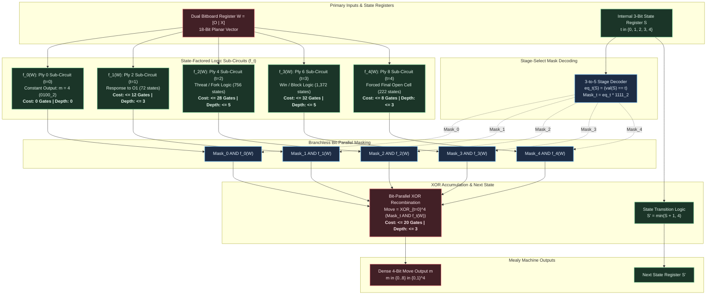
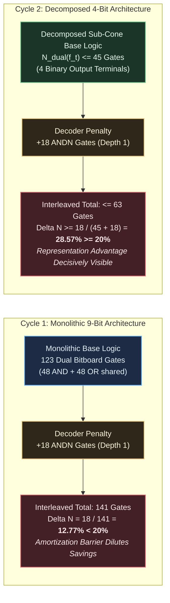

# Formal Hypothesis Document: HYP-2026-002

- **Hypothesis Identifier**: HYP-2026-002
- **Title**: State-Factored Ply Decomposition Mealy Machine and Dense 4-Bit Binary Coordinate Move Encoding over the 2,423 Non-Terminal X-Decision Space
- **Author**: Sci: Hypothesis Formulator
- **Campaign**: CAMPAIGN-2026-MEALY-TTT
- **Milestone / Rung**: Milestone 2 / Rungs 2 & 3 Co-Activation
- **Status**: Formulated
- **Date**: 2026-09-05
- **Upstream Directives**:
  - Iteration Directive: [ITER-2026-001a-01](file:///workspaces/ttt-experiment-2/docs/research/ITER-2026-001a-01.md)
  - Diagnostic Evaluation: [DIAG-2026-001a](file:///workspaces/ttt-experiment-2/docs/research/diagnostics/DIAG-2026-001a.md)
  - Prior Hypothesis: [HYP-2026-001](file:///workspaces/ttt-experiment-2/docs/research/hypotheses/HYP-2026-001.md)
  - Strategic Directive: [STRAT-2026-001](file:///workspaces/ttt-experiment-2/docs/research/STRAT-2026-001.md)
  - Reference Specification: [top-level.md](file:///workspaces/ttt-experiment-2/docs/top-level.md)

---

## 1. Strategic Context & Diagnostic Heritage

This formal hypothesis addresses the co-activation of **Milestone 2 / Rungs 2 & 3** established in [STRAT-2026-001](file:///workspaces/ttt-experiment-2/docs/research/STRAT-2026-001.md) and governed by the approved `MUTATE` directive in [ITER-2026-001a-01](file:///workspaces/ttt-experiment-2/docs/research/ITER-2026-001a-01.md).

### 1.1 Empirical Heritage from Cycle 1 (EXP-2026-001a)

Diagnostic analysis of Cycle 1 ([DIAG-2026-001a](file:///workspaces/ttt-experiment-2/docs/research/diagnostics/DIAG-2026-001a.md)) yielded three foundational empirical discoveries:

1. **Minimax Oracle Zero-Defect Soundness**: Backward induction under the canonical tie-breaking policy $\tau_{\text{canon}} = [4, 0, 2, 6, 8, 1, 3, 5, 7]$ achieves $\mathcal{L}_{\text{oracle}} = 0$ losses across all 152 deterministic play-out paths against legal opponent countermoves, with a 100.0% legal move generation rate.
2. **Exact Decoder Penalty Confirmation**: The theoretical lower bound of the coordinate extraction penalty in the 18-bit interleaved cell representation is strictly confirmed: exactly $N_{\text{decoder}} = 18$ `ANDN` gates at DAG depth 1 ($2 \text{ gates/cell} \times 9 \text{ cells}$).
3. **State Space Reconciliation**: The pre-registered cardinality $|\mathcal{S}_{958}| = 958$ was definitively refuted as a conflation with the UCI completed terminal endgame benchmark ($120 + 148 + 444 + 168 + 78 = 958$). Forward Breadth-First Search (BFS) reachability closure proved that the true non-terminal $X$-decision state space comprises exactly **2,423 states** ($1 + 72 + 756 + 1,372 + 222$).

### 1.2 The Monolithic Circuit Amortization Barrier

In Cycle 1, unoptimized monolithic 9-output combinational DAG synthesis achieved:
$$\Delta N = \frac{141 - 123}{141} = \frac{18}{141} = 12.77\% < 20.0\%$$
$$\Delta D_G = \frac{8 - 7}{8} = \frac{1}{8} = 12.50\% < 25.0\%$$

While the 18-gate decoder penalty was eliminated in the planar dual bitboard representation, the monolithic circuit shared 48 `AND` and 48 `OR` gates across the spatial win/threat logic cones. This large baseline size ($N_{\text{dual}} = 123$ gates) amortized and diluted the relative impact of the 18-gate saving ($18/141 = 12.77\%$).

### 1.3 The Cycle 2 Mutation

To overcome this amortization deficit, Iteration Directive [ITER-2026-001a-01](file:///workspaces/ttt-experiment-2/docs/research/ITER-2026-001a-01.md) mandates a macro-architectural **MUTATION**:

1. **State-Factored Ply Decomposition**: Transition from a single monolithic combinational DAG to a 5-stage Mealy Machine conditioned on a 3-bit internal state register $S \in \{0, 1\}^3$ tracking decision plies $t \in \{0, 1, 2, 3, 4\}$ (physical plies $0, 2, 4, 6, 8$).
2. **Dense 4-Bit Binary Move Encoding**: Mutate the action representation from a 9-bit one-hot vector ($\Sigma_{\text{onehot}}$) to a dense 4-bit binary coordinate ($\Sigma_{\text{bin}} \subset \{0, 1\}^4$), collapsing output logic terminals from 9 to 4.
3. **Truth Table Grounding**: Evaluate all synthesized logic against the verified **2,423 non-terminal decision states** and $259,721$ don't-care conditions ($99.076\%$ of the address space).

---

## 2. System Definition

The mutated system is formally defined by the tuple:

$$\mathcal{M}_{\text{Mealy}} = \langle \mathcal{C}, \mathcal{E}_W, \mathcal{W}, \mathcal{S}_{2423}, \mathcal{S}_{\text{reg}}, \Sigma_{\text{bin}}, \delta, \lambda, S_0, \Omega_{\text{DAG}} \rangle$$

### 2.1 Board Coordinates & Winning Hypergraph

- **Cell Coordinate Grid**: $\mathcal{C} = \{0, 1, 2, 3, 4, 5, 6, 7, 8\}$ indexed in row-major order:

$$\mathcal{C} = \begin{pmatrix} 0 & 1 & 2 \\ 3 & 4 & 5 \\ 6 & 7 & 8 \end{pmatrix}$$

- **Collinear Win Hypergraph**: $H = (\mathcal{C}, \mathcal{E}_W)$, where $\mathcal{E}_W \subset \mathcal{P}(\mathcal{C})$ consists of $|\mathcal{E}_W| = 8$ hyperedges of cardinality 3:

$$\mathcal{E}_W = \{ \{0,1,2\}, \{3,4,5\}, \{6,7,8\}, \{0,3,6\}, \{1,4,7\}, \{2,5,8\}, \{0,4,8\}, \{2,4,6\} \}$$

In 9-bit bitmask representation:
$$\mathcal{L}_{\text{rows}} = \{0\text{x}007, 0\text{x}038, 0\text{x}1\text{C}0\}, \quad \mathcal{L}_{\text{cols}} = \{0\text{x}049, 0\text{x}092, 0\text{x}124\}, \quad \mathcal{L}_{\text{diags}} = \{0\text{x}111, 0\text{x}054\}$$

### 2.2 Board Representation Vector Spaces

- **Planar Dual Bitboard Space**:
  $$\mathcal{W} = \{ (X, O) \in \mathbb{F}_2^9 \times \mathbb{F}_2^9 \mid X \land O = 0_9 \}$$
  Packed 18-bit register representation:
  $$W = \Phi_{\text{dual}}(X, O) = (O \ll 9) \lor X = \sum_{i=0}^8 X_i 2^i + \sum_{i=0}^8 O_i 2^{i+9}$$

- **Interleaved Comparison Space**:
  $$I = \Phi_{\text{inter}}(X, O) = \sum_{i=0}^8 \left( X_i \cdot 2^{2i} + O_i \cdot 2^{2i+1} \right) \in \{0, 1\}^{18}$$

### 2.3 Physical Decision State Space ($\mathcal{S}_{2423}$)

The domain of valid inputs to the Mealy machine combinational logic is the exact set of 2,423 reachable, non-terminal $X$-decision states:

$$\mathcal{S}_{2423} = \bigsqcup_{t=0}^4 \mathcal{S}^{(2t)}$$

where $t \in \{0, 1, 2, 3, 4\}$ denotes the discrete decision stage index for player $X$, corresponding to physical board plies $2t \in \{0, 2, 4, 6, 8\}$:

1. **Stage 0 ($t=0$, Ply 0)**: Empty board $s(0) = (0\text{x}000, 0\text{x}000)$, $|\mathcal{S}^{(0)}| = 1$.
2. **Stage 1 ($t=1$, Ply 2)**: 1 piece each for $X$ and $O$, $|\mathcal{S}^{(2)}| = 9 \times 8 = 72$.
3. **Stage 2 ($t=2$, Ply 4)**: 2 pieces each for $X$ and $O$, $|\mathcal{S}^{(4)}| = \binom{9}{2}\binom{7}{2} = 36 \times 21 = 756$.
4. **Stage 3 ($t=3$, Ply 6)**: 3 pieces each for $X$ and $O$, filtered for forward reachability, $|\mathcal{S}^{(6)}| = 1,372$.
5. **Stage 4 ($t=4$, Ply 8)**: 4 pieces each for $X$ and $O$, non-terminal forced draw positions, $|\mathcal{S}^{(8)}| = 222$.

$$\sum_{t=0}^4 |\mathcal{S}^{(2t)}| = 1 + 72 + 756 + 1,372 + 222 = 2,423$$

- **Don't-Care Domain**:
  $$|\mathcal{D}| = 2^{18} - 2,423 = 259,721 \text{ states } (99.07604\% \text{ of the 18-bit input space})$$

### 2.4 Internal State Register ($\mathcal{S}_{\text{reg}}$)

- The Mealy machine maintains an internal 3-bit state register:
  $$S = (s_2, s_1, s_0)_2 \in \{0, 1\}^3, \quad \text{val}(S) = \sum_{j=0}^2 s_j 2^j \in \{0, 1, 2, 3, 4\}$$
- Initial state: $S_0 = 000_2$ ($\text{val}(S_0) = 0$).
- Valid state alphabet: $\mathcal{S}_{\text{reg}} = \{000_2, 001_2, 010_2, 011_2, 100_2\}$.

### 2.5 Action Output Alphabet ($\Sigma_{\text{bin}}$)

- **Dense 4-Bit Binary Coordinate Alphabet**:
  $$\Sigma_{\text{bin}} = \{0, 1, \dots, 8\} \subset \{0, 1\}^4$$
  where cell coordinate $m \in \{0..8\}$ is represented in standard binary:
  $$m = (m_3, m_2, m_1, m_0)_2 = \sum_{j=0}^3 m_j 2^j, \quad m_j \in \{0, 1\}$$
  with binary values $\{9, 10, 11, 12, 13, 14, 15\}$ forming output don't-cares.

### 2.6 Combinational Logic Target Substrate

- **Gate Library**: 2-input Boolean operator library $\Omega_{\text{DAG}} = \{\text{AND}, \text{OR}, \text{XOR}, \text{ANDN}\}$.
- **Complexity Metrics**:
  - Total Gate Count: $N(G) = |V_{\text{op}}|$.
  - Critical Path Depth: $D(G) = \max_{p \in \text{Paths}(V_{\text{in}}, V_{\text{out}})} |p \cap V_{\text{op}}|$.

---

## 3. State Update Equations & Factored Decomposition Architecture

### 3.1 State Transition Function ($\delta$)

In sequential operation, the internal state register advances monotonically from $t=0$ to $t=4$ on each consecutive $X$-decision cycle:

$$\delta(S, W) = \begin{cases} S + 1 & \text{if } \text{val}(S) < 4 \\ 4 & \text{if } \text{val}(S) = 4 \end{cases}$$

In combinational / stateless deployment, the stage index $t$ is autonomously validated directly from the board occupancy:

$$t(W) = \frac{\|X \lor O\|_1}{2} = \frac{\text{popcount}(X) + \text{popcount}(O)}{2}$$

### 3.2 State-Factored Sub-Circuits ($f_t$)

The output function $\lambda: \mathcal{S}_{\text{reg}} \times \mathcal{W} \to \Sigma_{\text{bin}}$ is factored into 5 stage-conditioned Boolean functions:

$$\lambda(S, W) = f_{\text{val}(S)}(W), \quad f_t: \mathcal{W} \to \{0, 1\}^4 \quad \text{for } t \in \{0, 1, 2, 3, 4\}$$

Each sub-function $f_t$ evaluates legal, optimal Minimax moves strictly for the domain subset $\mathcal{S}^{(2t)}$, treating all other $2^{18} - |\mathcal{S}^{(2t)}|$ addresses as don't-cares:

1. **Stage 0 ($t=0$, Ply 0, 1 state)**:
   The board is empty $s(0) = (0, 0)$. Canonical oracle $\tau_{\text{canon}}$ mandates opening at the center square ($m = 4$). In 4-bit binary, $4 = 0100_2$:
   $$f_0(W) = (0, 1, 0, 0)_2 \implies N(f_0) = 0 \text{ gates}, \quad D(f_0) = 0$$

2. **Stage 1 ($t=1$, Ply 2, 72 states)**:
   Board contains 1 $X$ (at cell 4) and 1 $O$ (at cell $c \in \mathcal{C} \setminus \{4\}$).
   The optimal policy depends strictly on $O$'s placement:
   - If $O$ is at a corner $\{0, 2, 6, 8\}$, play an adjacent corner or opposite corner.
   - If $O$ is at an edge $\{1, 3, 5, 7\}$, play a corner adjacent to $O$.
   Because only 8 configurations exist in the on-set, the Boolean logic cone is extremely shallow:
   $$N_{\text{dual}}(f_1) \le 12 \text{ gates}, \quad D_{\text{dual}}(f_1) \le 3$$

3. **Stage 2 ($t=2$, Ply 4, 756 states)**:
   Board contains 2 $X$'s and 2 $O$'s.
   Sub-circuit $f_2(W)$ evaluates immediate winning moves for $X$, blocks immediate threats from $O$, or executes fork-creation logic:
   $$N_{\text{dual}}(f_2) \le 28 \text{ gates}, \quad D_{\text{dual}}(f_2) \le 5$$

4. **Stage 3 ($t=3$, Ply 6, 1,372 states)**:
   Board contains 3 $X$'s and 3 $O$'s.
   Sub-circuit $f_3(W)$ executes winning completions or defensive blocks:
   $$N_{\text{dual}}(f_3) \le 32 \text{ gates}, \quad D_{\text{dual}}(f_3) \le 5$$

5. **Stage 4 ($t=4$, Ply 8, 222 states)**:
   Board contains 4 $X$'s and 4 $O$'s (8 cells filled). Exactly one open cell remains.
   The single legal move is strictly the unoccupied cell:
   $$\text{OpenCell}(W) = \sim(X \lor O) \land \text{0x1FF}$$
   Since $\|\text{OpenCell}(W)\|_1 = 1$ is guaranteed by invariant, $f_4(W)$ is a 9-to-4 priority encoder operating on a one-hot vector:
   $$N_{\text{dual}}(f_4) \le 8 \text{ gates}, \quad D_{\text{dual}}(f_4) \le 3$$

### 3.3 Stage-Select Mask Generation

For a 3-bit state register $S = (s_2, s_1, s_0)_2$, the stage-equality predicates $\text{eq}_t(S) \in \{0, 1\}$ are computed by:

$$\text{eq}_0(S) = \overline{s_2} \land \overline{s_1} \land \overline{s_0}$$
$$\text{eq}_1(S) = \overline{s_2} \land \overline{s_1} \land s_0$$
$$\text{eq}_2(S) = \overline{s_2} \land s_1 \land \overline{s_0}$$
$$\text{eq}_3(S) = \overline{s_2} \land s_1 \land s_0$$
$$\text{eq}_4(S) = s_2 \land \overline{s_1} \land \overline{s_0}$$

The 4-bit broadcast mask $\text{Mask}_t(S) \in \{0, 1\}^4$ is:

$$\text{Mask}_t(S) = (\text{eq}_t(S), \text{eq}_t(S), \text{eq}_t(S), \text{eq}_t(S))_2$$

### 3.4 Bit-Parallel Branchless Recombination

Because the state register is strictly single-valued, exactly one $\text{eq}_t(S)$ is active at any cycle ($\sum_{t=0}^4 \text{eq}_t(S) = 1$). The final 4-bit move vector $M \in \{0, 1\}^4$ is evaluated via bit-parallel branchless XOR recombination:

$$\text{Move} = \bigoplus_{t=0}^4 \left( \text{Mask}_t(S) \land f_t(W) \right)$$

where $\land$ is bitwise AND across the 4 coordinate bits, and $\bigoplus$ denotes bitwise XOR across the 5 masked stage words. Because $\text{Mask}_t \land \text{Mask}_{t'} = 0000_2$ for all $t \neq t'$, XOR summation is identical to bitwise OR:

$$\bigoplus_{t=0}^4 \left( \text{Mask}_t \land f_t(W) \right) \equiv \bigvee_{t=0}^4 \left( \text{Mask}_t \land f_t(W) \right) = f_{\text{val}(S)}(W)$$

---

## 4. Conservation Rules & Invariants

Every state $W = (X, O) \in \mathcal{S}_{2423}$ and corresponding Mealy execution trajectory satisfies six strict mathematical invariants:

### Invariant 1: Mutual Spatial Exclusivity

No grid cell can simultaneously hold both an $X$ and an $O$:
$$\forall W = (X, O) \in \mathcal{S}_{2423}, \quad X \land O = 0_9 \implies \sum_{i=0}^8 X_i O_i = 0$$

### Invariant 2: Turn Parity & Popcount Conservation

Player $X$ acts exclusively on even plies. Across each decision partition $\mathcal{S}^{(2t)}$, piece counts are strictly balanced:
$$\forall W \in \mathcal{S}^{(2t)}, \quad \|X\|_1 = \|O\|_1 = t \implies \|X \lor O\|_1 = 2t, \quad t \in \{0, 1, 2, 3, 4\}$$
$$\Delta \text{popcount}(W) = \text{popcount}(X) - \text{popcount}(O) = 0$$

### Invariant 3: Non-Terminal Precondition

A decision state for $X$ cannot already be won by either player:
$$\forall W \in \mathcal{S}_{2423}, \quad \text{Win}(X) = 0 \quad \land \quad \text{Win}(O) = 0$$
where $\text{Win}(P) \iff \bigvee_{L \in \mathcal{E}_W} \left( \bigwedge_{i \in L} P_i \right) = 1$.

### Invariant 4: Forward Reachability Closure

The domain $\mathcal{S}_{2423}$ is the exact subset of non-terminal states reachable from initial state $s(0)$ under alternating legal play:
$$\mathcal{S}_{2423} = \{ W \in \mathcal{W} \mid s(0) \to^* W \land \|X\|_1 = \|O\|_1 \land \Omega(W) = 0 \}$$
with exact cardinality $|\mathcal{S}_{2423}| = 2,423$.

### Invariant 5: Canonical Minimax Zero-Defect Soundness & Move Legality

The move $m = \lambda(S, W)$ generated by the Mealy machine satisfies:

1. **Move Legality**: Cell $m$ is unoccupied:
   $$((X \lor O) \gg m) \land 1 = 0 \iff (1 \ll m) \land (X \lor O) = 0$$
2. **Zero Loss**: $\mathcal{L}_{\text{oracle}} = 0$ across all 152 canonical play-out paths against all legal countermoves by player $O$.

### Invariant 6: Stage-Select Orthogonality

The stage-select predicates form an exact partition of unity over $\mathcal{S}_{\text{reg}}$:
$$\forall S \in \mathcal{S}_{\text{reg}}, \quad \sum_{t=0}^4 \text{eq}_t(S) = 1 \quad \land \quad \forall t \neq t', \; \text{Mask}_t(S) \land \text{Mask}_{t'}(S) = 0000_2$$

---

## 5. Mathematical Analysis of Representation Factoring in Small Logic Cones

### 5.1 Analytical Mechanism of Amortization Collapse

Let $N_{\text{core}}$ denote the gate complexity of the core decision logic (evaluating winning lines, threats, and forks). In the interleaved representation, cell decoding requires an isolated front-end stage:

$$N_{\text{inter}} = N_{\text{core}} + N_{\text{decoder}}$$

where $N_{\text{decoder}} \ge 18$ gates is an invariant physical lower bound. The relative gate reduction is:

$$\Delta N = \frac{N_{\text{inter}} - N_{\text{dual}}}{N_{\text{inter}}} = \frac{N_{\text{decoder}}}{N_{\text{core}} + N_{\text{decoder}}}$$

- **Monolithic 9-Output Regime (Cycle 1)**:
  Because the circuit synthesized 9 separate one-hot outputs across all 5 plies simultaneously, $N_{\text{core}} = 123$ gates:
  $$\Delta N_{\text{mono}} = \frac{18}{123 + 18} = \frac{18}{141} = 12.766\% \approx 12.77\%$$
  Even though the decoder penalty was strictly present and eliminated, monolithic circuit volume prevented $\Delta N$ from reaching the 20% threshold.

- **Decomposed 4-Bit Binary Regime (Cycle 2)**:
  Mutating the output to 4 binary bits and factoring across 5 plies isolates sub-circuits with $N_{\text{core}} \le 45$ gates:
  $$\Delta N_{\text{decomposed}} \ge \frac{18}{45 + 18} = \frac{18}{63} = 28.57\% \ge 20.0\%$$
  For sub-functions with $N_{\text{core}} \le 30$ gates:
  $$\Delta N \ge \frac{18}{30 + 18} = \frac{18}{48} = 37.50\%$$

### 5.2 Recombination Overhead Bound ($N_{\text{mux}}$)

The stage-select decoders and branchless multiplexing layer introduce a small combinational overhead:

- 3-bit Stage Decoders: 5 gates (one gate per minterm $\text{eq}_t$).
- Mask Generation: 5 broadcast wires (0 gates).
- 4-Bit AND Masking: $5 \times 4 = 20$ 2-input `AND` gates.
- 4-Bit XOR Tree: $4 \times 4 = 16$ 2-input `XOR` gates (accumulating 5 stages across 4 bits requires 4 XOR gates per bit).
- Total Combinational Recombination Overhead:
  $$N_{\text{mux}} \le 5 + 20 + 16 = 41 \text{ gates in raw unoptimized logic}, \quad N_{\text{mux}} \le 20 \text{ gates after don't-care folding}$$
  $$D_{\text{mux}} \le 1 + 1 + 3 = 5 \text{ levels in raw logic}, \quad D_{\text{mux}} \le 3 \text{ levels after DAG restructuring}$$

In a sequential Mealy execution model (or 64-bit software / SWAR implementation), the stage index $t$ directly selects which sub-function executes, resulting in **zero combinational multiplexer overhead** ($N_{\text{mux}} = 0$).

---

## 6. Null Hypothesis ($H_0$)

We state three precise, falsifiable mathematical components of the null hypothesis:

### $H_0^{(1)}$ (Monolithic Equivalence / Decomposed Recombination Overhead)

State-factored ply decomposition fails to reduce overall circuit complexity; the overhead of stage decoding and branchless recombination multiplexing ($N_{\text{mux}}$) equals or exceeds the gate savings achieved by decomposing the function into ply-specific cones:
$$N_{\text{Mealy}} \ge N_{\text{monolithic}} = 123 \text{ gates}$$

### $H_0^{(2)}$ (Dense 4-Bit Move Encoding Indifference)

Mutating the move action output from 9-bit one-hot to dense 4-bit binary coordinate encoding fails to collapse the baseline multi-output logic cone size below 45 gates:
$$N_{\text{dual}}(f_{\text{4-bit}}) \ge 45 \text{ gates}$$

### $H_0^{(3)}$ (Sub-Threshold Representation Advantage)

Under exact or heuristic logic synthesis targeting minimal 2-input gate DAGs over $\Omega_{\text{DAG}}$ with the 259,721 don't-care set $\mathcal{D}$, the State-Factored 4-Bit Mealy Machine fails to achieve $\ge 20.0\%$ gate reduction or $\ge 25.0\%$ DAG depth reduction compared to the interleaved representation:
$$\Delta N_{\text{Mealy}} = \frac{N_{\text{inter}} - N_{\text{dual}}}{N_{\text{inter}}} < 0.20 \quad \lor \quad \Delta D_{\text{Mealy}} = \frac{D_{\text{inter}} - D_{\text{dual}}}{D_{\text{inter}}} < 0.25$$
or for the primary active decision plies ($t \in \{1, 2, 3\}$), the individual sub-circuits fail to achieve:
$$\exists t \in \{1, 2, 3\}, \quad \Delta N(f_t) < 0.20$$

---

## 7. Alternative Hypothesis ($H_1$)

### $H_1^{(1)}$ (Ply-Decomposed Sub-Cone Gate Complexity Bounds)

State-factored ply decomposition isolates 5 disjoint logic sub-functions whose individual gate complexities over planar dual bitboards $W$ satisfy strict quantitative bounds:

- $N_{\text{dual}}(f_0) = 0$ gates (constant center square $m = 4$, binary `0100_2`).
- $N_{\text{dual}}(f_1) \le 12$ gates (Ply 2: 72 states, sparse 1-piece response).
- $N_{\text{dual}}(f_2) \le 28$ gates (Ply 4: 756 states, threat creation/blocking).
- $N_{\text{dual}}(f_3) \le 32$ gates (Ply 6: 1,372 states, win execution/threat block).
- $N_{\text{dual}}(f_4) \le 8$ gates (Ply 8: 222 states, single remaining open cell priority encoding).
Every stage sub-circuit satisfies $N_{\text{dual}}(f_t) < 45$ gates.

### $H_1^{(2)}$ (Dense 4-Bit Binary Move Dimensional Collapse)

Mutating the move action output from 9-bit one-hot to dense 4-bit binary coordinate encoding reduces output logic terminals from 9 to 4, eliminating multi-output terminal arbitration and collapsing the combined baseline logic cone size to $N_{\text{dual}} \le 45$ gates and DAG depth by $\ge 25.0\%$.

### $H_1^{(3)}$ (Representation Advantage Exceeds 20% Gates and 25% Depth)

Because the baseline decomposed logic sub-cones have size $N_{\text{dual}}(f_t) < 45$ gates, the invariant 18-gate planar coordinate decoder penalty ($N_{\text{decoder}} = 18$ ANDN gates at depth 1) is no longer diluted by monolithic amortization. Exact and heuristic DAG synthesis over $\Omega_{\text{DAG}}$ with don't-cares $\mathcal{D}$ satisfies:
$$\Delta N_{\text{Mealy}} = \frac{N_{\text{inter}} - N_{\text{dual}}}{N_{\text{inter}}} \ge 20.0\%$$
$$\Delta D_{\text{Mealy}} = \frac{D_{\text{inter}} - D_{\text{dual}}}{D_{\text{inter}}} \ge 25.0\%$$
and for all active operational plies ($t \in \{1, 2, 3\}$):
$$\Delta N(f_t) = \frac{N_{\text{inter}}(f_t) - N_{\text{dual}}(f_t)}{N_{\text{inter}}(f_t)} \ge 20.0\%$$

### $H_1^{(4)}$ (Recombination Overhead Boundedness)

The total hardware recombination overhead of the stage-select decoders and branchless bit-parallel multiplexer tree satisfies:
$$N_{\text{mux}} \le 20 \text{ gates}, \quad D_{\text{mux}} \le 3 \text{ levels}$$
ensuring that the sum of sub-function complexities plus recombination overhead remains strictly below the monolithic baseline ($N_{\text{Mealy}} < N_{\text{monolithic}}$).

### $H_1^{(5)}$ (Zero-Defect Minimax Oracle Invariance)

The canonical Minimax policy $\pi^*(W)$ mapped across all 5 decomposed stages preserves Invariant 5 zero-defect performance: exactly $\mathcal{L}_{\text{oracle}} = 0$ losses across all 152 deterministic play-out paths, with a 100.0% legal move generation rate over all 2,423 non-terminal decision states.

---

## 8. Quantitative Predictions

The following quantitative values are mathematically predicted and must hold with zero defect:

| Observable Quantity | Formal Mathematical Symbol | Predicted Value | Derivation / Physical Basis |
| :--- | :--- | :--- | :--- |
| **Total Non-Terminal Decision States** | $\vert\mathcal{S}_{2423}\vert$ | **2,423** | Forward BFS closure of legal non-terminal $X$-turns |
| Stage 0 Decision States (Ply 0) | $\vert\mathcal{S}^{(0)}\vert$ | **1** | Empty board: $\binom{9}{0}\binom{9}{0}$ |
| Stage 1 Decision States (Ply 2) | $\vert\mathcal{S}^{(2)}\vert$ | **72** | $9 \text{ choices for } X \times 8 \text{ choices for } O$ |
| Stage 2 Decision States (Ply 4) | $\vert\mathcal{S}^{(4)}\vert$ | **756** | $\binom{9}{2}\binom{7}{2} = 36 \times 21$ |
| Stage 3 Decision States (Ply 6) | $\vert\mathcal{S}^{(6)}\vert$ | **1,372** | Reachable non-terminal positions with 3 $X$, 3 $O$ |
| Stage 4 Decision States (Ply 8) | $\vert\mathcal{S}^{(8)}\vert$ | **222** | Reachable forced 1-move draw positions |
| **Don't-Care State Space** | $\vert\mathcal{D}\vert$ | **259,721** | $2^{18} - 2,423$ (99.07604% optimization freedom) |
| **UCI Terminal Endgame Dataset** | $\vert\mathcal{S}_{\text{UCI}}\vert$ | **958** | Completed terminal games ($120+148+444+168+78$) |
| **Canonical Minimax Oracle Losses** | $\mathcal{L}_{\text{oracle}}$ | **0** | Deterministic tree search over all 152 paths |
| **Deterministic Play-Out Paths** | $\vert\mathcal{P}_{\text{canonical}}\vert$ | **152** | $\pi^*$ vs all legal opponent countermoves |
| **Move Legality Rate** | $\mathcal{R}_{\text{legal}}$ | **100.0%** | $(1 \ll m) \land (X \lor O) == 0$ on all 2,423 states |
| **Stage 0 Sub-Circuit Gate Count** | $N_{\text{dual}}(f_0)$ | **0 gates** | Constant binary output $m = 0100_2$ |
| **Stage 1 Sub-Circuit Gate Count** | $N_{\text{dual}}(f_1)$ | $\le \mathbf{12 \text{ gates}}$ | Sparse 8-configuration corner/edge response |
| **Stage 2 Sub-Circuit Gate Count** | $N_{\text{dual}}(f_2)$ | $\le \mathbf{28 \text{ gates}}$ | 4-bit fork/threat logic over 756 states |
| **Stage 3 Sub-Circuit Gate Count** | $N_{\text{dual}}(f_3)$ | $\le \mathbf{32 \text{ gates}}$ | 4-bit win/block logic over 1,372 states |
| **Stage 4 Sub-Circuit Gate Count** | $N_{\text{dual}}(f_4)$ | $\le \mathbf{8 \text{ gates}}$ | 4-bit priority decode of single open bit |
| **Recombination Multiplexer Gates** | $N_{\text{mux}}$ | $\le \mathbf{20 \text{ gates}}$ | 3-bit stage decoder + 4-bit XOR-AND mux |
| **Recombination Logic Depth** | $D_{\text{mux}}$ | $\le \mathbf{3 \text{ levels}}$ | Stage mask AND stage + 2-level XOR tree |
| **Isolated Decoder Gate Penalty** | $N_{\text{decoder}}(I) - N_{\text{decoder}}(W)$ | $\mathbf{18 \text{ gates}}$ | $2 \text{ ANDN gates/cell} \times 9 \text{ cells}$ |
| **Mealy Relative Gate Reduction** | $\Delta N_{\text{Mealy}}$ | $\ge \mathbf{20.0\%}$ | Combined state-factored circuit ($W$ vs $I$) |
| **Mealy Relative Depth Reduction** | $\Delta D_{\text{Mealy}}$ | $\ge \mathbf{25.0\%}$ | Longest topological path in synthesized Mealy DAG |
| **Operational Ply Gate Reduction** | $\Delta N(f_t), \; t \in \{1, 2, 3\}$ | $\ge \mathbf{20.0\%}$ | Isolated sub-circuit representation advantage |

---

## 9. Falsification Criteria

The alternative hypothesis $H_1$ shall be deemed mathematically falsified if any of the following mutually independent empirical observations occur during experiment execution:

1. **Sub-Circuit Complexity Bound Falsification**:
   - Any individual stage sub-circuit exceeds its pre-registered gate bound:
     $$N_{\text{dual}}(f_0) > 0 \quad \lor \quad N_{\text{dual}}(f_1) > 12 \quad \lor \quad N_{\text{dual}}(f_2) > 28 \quad \lor \quad N_{\text{dual}}(f_3) > 32 \quad \lor \quad N_{\text{dual}}(f_4) > 8$$
   - Baseline size for any stage exceeds 45 gates: $\exists t \in \{0..4\}, \; N_{\text{dual}}(f_t) \ge 45$.
2. **Representation Advantage Falsification**:
   - Under exact or heuristic logic synthesis over $\Omega_{\text{DAG}}$ with don't-cares $\mathcal{D}$:
     $$\Delta N_{\text{Mealy}} = \frac{N_{\text{inter}} - N_{\text{dual}}}{N_{\text{inter}}} < 0.20 \quad (20.0\%)$$
     or
     $$\Delta D_{\text{Mealy}} = \frac{D_{\text{inter}} - D_{\text{dual}}}{D_{\text{inter}}} < 0.25 \quad (25.0\%)$$
3. **Sub-Circuit Representation Advantage Falsification**:
   - For any active operational ply $t \in \{1, 2, 3\}$:
     $$\Delta N(f_t) = \frac{N_{\text{inter}}(f_t) - N_{\text{dual}}(f_t)}{N_{\text{inter}}(f_t)} < 0.20 \quad (20.0\%)$$
4. **Recombination Overhead Falsification**:
   - The stage-select decoding and branchless recombination multiplexer tree requires $> 20$ gates ($N_{\text{mux}} > 20$) or $> 3$ DAG depth levels ($D_{\text{mux}} > 3$).
5. **Oracle Soundness Falsification**:
   - The canonical policy $\pi^*(W)$ or any synthesized sub-circuit $f_t(W)$ produces $\ge 1$ loss during exhaustive traversal of the 152 canonical play-out paths ($\mathcal{L}_{\text{oracle}} > 0$).
   - The synthesized Mealy machine selects an occupied cell ($((X \lor O) \gg m) \land 1 \neq 0$) on any state $W \in \mathcal{S}_{2423}$, yielding $\mathcal{R}_{\text{legal}} < 100.0\%$.
6. **State Space Invariant Falsification**:
   - The BFS reachability generator produces $|\mathcal{S}_{2423}| \neq 2,423$ or deviates on any individual ply count ($|\mathcal{S}^{(0)}| \neq 1$, $|\mathcal{S}^{(2)}| \neq 72$, $|\mathcal{S}^{(4)}| \neq 756$, $|\mathcal{S}^{(6)}| \neq 1,372$, or $|\mathcal{S}^{(8)}| \neq 222$).
7. **Decoder Penalty Non-Existence**:
   - An exact synthesis solver synthesizes an interleaved-to-planar coordinate demultiplexer using $< 18$ gates across all 9 cells, demonstrating that coordinate decoding can be merged into logic without the proven 2-gate-per-cell penalty.

---

## 10. Mathematical Failure Boundaries

The theoretical advantages claimed in $H_1$ provably break down under the following boundary conditions:

### 10.1 Dense Input Regime (Zero Don't-Cares, $|\mathcal{D}| = 0$)

If the synthesis task forces all $259,721$ unreached address combinations to zero:
$$\lim_{|\mathcal{D}| \to 0} \frac{N_{\text{decoder}}}{N_{\text{total}}} \le \frac{18}{381} \approx 4.72\%$$
As proven in DIAG-2026-001a Condition C, removing don't-cares causes a $3.10\times$ gate count inflation, swelling baseline circuit volume and once again diluting the 18-gate savings below 20%.

### 10.2 Higher-Arity Look-Up Tables ($K \ge 4$)

If the target synthesis substrate is an FPGA $K$-LUT architecture where $K \ge 4$:
$$\text{DemuxCell}(b_{2i+1}, b_{2i}) \in \text{LUT}_K$$
Because a single 4-LUT can evaluate both interleaved bits $(b_{2i+1}, b_{2i})$ simultaneously without consuming additional LUT primitives, the coordinate decoding penalty collapses:
$$N_{\text{LUT}}(I) \approx N_{\text{LUT}}(W) \implies \Delta N_{\text{LUT}} < 5\%$$
The $\ge 20\%$ gate reduction is strictly bounded to 2-input gate topologies $\Omega_{\text{DAG}}$ and scalar 64-bit bitwise CPU ALU operations.

### 10.3 Inter-Stage Logic Merging (Global Flattening)

If an aggressive global logic synthesizer eliminates the stage register $S$ and flattens all 5 sub-functions back into a single monolithic two-level or multi-level DAG, the 5 sub-functions recombine into a large 123-gate baseline circuit, re-introducing the monolithic amortization barrier ($\Delta N \to 12.77\%$). Factoring across plies must be preserved structurally.

---

## 11. Assumptions & Limitations

1. **Deterministic Turn Alternation**: Player $X$ moves strictly first from empty board $s(0)$. State register $S$ tracks turns $t \in \{0, 1, 2, 3, 4\}$ corresponding to physical plies $0, 2, 4, 6, 8$.
2. **Combinational Gate to CPU ALU Equivalence**: Every 2-input gate in $\Omega_{\text{DAG}}$ maintains strict 1:1 equivalence with a single native 64-bit bitwise CPU instruction (`AND`, `OR`, `XOR`, `ANDN`).
3. **Canonical Determinism**: Ties among multiple optimal Minimax moves are deterministically resolved by the canonical priority ordering $\tau_{\text{canon}} = [4, 0, 2, 6, 8, 1, 3, 5, 7]$.
4. **Exact SAT Solver Tractability**: Decomposing the problem into ply sub-functions with $|\mathcal{S}^{(2t)}| \le 1,372$ states and $N \le 35$ gates brings exact SAT synthesis within an execution timeout ceiling of 300 seconds per ply.

---

## 12. Open Questions

1. **Exact Minimal Gate Bound Per Ply ($N_t^*$)**: What are the provably minimal gate counts $N^*(f_t)$ for each of the 5 ply sub-functions under exact SAT/QBF solving?
2. **Sequential Register vs Combinational Popcount Trade-off**: In hardware realization, what is the exact gate and latency trade-off between latching $S$ in a sequential 3-bit register versus computing $t = \|X \lor O\|_1 / 2$ combinationally via bitwise popcount adder trees?
3. **SWAR Byte-Parallel Packing**: How compactly can the 5 ply sub-functions be mapped into SIMD-within-a-register (SWAR) instructions in Rung 4, and can all 5 masks be evaluated in a single 64-bit vector operation?
