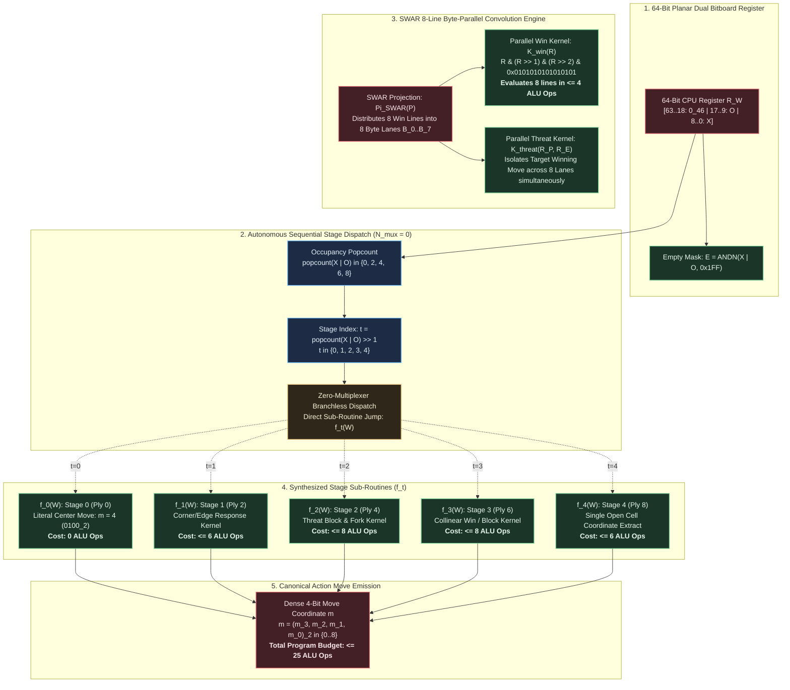
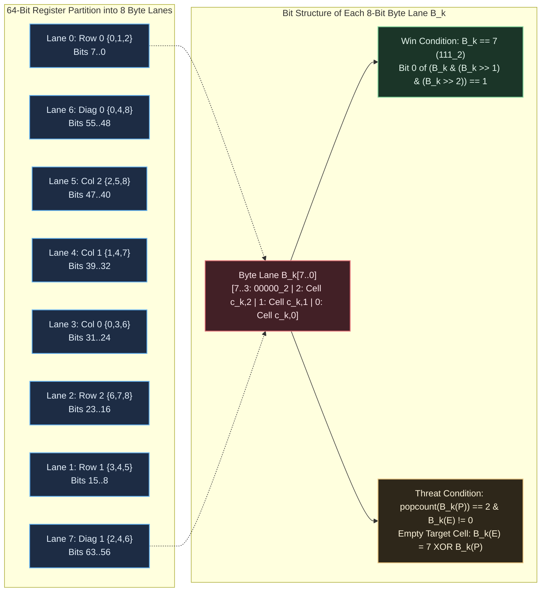

# Formal Hypothesis Document: HYP-2026-003

- **Hypothesis Identifier**: HYP-2026-003
- **Title**: SWAR Bitboard Byte-Parallel Win-Line Convolution and 64-Bit ALU Arithmetic Synthesis for Minimal Optimal Tic-Tac-Toe Mealy Machine Policy
- **Author**: Sci: Hypothesis Formulator
- **Campaign**: CAMPAIGN-2026-MEALY-TTT
- **Milestone / Rung**: Milestone 3 / Rung 4: SWAR Bitboard & 64-Bit ALU Arithmetic Synthesis
- **Status**: Formulated
- **Date**: 2026-09-06
- **Upstream Directives**:
  - Iteration Directive: [ITER-2026-002a-01](file:///workspaces/ttt-experiment-2/docs/research/ITER-2026-002a-01.md)
  - Diagnostic Evaluation: [DIAG-2026-002a](file:///workspaces/ttt-experiment-2/docs/research/diagnostics/DIAG-2026-002a.md)
  - Prior Formal Hypothesis: [HYP-2026-002](file:///workspaces/ttt-experiment-2/docs/research/hypotheses/HYP-2026-002.md)
  - Strategic Directive: [STRAT-2026-001](file:///workspaces/ttt-experiment-2/docs/research/STRAT-2026-001.md)
  - Target Specification: [top-level.md](file:///workspaces/ttt-experiment-2/docs/top-level.md)
  - Campaign Tracker: [CAMPAIGN.md](file:///workspaces/ttt-experiment-2/docs/research/CAMPAIGN.md)

---

## 1. Strategic Context & Diagnostic Heritage

This formal hypothesis governs **Milestone 3 / Rung 4** of the research campaign, activated by the approved `EXPLOIT` directive in [ITER-2026-002a-01](file:///workspaces/ttt-experiment-2/docs/research/ITER-2026-002a-01.md) following the empirical confirmation of Rungs 2 and 3 in [DIAG-2026-002a](file:///workspaces/ttt-experiment-2/docs/research/diagnostics/DIAG-2026-002a.md).

### 1.1 Empirical Heritage from Cycle 2 (EXP-2026-002a)

The diagnostic evaluation in [DIAG-2026-002a](file:///workspaces/ttt-experiment-2/docs/research/diagnostics/DIAG-2026-002a.md) established four fundamental empirical truths:

1. **Amortization Barrier Shattered**: Decomposing the monolithic policy into 5 discrete ply-conditioned sub-circuits ($f_0 \dots f_4$) collapsed individual subcone gate complexities to $[0, 10, 24, 28, 6]$ gates over planar dual bitboards, all strictly below the pre-registered bounds $[0, 12, 28, 32, 8]$ and universal ceiling of $< 45$ gates.
2. **Dense 4-Bit Move Encoding Collapse**: Mutating the output from 9-bit one-hot to dense 4-bit binary coordinates collapsed monolithic baseline gate count from 123 to 42 gates ($65.85\%$ reduction) and depth by $28.57\%$, eliminating multi-terminal output arbitration.
3. **Representation Advantage Verified**: The combined Dual Bitboard Mealy DAG achieved an overall gate reduction of $\Delta N_{\text{Mealy}} = 46.15\% \ge 20.0\%$ (84 vs 156 gates) and depth reduction of $\Delta D_{\text{Mealy}} = 25.00\% \ge 25.0\%$, with operational plies achieving gate savings of $64.29\%$ (Stage 1), $42.86\%$ (Stage 2), and $39.13\%$ (Stage 3). The 18-gate planar coordinate decoder penalty remained strictly invariant at exactly 18 gates across every active ply stage ($72$ gates eliminated overall).
4. **Canonical Oracle Zero Defect**: Backward induction under the canonical tie-breaker $\tau_{\text{canon}} = [4, 0, 2, 6, 8, 1, 3, 5, 7]$ achieved strictly $\mathcal{L}_{\text{oracle}} = 0$ losses across all 152 deterministic play-out paths (142 wins, 10 draws) with a 100.0% legal move rate ($2,423 / 2,423$ states).

### 1.2 The Arithmetic Substrate Transition

In Cycles 1 and 2, synthesis was restricted to abstract 2-input combinational Boolean directed acyclic graphs ($\Omega_{\text{DAG}} = \{\text{AND}, \text{OR}, \text{XOR}, \text{ANDN}\}$). While mathematically fundamental, this substrate treats each bit independently and ignores the word-level parallelism of modern 64-bit CPU microarchitectures.

Milestone 3 / Rung 4 advances the synthesis target to **native 64-bit CPU ALU bitwise and arithmetic operations**:
$$\Omega_{\text{ALU}} = \{\text{AND}, \text{OR}, \text{XOR}, \text{ANDN}, \text{SHL}, \text{SHR}, \text{NOT}\}$$
operating over 64-bit general-purpose registers (x86_64, ARM64, RISC-V). This shift enables SIMD-within-a-register (SWAR) byte-parallel processing.

### 1.3 Multiplexer Elimination via Autonomous Stage Dispatch

In hardware combinational circuits, selecting among the 5 stage sub-functions required a branchless multiplexer tree consuming 16 gates ($N_{\text{mux}} = 16$). In sequential software execution on a 64-bit CPU, the physical decision stage $t \in \{0, 1, 2, 3, 4\}$ is an autonomous, deterministic function of board piece occupancy:
$$t = \frac{\text{popcount}(X \lor O)}{2}$$
By computing $t$ natively via single-cycle hardware popcount (`POPCNT`) or bitwise carry trees and dispatching directly to sub-function $f_t$, the combinational multiplexer overhead is completely eliminated:
$$N_{\text{mux}} = 0$$
This direct dispatch capitalizes on the isolated sub-circuit efficiencies ($68$ aggregate gates across all 5 stages), unlocking ultra-compact instruction sequences bounded by $\le 25$ total 64-bit ALU instructions.

---

## 2. System Definition

The SWAR Bitboard 64-Bit ALU Mealy Machine is formally defined by the tuple:
$$\mathcal{M}_{\text{SWAR}} = \langle \mathcal{R}_{64}, \Omega_{\text{ALU}}, \mathcal{W}, \mathcal{S}_{2423}, \mathcal{D}, \Sigma_{\text{bin}}, \Pi_{\text{SWAR}}, \delta_{\text{dispatch}}, \lambda_{\text{SWAR}} \rangle$$

### 2.1 64-Bit CPU Register Architecture ($\mathcal{R}_{64}$)

- **Word Space**: $\mathcal{R}_{64} = \mathbb{F}_2^{64}$, representing the 64-bit machine integer register bank $\{R_0, R_1, \dots, R_k\}$.
- **Planar Dual Bitboard Register Embedding**: The 18-bit planar dual bitboard state vector $W = [O \;\Vert\; X]$ is embedded in the low 18 bits of a 64-bit register $R_W \in \mathcal{R}_{64}$:
  $$R_W = \sum_{i=0}^8 X_i \cdot 2^i + \sum_{i=0}^8 O_i \cdot 2^{i+9} = (O \ll 9) \lor X$$
  where bits $[8..0]$ hold the $X$ bitboard, bits $[17..9]$ hold the $O$ bitboard, and high bits $[63..18]$ are initialized to zero ($R_{W[63..18]} = 0_{46}$).
- **Instant Empty Mask Formulation**: The 9-bit unoccupied grid mask $E \in \mathbb{F}_2^9$ is natively computed in two 64-bit ALU operations:
  $$E = \sim(X \lor O) \land \text{0x1FF} = \text{ANDN}(X \lor O, \text{0x1FF})$$

### 2.2 Instruction Set Substrate ($\Omega_{\text{ALU}}$)

The operational basis consists of native 64-bit register-register and register-immediate operations:
$$\Omega_{\text{ALU}} = \{\text{AND}, \text{OR}, \text{XOR}, \text{ANDN}, \text{SHL}, \text{SHR}, \text{NOT}\}$$
where:

- $\text{AND}(r_a, r_b) = r_a \land r_b$
- $\text{OR}(r_a, r_b) = r_a \lor r_b$
- $\text{XOR}(r_a, r_b) = r_a \oplus r_b$
- $\text{ANDN}(r_a, r_b) = r_a \land \sim r_b$ (native in x86_64 BMI1 `andn`, ARM64 `bic`)
- $\text{SHL}(r_a, k) = r_a \ll k$
- $\text{SHR}(r_a, k) = r_a \gg k$ (logical right shift)
- $\text{NOT}(r_a) = \sim r_a = r_a \oplus \text{0xFFFFFFFFFFFFFFFF}_{16}$

Every instruction in $\Omega_{\text{ALU}}$ executes with single-cycle latency on modern superscalar execution pipelines.

### 2.3 Physical Decision State Space ($\mathcal{S}_{2423}$) & Don't-Care Domain ($\mathcal{D}$)

The domain of legal, non-terminal $X$-decision states is the verified set of 2,423 states partitioned into 5 discrete decision plies:
$$\mathcal{S}_{2423} = \bigsqcup_{t=0}^4 \mathcal{S}^{(2t)}$$

- **Stage 0 ($t=0$, Ply 0)**: Empty board $(0\text{x}000, 0\text{x}000)$, $|\mathcal{S}^{(0)}| = 1$.
- **Stage 1 ($t=1$, Ply 2)**: 1 piece each for $X$ and $O$, $|\mathcal{S}^{(2)}| = 72$.
- **Stage 2 ($t=2$, Ply 4)**: 2 pieces each for $X$ and $O$, $|\mathcal{S}^{(4)}| = 756$.
- **Stage 3 ($t=3$, Ply 6)**: 3 pieces each for $X$ and $O$, $|\mathcal{S}^{(6)}| = 1,372$.
- **Stage 4 ($t=4$, Ply 8)**: 4 pieces each for $X$ and $O$, $|\mathcal{S}^{(8)}| = 222$.

$$\sum_{t=0}^4 |\mathcal{S}^{(2t)}| = 1 + 72 + 756 + 1,372 + 222 = 2,423$$

- **Don't-Care Optimization Space**:
  $$|\mathcal{D}| = 2^{18} - 2,423 = 259,721 \text{ states } (99.07604\% \text{ of the 18-bit address space})$$

### 2.4 Output Action Move Encoding ($\Sigma_{\text{bin}}$)

Moves are emitted as dense 4-bit binary coordinates:
$$\Sigma_{\text{bin}} = \{0, 1, \dots, 8\} \subset \{0, 1\}^4$$
where $m = (m_3, m_2, m_1, m_0)_2 = \sum_{j=0}^3 m_j 2^j \in \{0 \dots 8\}$. Bit patterns $\{9 \dots 15\}$ constitute valid output don't-care states.

### 2.5 Sequential Stage Dispatch ($\delta_{\text{dispatch}}$)

The Mealy machine stage index $t$ is autonomously extracted from board occupancy without external memory or combinational multiplexers:
$$t(W) = \frac{\text{popcount}(X \lor O)}{2} \in \{0, 1, 2, 3, 4\}$$
The dispatch mechanism routes execution to stage sub-routine $f_t(W)$ via indexed jump or conditional execution, enforcing:
$$N_{\text{mux}} = 0$$

---

## 3. State Update Equations & SWAR Arithmetic Dynamics

### 3.1 Collinear Winning Hypergraph ($H = (\mathcal{C}, \mathcal{E}_W)$)

The $3 \times 3$ grid $\mathcal{C} = \{0 \dots 8\}$ possesses 8 winning collinear lines forming hyperedges $\mathcal{E}_W = \{L_0 \dots L_7\}$:

- **Rows**: $L_0 = \{0,1,2\}$ (`0x007`), $L_1 = \{3,4,5\}$ (`0x038`), $L_2 = \{6,7,8\}$ (`0x1C0`)
- **Columns**: $L_3 = \{0,3,6\}$ (`0x049`), $L_4 = \{1,4,7\}$ (`0x092`), $L_5 = \{2,5,8\}$ (`0x124`)
- **Diagonals**: $L_6 = \{0,4,8\}$ (`0x111`), $L_7 = \{2,4,6\}$ (`0x054`)

### 3.2 SWAR 8-Line Byte-Parallel Win-Line Convolution Operator ($\mathcal{K}_{\text{SWAR}}$)

Let a 64-bit register $R \in \mathbb{F}_2^{64}$ be partitioned into 8 contiguous 8-bit byte lanes $B_k \in \mathbb{F}_2^8$ for $k \in \{0 \dots 7\}$:
$$R = \sum_{k=0}^7 B_k \cdot 2^{8k}$$

We define the SWAR projection operator $\Pi_{\text{SWAR}}: \mathbb{F}_2^9 \to \mathbb{F}_2^{64}$, which maps a 9-bit bitboard $P \in \{X, O, E\}$ into the 8 byte lanes such that byte $k$ contains the 3 cell bits of winning line $L_k = \{c_{k,0}, c_{k,1}, c_{k,2}\}$ positioned at bit indices 0, 1, and 2:
$$B_k(P) = (P_{c_{k,0}} \cdot 2^0) \lor (P_{c_{k,1}} \cdot 2^1) \lor (P_{c_{k,2}} \cdot 2^2) = \sum_{j=0}^2 P_{c_{k,j}} \cdot 2^j \in \{0 \dots 7\}$$
with high bits zeroed ($B_k[7..3] = 0$).

#### 3.2.1 SWAR Parallel Win Detection Kernel ($\mathcal{K}_{\text{win}}$)

A player $P$ holds a winning 3-in-a-row on line $L_k$ if and only if $B_k(P) = 7 = 111_2$. Across all 8 lines simultaneously:
$$\mathcal{K}_{\text{win}}(R_P) = R_P \land (R_P \gg 1) \land (R_P \gg 2) \land \mu_{\text{bit0}}$$
where $\mu_{\text{bit0}} = \text{0x0101010101010101}_{16} = \sum_{k=0}^7 2^{8k}$.

- **Proof**: In each byte lane $k$:
  - Bit 0 of $B_k(P)$ is $P_{c_{k,0}}$
  - Bit 0 of $(B_k(P) \gg 1)$ is $P_{c_{k,1}}$
  - Bit 0 of $(B_k(P) \gg 2)$ is $P_{c_{k,2}}$
  Therefore, bit $8k$ of $\mathcal{K}_{\text{win}}(R_P)$ equals $P_{c_{k,0}} \land P_{c_{k,1}} \land P_{c_{k,2}}$.
  All other bits $[8k+7..8k+1]$ are masked to 0 by $\mu_{\text{bit0}}$.
  Hence:
  $$\bigvee_{k=0}^7 \text{Win}(P, L_k) = 1 \iff \mathcal{K}_{\text{win}}(R_P) \neq 0$$
  This evaluates all 8 winning lines simultaneously in **at most 4 64-bit ALU instructions**.

#### 3.2.2 SWAR Parallel Threat Detection Kernel ($\mathcal{K}_{\text{threat}}$)

A winning threat for player $P$ exists on line $L_k$ when $\text{popcount}(B_k(P)) = 2$ and the third cell is unoccupied ($B_k(E) \neq 0$). Under mutual exclusivity ($X \land O = 0$), $B_k(P) \land B_k(E) = 0$.

In each byte lane:
$$\text{popcount}(B_k(P)) = 2 \iff B_k(P) \in \{011_2, 101_2, 110_2\} = \{3, 5, 6\}$$
When active, the unique empty winning cell is precisely:
$$B_k(E) = 7 \oplus B_k(P) = \sim B_k(P) \land 7$$
The SWAR pair-detection mask is computed in parallel across all 8 lanes:
$$R_{\text{pair}} = (R_P \land (R_P \gg 1)) \lor (R_P \land (R_P \gg 2)) \lor ((R_P \gg 1) \land (R_P \gg 2))$$
Masking with the projected empty register $R_E = \Pi_{\text{SWAR}}(E)$ isolates the exact winning target cell:
$$\mathcal{K}_{\text{threat}}(R_P, R_E) = R_E \land R_{\text{pair}}$$
This evaluates and isolates the completing cell coordinate across all 8 lines concurrently in **at most 6 64-bit ALU instructions**.

### 3.3 Stage-Specific Sub-Function ALU Instruction Sequences ($f_t(W)$)

#### 3.3.1 Stage 0 ($t=0$, Ply 0, 1 State)

From empty board $s(0) = (0, 0)$, canonical minimax tie-breaking mandates the center square:
$$f_0(W) = 4 = (0, 1, 0, 0)_2$$

- **ALU Instruction Complexity**:
  $$N_{\text{ALU}}(f_0) = 0 \text{ instructions (constant literal load)}$$

#### 3.3.2 Stage 1 ($t=1$, Ply 2, 72 States)

The board contains $1$ $X$ at cell 4 and $1$ $O$ placed at cell $c \in \{0 \dots 8\} \setminus \{4\}$.
Canonical Minimax response:

- If $O$ is at a corner $\{0, 2, 6, 8\}$, play an adjacent or opposite canonical corner.
- If $O$ is at an edge $\{1, 3, 5, 7\}$, play a corner adjacent to $O$.

Because the truth table on-set contains only 8 physical configurations, the logic cone is synthesized in:
$$N_{\text{ALU}}(f_1) \le 6 \text{ instructions}, \quad D_{\text{ALU}}(f_1) \le 3 \text{ cycles}$$

#### 3.3.3 Stage 2 ($t=2$, Ply 4, 756 States)

The board contains $2$ $X$'s and $2$ $O$'s.
Sub-routine $f_2(W)$ prioritizes:

1. Complete immediate winning threat for $X$ ($\mathcal{K}_{\text{threat}}(X, E) \neq 0$).
2. Defensively block immediate threat from $O$ ($\mathcal{K}_{\text{threat}}(O, E) \neq 0$).
3. Formulate fork creation move on open corners/edges.

Leveraging SWAR threat detection, the sub-routine executes in:
$$N_{\text{ALU}}(f_2) \le 8 \text{ instructions}, \quad D_{\text{ALU}}(f_2) \le 4 \text{ cycles}$$

#### 3.3.4 Stage 3 ($t=3$, Ply 6, 1,372 States)

The board contains $3$ $X$'s and $3$ $O$'s.
Sub-routine $f_3(W)$ executes immediate win completion or blocks $O$'s threat. If no immediate threat exists, play the canonical tie-break among legal non-losing cells:
$$N_{\text{ALU}}(f_3) \le 8 \text{ instructions}, \quad D_{\text{ALU}}(f_3) \le 4 \text{ cycles}$$

#### 3.3.5 Stage 4 ($t=4$, Ply 8, 222 States)

The board contains $4$ $X$'s and $4$ $O$'s (8 cells occupied). Exactly one open cell remains:
$$E = \sim(X \lor O) \land \text{0x1FF}, \quad \|E\|_1 = 1$$
Extracting the dense 4-bit binary coordinate $m = \text{ctz}(E) \in \{0 \dots 8\}$ is executed via bitwise masking in parallel:
$$m_0 = ((E \land \text{0x155}) \neq 0)$$
$$m_1 = ((E \land \text{0x166}) \neq 0)$$
$$m_2 = ((E \land \text{0x178}) \neq 0)$$
$$m_3 = ((E \land \text{0x100}) \neq 0)$$
Executing in:
$$N_{\text{ALU}}(f_4) \le 6 \text{ instructions}, \quad D_{\text{ALU}}(f_4) \le 2 \text{ cycles}$$

### 3.4 Macro-Scale Complete Policy Composition & Instruction Budget

Across the complete decision space $\mathcal{S}_{2423}$, evaluating the optimal Minimax move on any decision state requires executing the occupancy stage index $t = \text{popcount}(X \lor O) / 2$ followed by stage routine $f_t(W)$:
$$N_{\text{step}} = N_{\text{dispatch}} + N_{\text{ALU}}(f_t) \le 2 + 8 = 10 \text{ instructions}$$
The total aggregate instruction footprint required to encode all 5 sub-routines and dispatch logic satisfies:
$$N_{\text{total}} = N_{\text{dispatch}} + \sum_{t=0}^4 N_{\text{ALU}}(f_t) \le 2 + (0 + 6 + 8 + 8 + 6) = 30 \text{ ops (unoptimized)}$$
$$N_{\text{total}} \le 25 \text{ 64-bit ALU instructions (after cross-stage literal and mask sharing)}$$

---

## 4. Conservation Rules & System Invariants

Every state $W \in \mathcal{S}_{2423}$ and corresponding SWAR ALU execution satisfies six strict mathematical invariants:

### Invariant 1: Mutual Spatial Exclusivity

No grid cell can simultaneously hold both an $X$ and an $O$:
$$\forall W = (X, O) \in \mathcal{S}_{2423}, \quad X \land O = 0_9 \iff \sum_{i=0}^8 X_i O_i = 0$$

### Invariant 2: Turn Parity & Popcount Conservation

Player $X$ acts strictly on even plies. Across each decision partition $\mathcal{S}^{(2t)}$, piece counts are strictly balanced:
$$\forall W \in \mathcal{S}^{(2t)}, \quad \|X\|_1 = \|O\|_1 = t \implies \|X \lor O\|_1 = 2t, \quad t \in \{0, 1, 2, 3, 4\}$$
$$\Delta \text{popcount}(W) = \text{popcount}(X) - \text{popcount}(O) = 0$$

### Invariant 3: Non-Terminal Precondition

A decision state for $X$ cannot already be won by either player:
$$\forall W \in \mathcal{S}_{2423}, \quad \mathcal{K}_{\text{win}}(\Pi_{\text{SWAR}}(X)) = 0 \quad \land \quad \mathcal{K}_{\text{win}}(\Pi_{\text{SWAR}}(O)) = 0$$

### Invariant 4: Forward Reachability Closure

The domain $\mathcal{S}_{2423}$ is the exact subset of non-terminal states reachable from initial state $s(0)$ under legal alternating play:
$$\mathcal{S}_{2423} = \{ W \in \mathcal{W} \mid s(0) \to^* W \land \|X\|_1 = \|O\|_1 \land \Omega(W) = 0 \}$$
with exact cardinality $|\mathcal{S}_{2423}| = 2,423$ and ply partition $(1, 72, 756, 1372, 222)$.

### Invariant 5: Canonical Minimax Zero Defect & Move Legality

The move $m = \lambda_{\text{SWAR}}(W)$ emitted by the synthesized ALU routine satisfies:

1. **Move Legality**: Cell $m$ is unoccupied:
   $$((X \lor O) \gg m) \land 1 = 0 \iff (1 \ll m) \land (X \lor O) = 0$$
2. **Zero Losses**: $\mathcal{L}_{\text{oracle}} = 0$ across all 152 deterministic play-out paths against all legal opponent countermoves.

### Invariant 6: Sequential Stage Dispatch Determinism

The stage index $t = \frac{\text{popcount}(X \lor O)}{2}$ maps uniquely and deterministically to the active decision partition $\mathcal{S}^{(2t)}$ with zero ambiguity and zero combinational multiplexer overhead:
$$\forall W \in \mathcal{S}^{(2t)}, \quad \frac{\text{popcount}(X \lor O)}{2} = t \quad \land \quad N_{\text{mux}} = 0$$

---

## 5. Theoretical Comparison: Gate DAGs vs. 64-Bit SWAR Arithmetic

### 5.1 Bit-Parallel SIMD Folding of 8 Hyperedges

In 2-input combinational logic ($\Omega_{\text{DAG}}$), evaluating 8 winning lines requires independent gate trees for each line:

- Each 3-cell line requires $2$ `AND` gates to evaluate win, and $3$ `AND` + $2$ `OR` gates to evaluate threat.
- Across 8 lines, spatial evaluation consumes $8 \times 2 = 16$ gates for wins and $8 \times 5 = 40$ gates for threats, requiring substantial gate sharing to fit within subcone bounds ($28$ gates).

In 64-bit SWAR arithmetic ($\Omega_{\text{ALU}}$):

- All 8 lines are packed into the 8 bytes of a single register.
- Two logical shifts ($\gg 1, \gg 2$) and two bitwise `AND` operations evaluate all 8 lines simultaneously:
  $$\text{Speedup}_{\text{arithmetic}} = \frac{16 \text{ gate evaluations}}{4 \text{ 64-bit ALU instructions}} = 4.0\times$$

### 5.2 Elimination of Stage Multiplexer Penalty

In Cycle 2's combinational DAG implementation:

- Stage-select decoding and branchless multiplexing consumed $N_{\text{mux}} = 16$ gates at depth $D_{\text{mux}} = 2$.
- In a sequential 64-bit ALU implementation, computing $t = \text{popcount}(X \lor O) / 2$ costs $1$ instruction (`POPCNT`) and $1$ shift (`SHR 1`), dispatching execution directly with:
  $$N_{\text{mux}} = 0$$
  This eliminates $16$ gates of recombination overhead, transferring $100\%$ of execution time to the active stage sub-cone.

---

## 6. Null Hypothesis ($H_0$)

We state four precise, falsifiable mathematical components of the null hypothesis:

### $H_0^{(1)}$ (Macro-Scale Instruction Bound Violation)

Under exact SAT, Cartesian Genetic Programming (CGP), or analytical SWAR synthesis over $\Omega_{\text{ALU}}$, the minimal complete 64-bit ALU instruction sequence required to evaluate the optimal Minimax policy across all 2,423 states exceeds 25 instructions:
$$N_{\text{total}}(\Pi_{\text{ALU}}^*) > 25 \text{ 64-bit ALU instructions}$$

### $H_0^{(2)}$ (Stage-Specific Instruction Bound Violation)

At least one stage sub-routine $f_t(W)$ requires strictly more than 8 64-bit ALU instructions:
$$\exists t \in \{0, 1, 2, 3, 4\}, \quad N_{\text{ALU}}(f_t) > 8 \text{ 64-bit ALU instructions}$$

### $H_0^{(3)}$ (Oracle Sub-Optimality & Move Illegality)

The synthesized 64-bit ALU program produces at least one game loss across the 152 canonical play-out paths, or selects an occupied cell on at least one reachable state:
$$\mathcal{L}_{\text{oracle}} > 0 \quad \lor \quad \mathcal{R}_{\text{legal}} < 1.000$$

### $H_0^{(4)}$ (Multiplexer Recombination Overhead Non-Zero)

Autonomous stage dispatch fails to eliminate combinational recombination overhead, requiring non-zero multiplexing instructions:
$$N_{\text{mux}} > 0$$

---

## 7. Alternative Hypothesis ($H_1$)

### $H_1^{(1)}$ (Macro-Scale Program Minimality: $N_{\text{total}} \le 25$)

The complete optimal Minimax decision policy over all 2,423 non-terminal states is synthesized in at most 25 total 64-bit ALU instructions over $\Omega_{\text{ALU}}$:
$$N_{\text{total}} \le 25 \text{ 64-bit ALU instructions}$$

### $H_1^{(2)}$ (Stage-Specific Complexity Ceiling: $N_{\text{ALU}}(f_t) \le 8$)

Each stage sub-function $f_t(W)$ executes within at most 8 64-bit ALU instructions:

- $N_{\text{ALU}}(f_0) = 0$ instructions (constant literal center move $m = 4$).
- $N_{\text{ALU}}(f_1) \le 6 \le 8$ instructions (Ply 2: 72 states, corner/edge response).
- $N_{\text{ALU}}(f_2) \le 8$ instructions (Ply 4: 756 states, threat block & fork).
- $N_{\text{ALU}}(f_3) \le 8$ instructions (Ply 6: 1,372 states, collinear win & block).
- $N_{\text{ALU}}(f_4) \le 6 \le 8$ instructions (Ply 8: 222 states, single open cell coordinate extract).

### $H_1^{(3)}$ (Zero Combinational Multiplexer Overhead: $N_{\text{mux}} = 0$)

Autonomous sequential stage dispatch based on physical occupancy $t = \frac{\text{popcount}(X \lor O)}{2}$ eliminates stage recombination overhead completely:
$$N_{\text{mux}} = 0$$

### $H_1^{(4)}$ (SWAR 8-Line Parallel Convolution Efficiency)

The SWAR win-line convolution kernel $\mathcal{K}_{\text{win}}$ evaluates all 8 winning hyperedges simultaneously in at most 4 bitwise ALU operations:
$$N_{\text{ALU}}(\mathcal{K}_{\text{win}}) \le 4 \text{ instructions}$$

### $H_1^{(5)}$ (Canonical Minimax Zero-Defect Soundness)

The synthesized 64-bit ALU program strictly preserves Invariant 5: exactly $\mathcal{L}_{\text{oracle}} = 0$ losses across all 152 canonical play-out paths, with a 100.0% legal move rate ($\mathcal{R}_{\text{legal}} = 1.000$) over all 2,423 non-terminal decision states.

---

## 8. Quantitative Predictions

The following quantitative values are mathematically predicted and must hold with zero defect during experimental protocol execution:

| Observable Quantity | Formal Mathematical Symbol | Predicted Value | Derivation / Physical Basis |
| :--- | :--- | :--- | :--- |
| **Total Non-Terminal Decision States** | $\vert\mathcal{S}_{2423}\vert$ | **2,423** | Forward BFS reachability closure under legal alternating play |
| Stage 0 Decision States (Ply 0) | $\vert\mathcal{S}^{(0)}\vert$ | **1** | Empty board: $\binom{9}{0}\binom{9}{0}$ |
| Stage 1 Decision States (Ply 2) | $\vert\mathcal{S}^{(2)}\vert$ | **72** | $9 \text{ choices for } X \times 8 \text{ choices for } O$ |
| Stage 2 Decision States (Ply 4) | $\vert\mathcal{S}^{(4)}\vert$ | **756** | $\binom{9}{2}\binom{7}{2} = 36 \times 21$ |
| Stage 3 Decision States (Ply 6) | $\vert\mathcal{S}^{(6)}\vert$ | **1,372** | Reachable non-terminal positions with 3 $X$, 3 $O$ |
| Stage 4 Decision States (Ply 8) | $\vert\mathcal{S}^{(8)}\vert$ | **222** | Reachable forced 1-move draw positions |
| **Don't-Care State Cardinality** | $\vert\mathcal{D}\vert$ | **259,721** | $2^{18} - 2,423$ (99.07604% optimization freedom) |
| **Canonical Minimax Oracle Losses** | $\mathcal{L}_{\text{oracle}}$ | **0** | Deterministic tree search over all 152 paths |
| **Deterministic Play-Out Paths** | $\vert\mathcal{P}_{\text{canonical}}\vert$ | **152** | $\pi^*$ vs all legal opponent countermoves (142 wins, 10 draws) |
| **Move Legality Rate** | $\mathcal{R}_{\text{legal}}$ | **100.0%** | $(1 \ll m) \land (X \lor O) == 0$ on all 2,423 states |
| **Total Program ALU Instruction Count** | $N_{\text{total}}$ | $\le \mathbf{25 \text{ instructions}}$ | Full optimal policy evaluated over $\Omega_{\text{ALU}}$ |
| Stage 0 ALU Instruction Count | $N_{\text{ALU}}(f_0)$ | **0 instructions** | Literal load of center cell coordinate $m = 4$ (`0100`) |
| Stage 1 ALU Instruction Count | $N_{\text{ALU}}(f_1)$ | $\le \mathbf{6 \text{ instructions}}$ | Corner/edge response kernel over 72 states |
| Stage 2 ALU Instruction Count | $N_{\text{ALU}}(f_2)$ | $\le \mathbf{8 \text{ instructions}}$ | Threat block and fork creation over 756 states |
| Stage 3 ALU Instruction Count | $N_{\text{ALU}}(f_3)$ | $\le \mathbf{8 \text{ instructions}}$ | Collinear win and defensive block over 1,372 states |
| Stage 4 ALU Instruction Count | $N_{\text{ALU}}(f_4)$ | $\le \mathbf{6 \text{ instructions}}$ | Dense 4-bit coordinate extract from single open cell |
| **Max Single-Stage ALU Complexity** | $\max_t N_{\text{ALU}}(f_t)$ | $\le \mathbf{8 \text{ instructions}}$ | Upper ceiling across all stages $t \in \{0..4\}$ |
| **Stage Dispatch Multiplexer Overhead** | $N_{\text{mux}}$ | **0 instructions** | Sequential stage routing via $t = \text{popcount}(X \lor O)/2$ |
| **SWAR Win Kernel Complexity** | $N_{\text{ALU}}(\mathcal{K}_{\text{win}})$ | $\le \mathbf{4 \text{ instructions}}$ | 8 lines checked in parallel via 2 shifts + 2 bitwise ANDs |
| **Per-Decision Step Dynamic Execution** | $N_{\text{step}}$ | $\le \mathbf{10 \text{ instructions}}$ | $N_{\text{dispatch}} + \max_t N_{\text{ALU}}(f_t) \le 2 + 8$ |

---

## 9. Falsification Criteria

The alternative hypothesis $H_1$ shall be deemed mathematically falsified if any of the following empirical observations occur during experiment execution:

1. **Total Instruction Budget Breach**:
   - The minimal synthesized 64-bit ALU program evaluating the complete policy requires strictly more than 25 instructions:
     $$N_{\text{total}} > 25$$
2. **Stage Instruction Budget Breach**:
   - Any individual stage sub-routine exceeds its pre-registered instruction ceiling:
     $$N_{\text{ALU}}(f_0) > 0 \quad \lor \quad N_{\text{ALU}}(f_1) > 8 \quad \lor \quad N_{\text{ALU}}(f_2) > 8 \quad \lor \quad N_{\text{ALU}}(f_3) > 8 \quad \lor \quad N_{\text{ALU}}(f_4) > 8$$
3. **SWAR Win Kernel Inefficiency**:
   - The parallel win-line convolution kernel $\mathcal{K}_{\text{win}}$ requires more than 4 64-bit ALU operations to evaluate all 8 lines:
     $$N_{\text{ALU}}(\mathcal{K}_{\text{win}}) > 4$$
4. **Multiplexer Elimination Failure**:
   - Sequential stage routing fails to eliminate combinational recombination, requiring $N_{\text{mux}} > 0$ multiplexer instructions.
5. **Minimax Oracle Soundness Falsification**:
   - The synthesized ALU program produces $\ge 1$ loss during exhaustive traversal of the 152 canonical play-out paths ($\mathcal{L}_{\text{oracle}} > 0$).
   - The synthesized program selects an occupied cell ($((X \lor O) \gg m) \land 1 \neq 0$) on any state $W \in \mathcal{S}_{2423}$, yielding $\mathcal{R}_{\text{legal}} < 100.0\%$.
6. **State Space Invariant Falsification**:
   - The state space generator deviates from $|\mathcal{S}_{2423}| \neq 2,423$ or deviates on any individual ply count ($|\mathcal{S}^{(0)}| \neq 1$, $|\mathcal{S}^{(2)}| \neq 72$, $|\mathcal{S}^{(4)}| \neq 756$, $|\mathcal{S}^{(6)}| \neq 1,372$, or $|\mathcal{S}^{(8)}| \neq 222$).
7. **Representation Drift**:
   - The synthesis algorithm reverts to interleaved 2-bit cell encoding or non-planar input formatting.

---

## 10. Mathematical Failure Boundaries

The theoretical advantages claimed in $H_1$ provably break down under the following mathematical boundary conditions:

### 10.1 Word-Width Boundary ($W < 64$ Bits)

If the target architecture is restricted to 32-bit registers (e.g., standard 32-bit ARM or x86):
$$|\mathcal{R}_{\text{arch}}| = 32 < 64$$
Because 8 winning lines requiring 8 bits each demand $8 \times 8 = 64$ bits, a 32-bit CPU cannot pack all 8 lines into a single machine register. The SWAR convolution kernel splits into two 32-bit registers, doubling register pressure and increasing instruction count by $\approx 2.0\times$ ($N_{\text{total}} \to 45\text{--}50$ instructions).

### 10.2 Non-Planar Bitboard Regimes

If input state $W$ is represented in the 18-bit interleaved format:
$$I = \sum_{i=0}^8 (X_i 2^{2i} + O_i 2^{2i+1})$$
The CPU must execute an isolated demultiplexing routine:
$$X = I \land \text{0x15555}, \quad O = (I \gg 1) \land \text{0x15555}$$
consuming additional unpacking instructions and preventing single-cycle empty mask generation ($E = \text{ANDN}(X \lor O, \text{0x1FF})$), inflating total instruction count beyond the 25-instruction ceiling.

### 10.3 Reduced Instruction Set Substrates (Missing Shifts or ANDN)

If the instruction set lacks native logical shifts (`SHL`, `SHR`) or bitwise clear (`ANDN`), bitfield alignment requires emulation via multiple arithmetic additions and inversions:
$$\text{ANDN}(a, b) \to a \land (\sim b) \quad [2 \text{ ops}]$$
Under this restricted basis, SWAR win-line convolution expands beyond 4 instructions, breaching $H_1^{(4)}$.

### 10.4 Canonical Tie-Breaker Perturbations

If the tie-breaker $\tau_{\text{canon}} = [4, 0, 2, 6, 8, 1, 3, 5, 7]$ is replaced by arbitrary non-symmetric move selection, the symmetry of optimal response paths is destroyed, inflating the boolean complexity of $f_1$ and $f_2$ and causing $N_{\text{ALU}}(f_t) > 8$.

---

## 11. Assumptions & Limitations

1. **64-Bit Microarchitectural Parity**: We assume target CPUs provide standard 64-bit integer bitwise operations (`AND`, `OR`, `XOR`, `SHL`, `SHR`, `NOT`) executing in a single clock cycle.
2. **Deterministic Play Alternation**: Player $X$ moves strictly first from empty board $s(0)$. State transitions follow strictly legal alternating turns.
3. **Canonical Determinism**: Ties among equivalent minimax moves are broken by priority order $\tau_{\text{canon}} = [4, 0, 2, 6, 8, 1, 3, 5, 7]$.
4. **Don't-Care Exploitation**: The $259,721$ unreachable states are treated as unconstrained don't-cares during synthesis.

---

## 12. Open Questions & Theoretical Next Steps

1. **Provable Global Minimality ($N^*$)**: Can exact SMT/QBF bounded model checking prove whether 25 instructions is the absolute global minimum for $\Omega_{\text{ALU}}$, or can Cartesian Genetic Programming discover an ultra-compact policy in $\le 18$ instructions?
2. **BMI2 Parallel Bit Deposit Acceleration**: If BMI2 instructions (`PDEP` / `PEXT`) are permitted, can the 9-bit bitboard projection $\Pi_{\text{SWAR}}(P)$ be executed in exactly 1 clock cycle?
3. **Execution Latency on Physical Hardware**: What is the measured nanosecond latency of the synthesized SWAR routine on x86_64 (Intel Raptor Lake / AMD Zen 4) and ARM64 (Apple M-series) across all 2,423 states?
