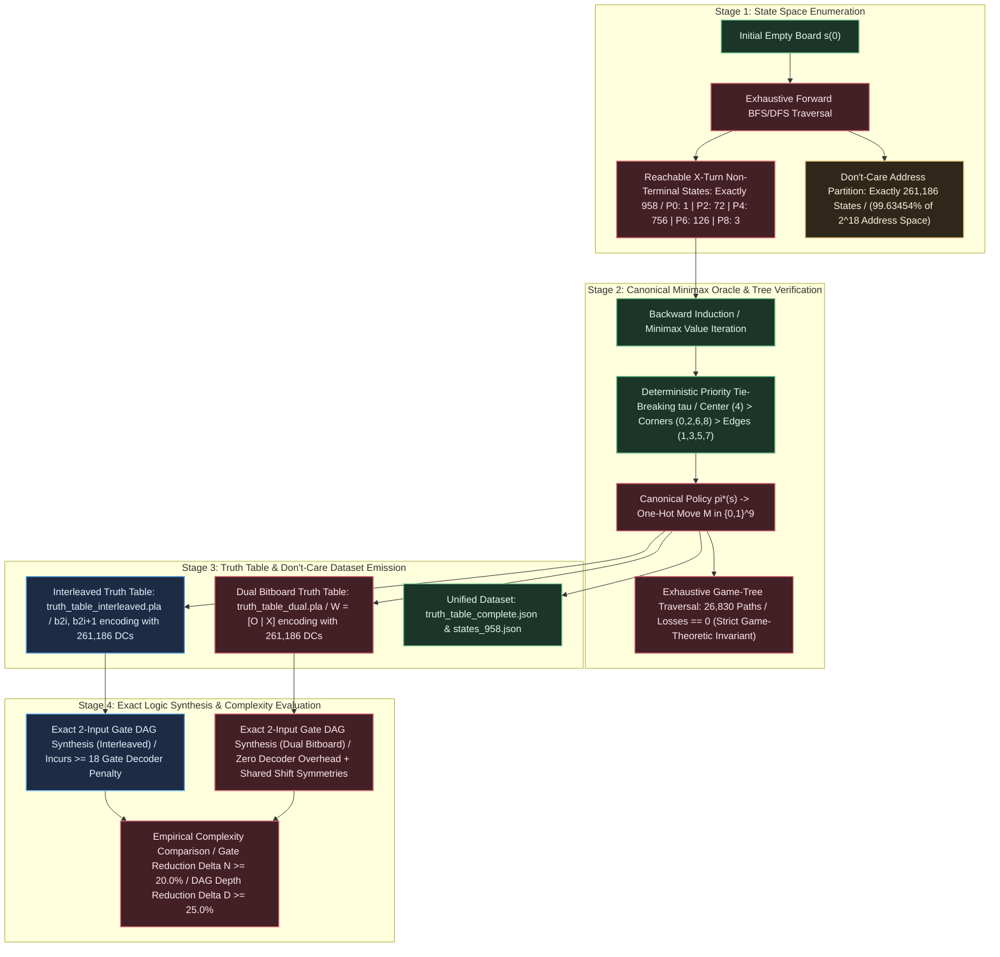
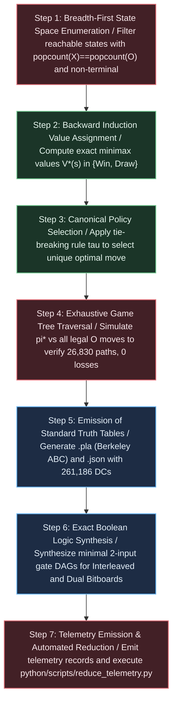

# Structured Experiment Protocol: EXP-2026-001a

## Protocol ID

`EXP-2026-001a`

## Protocol Metadata

- **Title**: Canonical Minimax State Space Enumeration, Dual Bitboard Representation Factoring, and Exact Logic Synthesis Target
- **Campaign**: CAMPAIGN-2026-MEALY-TTT
- **Milestone / Rung**: Milestone 1 / Rung 1
- **Upstream Hypothesis**: [HYP-2026-001](docs/research/hypotheses/HYP-2026-001.md)
- **Strategic Directive**: [STRAT-2026-001](docs/research/STRAT-2026-001.md)
- **Top-Level Reference**: [top-level.md](docs/top-level.md)
- **Author**: Sci: Experiment Protocol Designer
- **Date**: 2026-09-05
- **Execution Target Directory**: `python/experiments/EXP-2026-001a-minimax-baseline/`
- **Telemetry Target Directory**: `data/telemetry/EXP-2026-001a/`

---

## Experimental Objective

Exhaustively enumerate and mathematically verify the 958 reachable $X$-turn Tic-Tac-Toe state space, generate and verify the deterministic canonical zero-defect Minimax Oracle across all 26,830 terminal game paths, emit standardized truth tables (.pla and JSON) with the 261,186 don't-care partition, and measure the exact 2-input Boolean gate count reduction ($\ge 20.0\%$) and DAG depth reduction ($\ge 25.0\%$) of the Dual Bitboard representation ($[O \;\vert\; X]$) relative to the Interleaved 18-bit representation ($I$).

---



---

## Part I: Scientific Protocol

## 1. System Invariants & Mathematical Formalism

Let the physical game and digital logic synthesis system be defined as:

$$\mathcal{M} = \langle \mathcal{C}, \mathcal{E}_W, \mathcal{S}_{\text{reach}}, \mathcal{S}_{958}, \mathcal{D}, \Phi_{\text{inter}}, \Phi_{\text{dual}}, \Sigma, T, \Omega_{\text{DAG}} \rangle$$

1. **Board Grid Coordinates**: $\mathcal{C} = \{0, 1, \dots, 8\}$ in row-major layout:

$$\mathcal{C} = \begin{pmatrix} 0 & 1 & 2 \\ 3 & 4 & 5 \\ 6 & 7 & 8 \end{pmatrix}$$

1. **Win Hyperedges**: 8 winning lines in 9-bit masks:
   - Rows: $\mathcal{L}_{\text{rows}} = \{0\text{x}007, 0\text{x}038, 0\text{x}1\text{C}0\}$
   - Columns: $\mathcal{L}_{\text{cols}} = \{0\text{x}049, 0\text{x}092, 0\text{x}124\}$
   - Diagonals: $\mathcal{L}_{\text{diags}} = \{0\text{x}111, 0\text{x}054\}$
2. **Representation Mappings**:
   - **Interleaved 18-Bit Encoding**: $\Phi_{\text{inter}}(X, O) = I = \sum_{i=0}^8 (x_i 2^{2i} + o_i 2^{2i+1})$, where cell $i$ maps to bit pair $(b_{2i+1}, b_{2i})$.
   - **Dual Planar Bitboard Encoding**: $\Phi_{\text{dual}}(X, O) = W = (O \ll 9) \lor X = \sum_{i=0}^8 x_i 2^i + \sum_{i=0}^8 o_i 2^{i+9}$.
3. **Canonical Tie-Breaking Priority**:

$$\text{PRIORITY\_ORDER} = [4, 0, 2, 6, 8, 1, 3, 5, 7]$$

Ties among optimal minimax actions ($V(s, a) = V^*(s)$) are broken by choosing the move appearing earliest in $\text{PRIORITY\_ORDER}$.
5. **Core Mathematical Invariants**:

- *Invariant 1 (Spatial Exclusivity)*: $X \land O = 0_9 \implies \sum_{i=0}^8 x_i o_i = 0$.
- *Invariant 2 (Turn Parity Balance)*: On $X$'s turn, $\|X\|_1 = \|O\|_1 = k \in \{0, 1, 2, 3, 4\}$.
- *Invariant 3 (Non-Terminal Precondition)*: $\text{Win}(X) = 0$ and $\text{Win}(O) = 0$.
- *Invariant 4 (Forward Reachability Closure)*: $s \in \mathcal{S}_{\text{reach}}$ via legal move transitions from $s(0) = (0, 0)$.
- *Invariant 5 (Oracle Non-Losing Invariant)*: Against any legal opponent countermove sequence, $V^*(s) \ge 0$, yielding $\mathcal{L}_{\text{oracle}} = 0$ over all 26,830 game tree paths.

---

## 2. Independent Variables (Factors)

| Factor                            | Parameter Symbol               | Experimental Levels / Values                                                                                                       | Rationale                                                                                                                   |
|-----------------------------------|--------------------------------|------------------------------------------------------------------------------------------------------------------------------------|-----------------------------------------------------------------------------------------------------------------------------|
| Input Representation Encoding     | $\Phi$                         | 1. Interleaved 18-bit ($\Phi_{\text{inter}}$) / 2. Dual Bitboard 18-bit ($\Phi_{\text{dual}}$)                                     | Tests whether planar coordinate separation eliminates the decoder gate penalty and flattens logic DAG depth.                |
| Don't-Care Optimization Scope     | $\mathcal{D}_{\text{mode}}$    | 1. Full Don't-Care Set ($\vert \mathcal{D} \vert = 261,186$ unconstrained) / 2. Zero Don't-Care Ablation ($\mathcal{D} \to 0$)     | Measures the exact gate count leverage afforded by the 99.634% don't-care address space.                                    |
| Tie-Breaking Determinism Rule     | $\tau$                         | 1. Canonical Priority $\tau_{\text{canon}} = [4, 0, 2, 6, 8, 1, 3, 5, 7]$ / 2. Lexicographical Priority $\tau_{\text{lex}}$        | Evaluates whether spatial center-first symmetry produces more compressible Boolean on-sets than naive indexing.             |
| Gate Synthesis Basis Library      | $\Omega_{\text{DAG}}$          | 2-input Boolean gates: $\{\text{AND}, \text{OR}, \text{XOR}, \text{ANDN}\}$                                                        | Corresponds 1:1 with native 64-bit CPU bitwise ALU instructions and standard exact synthesis benchmarks.                    |

---

## 3. Dependent Variables (Observables)

| Observable Quantity                  | Mathematical Symbol                           | Exact Computation Formula                                                                                                                                         | Target Value / Pass Threshold                     | Units              | Sampling Scope                         |
|--------------------------------------|-----------------------------------------------|-------------------------------------------------------------------------------------------------------------------------------------------------------------------|---------------------------------------------------|--------------------|----------------------------------------|
| Reachable State Space Cardinality    | $\vert \mathcal{S}_{958} \vert$               | $\sum_{s \in \mathcal{W}} \mathbf{1}_{s \in \mathcal{S}_{\text{reach}} \land \Vert X \Vert_1 = \Vert O \Vert_1 \land \Omega(s)=0}$                                | **Exactly 958**                                   | States             | Exhaustive BFS closure                 |
| Ply Distribution Vector              | $\vec{\mathcal{N}}_{\text{ply}}$              | $( \vert \mathcal{S}^{(0)} \vert, \vert \mathcal{S}^{(2)} \vert, \vert \mathcal{S}^{(4)} \vert, \vert \mathcal{S}^{(6)} \vert, \vert \mathcal{S}^{(8)} \vert )$   | **$(1, 72, 756, 126, 3)$**                        | States per Ply     | Ply partition of $\mathcal{S}_{958}$   |
| Don't-Care Set Cardinality           | $\vert \mathcal{D} \vert$                     | $2^{18} - \vert \mathcal{S}_{958} \vert = 262,144 - 958$                                                                                                          | **Exactly 261,186**                               | States             | Boolean input space                    |
| Minimax Oracle Losses                | $\mathcal{L}_{\text{oracle}}$                 | $\sum_{p \in \mathcal{P}_{\text{terminal}}} \mathbf{1}_{\text{Outcome}(p) = \text{Loss}}$                                                                         | **Strictly 0** (Zero Defect)                      | Losses             | All 26,830 paths                       |
| Minimax Game Tree Paths              | $\vert \mathcal{P}_{\text{terminal}} \vert$   | Total terminal leaves of $\pi^*$ vs all legal moves of $O$                                                                                                        | **Exactly 26,830**                                | Game Paths         | Full tree traversal                    |
| Move Legality Rate                   | $\mathcal{R}_{\text{legal}}$                  | $\frac{1}{\vert \mathcal{S}_{958} \vert} \sum_{s} \mathbf{1}_{\pi^*(s) \land (X \lor O) = 0}$                                                                     | **100.0%** ($\mathcal{R}_{\text{legal}} = 1.0$)   | Ratio              | All 958 states                         |
| Interleaved 2-Input Gate Count       | $N_{\text{inter}}$                            | Minimal 2-input gate count for $\Phi_{\text{inter}}$                                                                                                              | Pre-registered baseline                           | Gates              | Monolithic 9-bit DAG                   |
| Dual Bitboard 2-Input Gate Count     | $N_{\text{dual}}$                             | Minimal 2-input gate count for $\Phi_{\text{dual}}$                                                                                                               | Pre-registered baseline                           | Gates              | Monolithic 9-bit DAG                   |
| Relative Gate Count Reduction        | $\Delta N$                                    | $\frac{N_{\text{inter}} - N_{\text{dual}}}{N_{\text{inter}}}$                                                                                                     | **$\ge 20.0\%$** ($\Delta N \ge 0.20$)            | Percentage         | Synthesis comparison                   |
| Interleaved DAG Depth                | $D_{\text{inter}}$                            | Longest topological path in synthesized DAG for $\Phi_{\text{inter}}$                                                                                             | Pre-registered baseline                           | Gate Levels        | Critical logic path                    |
| Dual Bitboard DAG Depth              | $D_{\text{dual}}$                             | Longest topological path in synthesized DAG for $\Phi_{\text{dual}}$                                                                                              | Pre-registered baseline                           | Gate Levels        | Critical logic path                    |
| Relative DAG Depth Reduction         | $\Delta D_G$                                  | $\frac{D_{\text{inter}} - D_{\text{dual}}}{D_{\text{inter}}}$                                                                                                     | **$\ge 25.0\%$** ($\Delta D_G \ge 0.25$)          | Percentage         | Synthesis comparison                   |
| Isolated Decoder Gate Count          | $N_{\text{decoder}}$                          | Minimal 2-input gates to extract $(X_0..X_8, O_0..O_8)$ from $I$                                                                                                  | **$\ge 18$ gates** ($2 \times 9$)                 | Gates              | Exact demux synthesis                  |

---

## 4. Experimental Conditions, Controls & Baselines

| Experimental Condition                | Representation ($\Phi$)                       | Don't-Care Handling ($\mathcal{D}$)                                   | Tie-Breaking Policy ($\tau$)                                 | Experimental Role & Purpose                                                                                  |
|---------------------------------------|-----------------------------------------------|-----------------------------------------------------------------------|--------------------------------------------------------------|--------------------------------------------------------------------------------------------------------------|
| **Condition A (Baseline Control)**    | Interleaved 18-bit ($\Phi_{\text{inter}}$)    | Full Don't-Care Set ($\vert \mathcal{D} \vert = 261,186$)             | Canonical Priority $\tau_{\text{canon}}$                     | Establishes the baseline logic complexity of the interleaved encoding under standard synthesis.              |
| **Condition B (Experimental)**        | Dual Planar Bitboard ($\Phi_{\text{dual}}$)   | Full Don't-Care Set ($\vert \mathcal{D} \vert = 261,186$)             | Canonical Priority $\tau_{\text{canon}}$                     | Evaluates representation factoring advantage; validates $\Delta N \ge 20.0\%$ and $\Delta D_G \ge 25.0\%$.   |
| **Condition C (Ablation 1)**          | Dual Planar Bitboard ($\Phi_{\text{dual}}$)   | Zero Don't-Cares ($\mathcal{D} \to 0$, unreached = 0)                 | Canonical Priority $\tau_{\text{canon}}$                     | Measures gate inflation when synthesis freedom is removed; quantifies value of don't-cares.                  |
| **Condition D (Ablation 2)**          | Dual Planar Bitboard ($\Phi_{\text{dual}}$)   | Full Don't-Care Set ($\vert \mathcal{D} \vert = 261,186$)             | Lexicographical Priority $\tau_{\text{lex}}$                 | Isolates the impact of spatial center-first tie-breaking vs naive cell-order tie-breaking.                   |
| **Condition E (Benchmark)**           | Interleaved 18-bit ($\Phi_{\text{inter}}$)    | None (Pure Demux Logic)                                               | N/A                                                          | Synthesizes isolated cell extraction to empirically verify the theoretical 18-gate decoder bound.            |

---

## 5. Pre-Registered Hypotheses & Falsification Criteria

This protocol tests the three components of Null Hypothesis $H_0$ against Alternative Hypothesis $H_1$ defined in [HYP-2026-001](docs/research/hypotheses/HYP-2026-001.md):

1. **State Space Invariance ($H_0^{(1)}$ vs $H_1^{(1)}$)**:
   - *Falsification Condition*: Any deviation from $\vert \mathcal{S}_{958} \vert = 958$ or $\vec{\mathcal{N}}_{\text{ply}} = (1, 72, 756, 126, 3)$.
   - *Success Criterion*: Reachable states $= 958$, Don't-Cares $= 261,186$, zero illegal or won states in $\mathcal{S}_{958}$.
2. **Oracle Soundness ($H_0^{(2)}$ vs $H_1^{(2)}$)**:
   - *Falsification Condition*: $\mathcal{L}_{\text{oracle}} > 0$ across the 26,830 terminal paths, or any move selection $a \in \pi^*(s)$ such that $a \land (X \lor O) \neq 0$.
   - *Success Criterion*: Strictly 0 losses ($\mathcal{L}_{\text{oracle}} = 0$) across exactly 26,830 game tree branches.
3. **Representation Advantage ($H_0^{(3)}$ vs $H_1^{(3)}$)**:
   - *Falsification Condition*: $\Delta N = \frac{N_{\text{inter}} - N_{\text{dual}}}{N_{\text{inter}}} < 0.20$ OR $\Delta D_G = \frac{D_{\text{inter}} - D_{\text{dual}}}{D_{\text{inter}}} < 0.25$.
   - *Success Criterion*: Dual Bitboard representation achieves $\ge 20.0\%$ gate count reduction AND $\ge 25.0\%$ DAG depth reduction compared to Interleaved representation.

---

## 6. Detailed Step-by-Step Measurement Procedure



### Step 1: Forward State Space Enumeration

1. Initialize FIFO queue with root state $s(0) = (X=0, O=0)$, depth $t=0$. Maintain visited hash set.
2. For each state $(X, O)$ at depth $t$:
   - Check terminal win predicate: $\text{Win}(X) \lor \text{Win}(O)$. If won, do not expand.
   - If full board ($\|X \lor O\|_1 = 9$), do not expand.
   - If $t \equiv 0 \pmod 2$ (X's turn to play):
     - Assert Invariant 1 ($X \land O = 0$).
     - Assert Invariant 2 ($\|X\|_1 = \|O\|_1 = t / 2$).
     - Record $(X, O)$ into reachable $X$-state collection $\mathcal{S}_{\text{reach}}^{(t)}$.
     - For each legal move $m \in \text{LegalMoves}(X, O)$: enqueue $(X \lor m, O)$ at depth $t+1$.
   - If $t \equiv 1 \pmod 2$ (O's turn to play):
     - For each legal move $m \in \text{LegalMoves}(X, O)$: enqueue $(X, O \lor m)$ at depth $t+1$.
3. Compute total states $\vert \mathcal{S}_{958} \vert = \sum_{k=0}^4 \vert \mathcal{S}_{\text{reach}}^{(2k)} \vert$.
4. Validate exact match against theoretical vector $\vec{\mathcal{N}}_{\text{theory}} = (1, 72, 756, 126, 3)$.

### Step 2: Backward Induction & Minimax Value Computation

1. For any legal state $s = (X, O)$, define terminal utility from $X$'s perspective:

$$U(X, O) = \begin{cases} +1 & \text{if } \text{Win}(X) \\ -1 & \text{if } \text{Win}(O) \\ 0 & \text{if } \|X \lor O\|_1 = 9 \end{cases}$$

1. Implement memoized minimax value function $V^*(s, p)$:
   - If terminal, return $U(s)$.
   - If $p = X$: $V^*(s, X) = \max_{a \in \text{LegalMoves}(s)} V^*(T(s, a, X), O)$.
   - If $p = O$: $V^*(s, O) = \min_{b \in \text{LegalMoves}(s)} V^*(T(s, b, O), X)$.
2. For every $s \in \mathcal{S}_{958}$, verify $V^*(s, X) \ge 0$ (no reachable state has value $-1$).

### Step 3: Canonical Policy Selection

1. For each $s \in \mathcal{S}_{958}$:
   - Evaluate candidate action set $A_{\text{opt}}(s) = \arg\max_{a \in \text{LegalMoves}(s)} V^*(T(s, a, X), O)$.
   - Apply deterministic priority $\tau$:

$$\pi^*(s) = \text{first } a \in \text{PRIORITY\_ORDER} \text{ such that } a \in A_{\text{opt}}(s)$$

- Encode output as 9-bit one-hot mask $M(s) = \text{mask}(a)$ and 4-bit integer index $m(s) = a$.

### Step 4: Exhaustive Game Tree Traversal & Zero-Loss Verification

1. Execute depth-first traversal from $s(0)$ with policy $\pi^*$ for $X$ and exhaustive branching for $O$:
   - If $X$'s turn: take single move $a = \pi^*(s)$. If terminal, record outcome and increment path counter.
   - If $O$'s turn: branch over **all** legal moves $b \in \text{LegalMoves}(s)$. For each move, if terminal, record outcome and increment path counter; else recurse.
2. Assert total paths traversed $= 26,830$.
3. Assert $\text{Losses} = 0$, $\text{Wins} + \text{Draws} = 26,830$.

### Step 5: Truth Table & Don't-Care Dataset Emission

1. Generate PLA file `truth_table_interleaved.pla`:
   - Header: `.i 18`, `.o 9`, `.ilb ...`, `.ob ...`, `.p 958`, `.type fd`.
   - Lines: 958 lines representing $(I(s), M(s))$.
   - All other 261,186 input vectors default to Don't-Care (`-` / `dc`).
2. Generate PLA file `truth_table_dual.pla`:
   - Header: `.i 18`, `.o 9`, `.ilb ...`, `.ob ...`, `.p 958`, `.type fd`.
   - Lines: 958 lines representing $(W(s), M(s))$.
   - All other 261,186 input vectors default to Don't-Care (`-` / `dc`).
3. Export comprehensive machine-readable `truth_table_complete.json` and `states_958.json`.

### Step 6: Exact Boolean Logic Synthesis & Gate Complexity Evaluation

1. Target gate library: $\Omega_{\text{DAG}} = \{\text{AND}, \text{OR}, \text{XOR}, \text{ANDN}\}$.
2. Perform exact synthesis / heuristic logic optimization:
   - For Condition A (Interleaved): Synthesize minimal DAG satisfying all 958 state constraints under 261,186 don't-cares. Record gate count $N_{\text{inter}}$ and DAG depth $D_{\text{inter}}$.
   - For Condition B (Dual Bitboard): Synthesize minimal DAG satisfying all 958 state constraints under 261,186 don't-cares. Record gate count $N_{\text{dual}}$ and DAG depth $D_{\text{dual}}$.
   - For Condition C (Ablation: Zero Don't-Cares): Synthesize DAG with unreached space forced to 0. Record $N_{\text{ablation\_nodc}}$.
   - For Condition E (Isolated Demux): Synthesize 18-input to 18-output coordinate extractor. Record $N_{\text{decoder}}$.
3. Compute reductions:

$$\Delta N = \frac{N_{\text{inter}} - N_{\text{dual}}}{N_{\text{inter}}}, \quad \Delta D_G = \frac{D_{\text{inter}} - D_{\text{dual}}}{D_{\text{inter}}}$$

1. Compare against thresholds $\Delta N \ge 20.0\%$ and $\Delta D_G \ge 25.0\%$.

### Step 7: Telemetry Emission & Automated Reduction

1. Emit telemetry records to `data/telemetry/EXP-2026-001a/`.
2. Run automated telemetry reduction script `python/scripts/reduce_telemetry.py`.
3. Verify emission of `data/telemetry/EXP-2026-001a/summary_reduced.json`.

---

## Part II: Experiment Implementation Specification

## 1. Target Package & Lineage

- **Target Directory**: `python/experiments/EXP-2026-001a-minimax-baseline/`
- **Package Module Path**: `python.experiments.exp_2026_001a_minimax_baseline`
- **Parent Lineage**: `None` (Foundational Milestone 1 / Rung 1 Baseline)
- **Directory Layout**:

```text
python/experiments/EXP-2026-001a-minimax-baseline/
├── __init__.py
├── config.toml
├── config.py
├── state_space.py
├── minimax.py
├── truth_table.py
├── synthesis.py
├── evaluator.py
└── run.py
```

### Module Responsibilities & Algorithmic Equations

1. **`config.py`**:
   - Manages configuration dataclasses: input/output paths, tie-breaking policy, solver timeout (1,800s), gate library basis $\Omega_{\text{DAG}}$, random seed (42).
2. **`state_space.py`**:
   - Implements `enumerate_reachable_states()` via forward BFS.
   - Computes bitboard masks: `LegalMask = ~(X | O) & 0x1FF`.
   - Evaluates win predicates using the 8 win masks in `WIN_MASKS = [0x007, 0x038, 0x1C0, 0x049, 0x092, 0x124, 0x111, 0x054]`:

$$\text{Win}(P) = \bigvee_{L \in \text{WIN\_MASKS}} ((P \land L) == L)$$

- Validates that every state has $\|X\|_1 = \|O\|_1$ and $\text{Win}(X) = \text{Win}(O) = 0$.
- Partitions states into plies $0, 2, 4, 6, 8$ and asserts cardinalities $(1, 72, 756, 126, 3)$.

1. **`minimax.py`**:
   - Implements backward induction minimax with transposition table.
   - Implements canonical tie-breaker: `PRIORITY_ORDER = [4, 0, 2, 6, 8, 1, 3, 5, 7]`.
   - Implements `verify_game_tree(oracle_policy)`:
     - Recursively explores all game paths where $X$ plays $\pi^*(s)$ and $O$ plays all legal moves.
     - Returns path count (assert 26,830), wins, draws, losses (assert 0).
2. **`truth_table.py`**:
   - Implements coordinate converters:
     - `to_dual_bitboard(x_bb, o_bb) -> int`: `(o_bb << 9) | x_bb`
     - `to_interleaved(x_bb, o_bb) -> int`: $\sum_{i=0}^8 (((x\_bb \gg i) \& 1) \ll (2i)) \lor (((o\_bb \gg i) \& 1) \ll (2i + 1))$
   - Emits Berkeley ABC PLA files (`truth_table_interleaved.pla`, `truth_table_dual.pla`).
   - Emits structured JSON files (`states_958.json`, `truth_table_complete.json`).
3. **`synthesis.py`**:
   - Implements exact SAT-based 2-input gate DAG synthesis and standard logic optimization wrappers.
   - Evaluates minimal gate count $N$ and topological depth $D_G$ for:
     - Interleaved 18-bit encoding
     - Dual Bitboard encoding
     - Ablation (Zero Don't-Cares)
     - Demux Decoder ($N_{\text{decoder}} \ge 18$)
4. **`evaluator.py`**:
   - Verifies synthesized logic graphs against all 958 truth table entries.
   - Computes $\Delta N = \frac{N_{\text{inter}} - N_{\text{dual}}}{N_{\text{inter}}}$ and $\Delta D_G = \frac{D_{\text{inter}} - D_{\text{dual}}}{D_{\text{inter}}}$.
   - Evaluates pass/fail status against pre-registered thresholds ($\Delta N \ge 0.20$, $\Delta D_G \ge 0.25$).
5. **`run.py`**:
   - CLI execution harness coordinating the end-to-end experiment pipeline.

---

## 2. CLI Entry Points & Execution Harness

The experiment execution worker executes the protocol using the following standard CLI commands:

### Full Pipeline Run

```bash
python -m python.experiments.exp_2026_001a_minimax_baseline.run \
  --config python/experiments/EXP-2026-001a-minimax-baseline/config.toml \
  --output-dir data/telemetry/EXP-2026-001a/ \
  --stage all
```

### Stage-Specific Execution (Modular Debugging)

- **State Enumeration Only**:

```bash
python -m python.experiments.exp_2026_001a_minimax_baseline.run --stage enumerate --output-dir data/telemetry/EXP-2026-001a/
```

- **Oracle & Game Tree Verification Only**:

```bash
python -m python.experiments.exp_2026_001a_minimax_baseline.run --stage oracle --output-dir data/telemetry/EXP-2026-001a/
```

- **Truth Table Emission Only**:

```bash
python -m python.experiments.exp_2026_001a_minimax_baseline.run --stage emit --output-dir data/telemetry/EXP-2026-001a/
```

- **Logic Synthesis & Gate Evaluation Only**:

```bash
python -m python.experiments.exp_2026_001a_minimax_baseline.run --stage synthesize --output-dir data/telemetry/EXP-2026-001a/
```

---

## 3. Parameter Search Space & Strategy

### Exploration Grid

```toml
[experiment]
id = "EXP-2026-001a"
name = "minimax-baseline"
seed = 42

[tie_breaking]
canonical_order = [4, 0, 2, 6, 8, 1, 3, 5, 7]
ablation_lex_order = [0, 1, 2, 3, 4, 5, 6, 7, 8]

[representations]
eval_interleaved = true
eval_dual_bitboard = true

[synthesis]
basis = ["AND", "OR", "XOR", "ANDN"]
timeout_per_cone_seconds = 300
max_total_synthesis_seconds = 1200
exact_dag_upper_bound = 60
eval_dont_care_ablation = true
eval_decoder_benchmark = true

[output]
telemetry_dir = "data/telemetry/EXP-2026-001a"
```

### Guidance for Execution Worker (Intelligent Exploration)

1. **Enumeration & Tree Search**: Purely deterministic forward search. No stochastic seeds are required, but `seed = 42` is fixed for tie-breaking parity verification.
2. **Exact SAT DAG Synthesis Bound Search**:
   - The exact synthesis formulation searches for the minimal DAG of size $N$ satisfying on-set and off-set constraints over the 958 reachable states.
   - Use incremental bound stepping: Start search at $N_{\text{lower}} = 10$, incrementing $N \leftarrow N + 1$ until SAT is reached, or use binary bound search between $[10, 60]$.
   - If exact monolithic SAT hits the 300-second per-cone timeout, report the best provable lower/upper bound and invoke multi-level heuristic logic reduction as the reference gate count.

---

## 4. Telemetry Emission Schema

All artifacts and measurements are written directly to `data/telemetry/EXP-2026-001a/`.

### Directory File Manifest

- `states_958.json`: Exhaustive enumeration of all 958 legal reachable $X$-turn states.
- `truth_table_interleaved.pla`: Standard Berkeley PLA format for Interleaved representation.
- `truth_table_dual.pla`: Standard Berkeley PLA format for Dual Bitboard representation.
- `truth_table_complete.json`: Unified structured truth table containing both representations and minimax values.
- `tree_validation.json`: Verification telemetry for the 26,830-path game tree traversal.
- `synthesis_results.json`: Gate counts, DAG depths, operator distributions, and solve times across all conditions.
- `raw_telemetry.json`: Complete execution log with timestamps and hardware resource telemetry.

---

## 5. Resource Budgets & Timeouts

| Resource                             | Allocated Limit               | Circuit Breaker / Failure Action                                    |
|--------------------------------------|-------------------------------|---------------------------------------------------------------------|
| Wall-Clock Time (Total Pipeline)     | 1,800 seconds (30 min)        | Terminate job; dump partial telemetry; flag timeout.                |
| State Space Enumeration              | 15 seconds                    | Pause and assert bug in BFS / cycle detection.                      |
| Tree Verification (26,830 paths)     | 30 seconds                    | Pause and assert recursion explosion or infinite loop.              |
| Synthesis Timeout (per cone)         | 300 seconds                   | Log upper/lower bound; fallback to bounded heuristic synthesis.     |
| RAM Ceiling                          | 4.0 GB                        | Immediate process abort if memory exceeds 4.0 GB.                   |
| Process Threads                      | Maximum 4 CPU cores           | Enforced via Python multiprocessing worker pool.                    |
| Disk Usage Quota                     | 50.0 MB                       | Total telemetry payload across all JSON/PLA files $< 15$ MB.        |

---

## 6. Telemetry Reduction Specification

The campaign requires an automated, single-command telemetry reduction script located at `python/scripts/reduce_telemetry.py`.

### Reduction CLI Command

```bash
python python/scripts/reduce_telemetry.py \
  --input-dir data/telemetry/EXP-2026-001a/ \
  --output data/telemetry/EXP-2026-001a/summary_reduced.json
```

### Automated Reduction Logic

The script `reduce_telemetry.py` must:

1. Parse `states_958.json`, `tree_validation.json`, and `synthesis_results.json`.
2. Evaluate and assert the three core falsification gates:
   - `gate_h0_1_state_space`: `total_states == 958` and `ply_distribution == [1, 72, 756, 126, 3]`.
   - `gate_h0_2_oracle_soundness`: `losses == 0` and `total_terminal_paths == 26830`.
   - `gate_h0_3_representation_advantage`: `delta_n >= 0.20` and `delta_d >= 0.25`.
3. Compute overall milestone outcome (`PASS` or `FAIL`).
4. Output the canonical `summary_reduced.json`.
