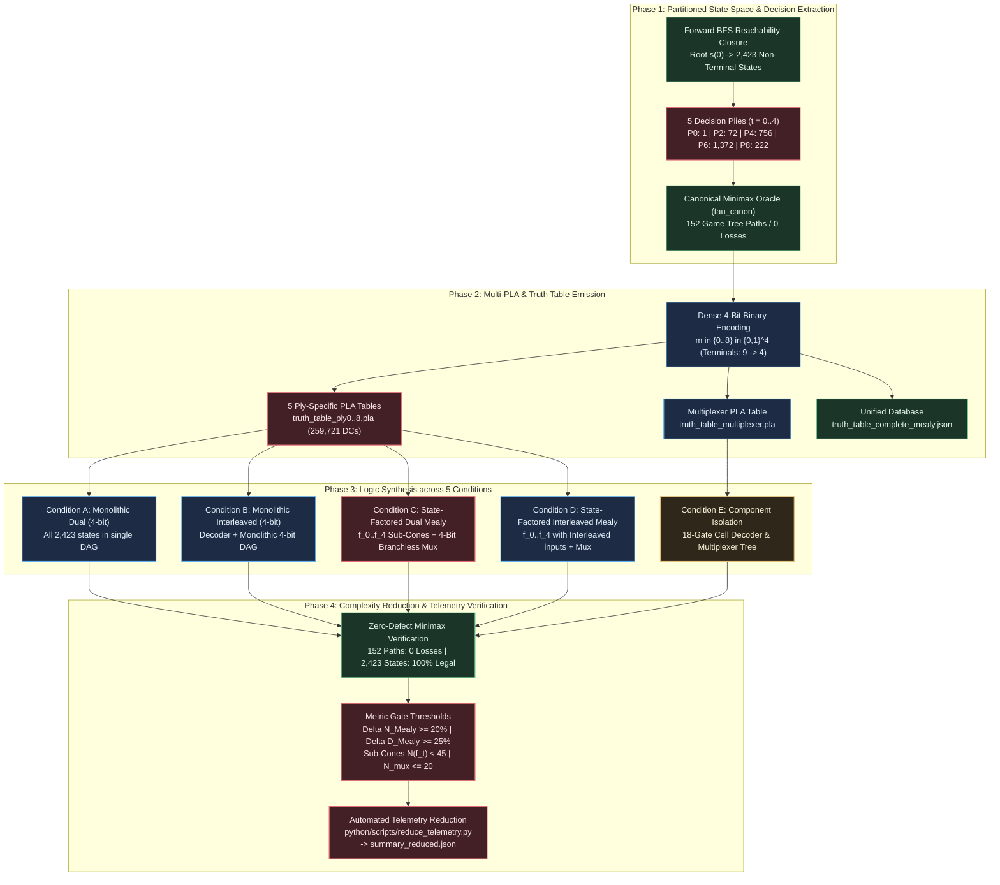

# Structured Experiment Protocol: EXP-2026-002a

## Protocol ID

`EXP-2026-002a`

## Protocol Metadata

- **Title**: State-Factored Ply Decomposition Mealy Machine and Dense 4-Bit Binary Move Encoding over the 2,423 Non-Terminal X-Decision Space
- **Campaign**: CAMPAIGN-2026-MEALY-TTT
- **Milestone / Rung**: Milestone 2 / Rungs 2 & 3 Co-Activation
- **Upstream Hypothesis**: [HYP-2026-002](file:///workspaces/ttt-experiment-2/docs/research/hypotheses/HYP-2026-002.md)
- **Iteration Directive**: [ITER-2026-001a-01](file:///workspaces/ttt-experiment-2/docs/research/ITER-2026-001a-01.md)
- **Diagnostic Reference**: [DIAG-2026-001a](file:///workspaces/ttt-experiment-2/docs/research/diagnostics/DIAG-2026-001a.md)
- **Strategic Directive**: [STRAT-2026-001](file:///workspaces/ttt-experiment-2/docs/research/STRAT-2026-001.md)
- **Top-Level Reference**: [top-level.md](file:///workspaces/ttt-experiment-2/docs/top-level.md)
- **Campaign Tracker**: [CAMPAIGN.md](file:///workspaces/ttt-experiment-2/docs/research/CAMPAIGN.md)
- **Author**: Sci: Experiment Protocol Designer
- **Date**: 2026-09-05
- **Target Execution Directory**: `python/experiments/exp_2026_002a_ply_mealy/`
- **Target Telemetry Directory**: `data/telemetry/EXP-2026-002a/`
- **Allocated Compute Budget**: $\le 2.0$ Compute-Hours ($7,200$ seconds)

---

## Experimental Objective

Operationalize and empirically evaluate the State-Factored Ply Decomposition Mealy Machine (5-stage conditioned sub-circuits $f_0 \dots f_4$ plus 3-to-5 stage decoder/multiplexer) against monolithic baselines across Dual Bitboard and Interleaved representations using Dense 4-bit Binary Move Encoding over the verified 2,423 non-terminal $X$-decision states, validating a $\ge 20.0\%$ gate count reduction ($\Delta N_{\text{Mealy}} \ge 0.20$), a $\ge 25.0\%$ DAG depth reduction ($\Delta D_{\text{Mealy}} \ge 0.25$), and invariant zero oracle loss ($\mathcal{L}_{\text{oracle}} = 0$) within a $\le 2.0$ Compute-Hour execution budget.

---



---

## Part I: Scientific Protocol

### 1. System Invariants & Mathematical Formalism

The experimental system operationalizes the State-Factored Mealy Machine defined in [HYP-2026-002](file:///workspaces/ttt-experiment-2/docs/research/hypotheses/HYP-2026-002.md):

$$\mathcal{M}_{\text{Mealy}} = \langle \mathcal{C}, \mathcal{E}_W, \mathcal{W}, \mathcal{S}_{2423}, \mathcal{S}_{\text{reg}}, \Sigma_{\text{bin}}, \delta, \lambda, S_0, \Omega_{\text{DAG}} \rangle$$

#### 1.1 Board Coordinates & Winning Hypergraph

- **Grid Coordinates**: $\mathcal{C} = \{0, 1, \dots, 8\}$ in row-major layout:

$$\mathcal{C} = \begin{pmatrix} 0 & 1 & 2 \\ 3 & 4 & 5 \\ 6 & 7 & 8 \end{pmatrix}$$

- **Collinear Win Hypergraph**: $H = (\mathcal{C}, \mathcal{E}_W)$ with $|\mathcal{E}_W| = 8$ hyperedges of cardinality 3:

$$\mathcal{E}_W = \{ \{0,1,2\}, \{3,4,5\}, \{6,7,8\}, \{0,3,6\}, \{1,4,7\}, \{2,5,8\}, \{0,4,8\}, \{2,4,6\} \}$$

In 9-bit bitmask representation:
$$\mathcal{L}_{\text{rows}} = \{0\text{x}007, 0\text{x}038, 0\text{x}1\text{C}0\}, \quad \mathcal{L}_{\text{cols}} = \{0\text{x}049, 0\text{x}092, 0\text{x}124\}, \quad \mathcal{L}_{\text{diags}} = \{0\text{x}111, 0\text{x}054\}$$

#### 1.2 Board Representations

- **Planar Dual Bitboard Vector Space**:
  $$\mathcal{W} = \{ (X, O) \in \mathbb{F}_2^9 \times \mathbb{F}_2^9 \mid X \land O = 0_9 \}$$
  Packed 18-bit register:
  $$W = \Phi_{\text{dual}}(X, O) = (O \ll 9) \lor X = \sum_{i=0}^8 X_i 2^i + \sum_{i=0}^8 O_i 2^{i+9}$$

- **Interleaved Comparison Space**:
  $$I = \Phi_{\text{inter}}(X, O) = \sum_{i=0}^8 \left( X_i \cdot 2^{2i} + O_i \cdot 2^{2i+1} \right) \in \{0, 1\}^{18}$$

#### 1.3 Physical Decision State Space Partition ($\mathcal{S}_{2423}$)

The domain of valid inputs consists of the verified 2,423 non-terminal $X$-decision states:

$$\mathcal{S}_{2423} = \bigsqcup_{t=0}^4 \mathcal{S}^{(2t)}$$

where stage index $t \in \{0, 1, 2, 3, 4\}$ denotes discrete $X$-turns corresponding to physical plies $2t \in \{0, 2, 4, 6, 8\}$:

1. **Stage 0 ($t=0$, Ply 0)**: Empty board $s(0) = (0, 0)$, $\vert\mathcal{S}^{(0)}\vert = 1$.
2. **Stage 1 ($t=1$, Ply 2)**: 1 piece each for $X$ and $O$, $\vert\mathcal{S}^{(2)}\vert = 9 \times 8 = 72$.
3. **Stage 2 ($t=2$, Ply 4)**: 2 pieces each for $X$ and $O$, $\vert\mathcal{S}^{(4)}\vert = \binom{9}{2}\binom{7}{2} = 36 \times 21 = 756$.
4. **Stage 3 ($t=3$, Ply 6)**: 3 pieces each for $X$ and $O$, forward-reachable non-terminal positions, $\vert\mathcal{S}^{(6)}\vert = 1,372$.
5. **Stage 4 ($t=4$, Ply 8)**: 4 pieces each for $X$ and $O$, forced 1-move draw positions, $\vert\mathcal{S}^{(8)}\vert = 222$.

$$\sum_{t=0}^4 \vert\mathcal{S}^{(2t)}\vert = 1 + 72 + 756 + 1,372 + 222 = 2,423$$

- **Don't-Care Optimization Domain**:
  $$\vert\mathcal{D}\vert = 2^{18} - 2,423 = 259,721 \text{ states } (99.07604\% \text{ of address space})$$

#### 1.4 Dense 4-Bit Binary Move Encoding ($\Sigma_{\text{bin}}$)

Moves are encoded as 4-bit binary integers $m = (m_3, m_2, m_1, m_0)_2 = \sum_{j=0}^3 m_j 2^j \in \{0..8\} \subset \{0, 1\}^4$:

| Coordinate Cell Index | Grid Location | 4-Bit Binary Vector $(m_3, m_2, m_1, m_0)_2$ | Integer Value |
| :---: | :---: | :---: | :---: |
| 0 | Top-Left | `0000` | 0 |
| 1 | Top-Center | `0001` | 1 |
| 2 | Top-Right | `0010` | 2 |
| 3 | Mid-Left | `0011` | 3 |
| 4 | Center | `0100` | 4 |
| 5 | Mid-Right | `0101` | 5 |
| 6 | Bottom-Left | `0110` | 6 |
| 7 | Bottom-Center | `0111` | 7 |
| 8 | Bottom-Right | `1000` | 8 |

Values `1001` through `1111` ($9 \dots 15$) represent output don't-cares.

#### 1.5 State Transition, Stage Decoding, & Recombination

- **Internal State Register**: $S = (s_2, s_1, s_0)_2 \in \{0, 1\}^3$, $\text{val}(S) \in \{0, 1, 2, 3, 4\}$.
- **Autonomous Combinational Ply Detector**: In stateless deployment, $t(W) = \frac{\text{popcount}(X) + \text{popcount}(O)}{2}$.
- **Stage-Select Equality Predicates**:
  $$\text{eq}_0(S) = \overline{s_2} \land \overline{s_1} \land \overline{s_0}$$
  $$\text{eq}_1(S) = \overline{s_2} \land \overline{s_1} \land s_0$$
  $$\text{eq}_2(S) = \overline{s_2} \land s_1 \land \overline{s_0}$$
  $$\text{eq}_3(S) = \overline{s_2} \land s_1 \land s_0$$
  $$\text{eq}_4(S) = s_2 \land \overline{s_1} \land \overline{s_0}$$
- **4-Bit Broadcast Mask**: $\text{Mask}_t(S) = (\text{eq}_t(S), \text{eq}_t(S), \text{eq}_t(S), \text{eq}_t(S))_2$.
- **Bit-Parallel Branchless Recombination**:
  $$\text{Move} = \bigoplus_{t=0}^4 \left( \text{Mask}_t(S) \land f_t(W) \right) \equiv \bigvee_{t=0}^4 \left( \text{Mask}_t(S) \land f_t(W) \right)$$

#### 1.6 Core Mathematical Invariants

- **Invariant 1 (Spatial Exclusivity)**: $\forall W \in \mathcal{S}_{2423}, X \land O = 0_9 \implies \sum_{i=0}^8 X_i O_i = 0$.
- **Invariant 2 (Turn Parity & Popcount Conservation)**: $\forall W \in \mathcal{S}^{(2t)}, \Vert X \Vert_1 = \Vert O \Vert_1 = t \implies \Vert X \lor O \Vert_1 = 2t$.
- **Invariant 3 (Non-Terminal Precondition)**: $\forall W \in \mathcal{S}_{2423}, \text{Win}(X) = 0 \land \text{Win}(O) = 0$.
- **Invariant 4 (Forward Reachability Closure)**: $\mathcal{S}_{2423} = \{ W \in \mathcal{W} \mid s(0) \to^* W \land \Vert X \Vert_1 = \Vert O \Vert_1 \land \Omega(W) = 0 \}$, exact cardinality $2,423$.
- **Invariant 5 (Canonical Minimax Zero Defect)**: $\mathcal{L}_{\text{oracle}} = 0$ across all 152 deterministic play-out paths under $\tau_{\text{canon}} = [4, 0, 2, 6, 8, 1, 3, 5, 7]$; move legality rate $\mathcal{R}_{\text{legal}} = 100.0\%$ over all 2,423 states.
- **Invariant 6 (Stage-Select Orthogonality)**: $\sum_{t=0}^4 \text{eq}_t(S) = 1 \land \forall t \neq t', \text{Mask}_t(S) \land \text{Mask}_{t'}(S) = 0000_2$.

---

### 2. Independent Variables (Factors)

| Factor | Parameter Symbol | Experimental Levels / Values | Rationale |
| --- | --- | --- | --- |
| Macro-Architectural Partitioning | $\text{Arch}$ | 1. Monolithic Single-Stage DAG; 2. State-Factored 5-Stage Mealy Machine ($f_0 \dots f_4 + \text{Mux}$) | Evaluates whether decomposing logic across decision plies eliminates monolithic circuit amortization. |
| Move Action Encoding | $\Sigma_{\text{out}}$ | 1. Dense 4-Bit Binary ($m \in \{0..8\} \subset \{0, 1\}^4$); 2. 9-Bit One-Hot ($M \in \{0, 1\}^9$, Cycle 1 Reference) | Measures the gate count reduction afforded by collapsing output terminals from 9 to 4. |
| Input State Representation | $\Phi$ | 1. Planar Dual Bitboard ($W = [O \;\vert\; X]$); 2. Interleaved 18-bit ($I$) | Tests whether planar coordinate separation delivers $\ge 20.0\%$ gate reduction in decomposed sub-cones. |
| Stage Select Mechanism | $\text{Mode}_{\text{stage}}$ | 1. Sequential 3-Bit State Register ($S \in \{0..4\}$); 2. Combinational Popcount ($t = \Vert X \lor O \Vert_1 / 2$) | Compares software SWAR/sequential zero-overhead execution against full combinational hardware realization. |
| Gate Synthesis Library | $\Omega_{\text{DAG}}$ | 2-input Boolean gates: $\{\text{AND}, \text{OR}, \text{XOR}, \text{ANDN}\}$ | Corresponds strictly 1:1 with native 64-bit CPU bitwise ALU instructions. |

---

### 3. Dependent Variables (Observables)

| Observable Quantity | Mathematical Symbol | Exact Computation Formula | Target Value / Pass Threshold | Units | Sampling Scope |
| --- | --- | --- | --- | --- | --- |
| Reachable Decision States | $\vert\mathcal{S}_{2423}\vert$ | $\sum_{s \in \mathcal{W}} \mathbf{1}_{s \in \mathcal{S}_{\text{reach}} \land \Vert X \Vert_1 = \Vert O \Vert_1 \land \Omega(s) = 0}$ | **Exactly 2,423** | States | Forward BFS reachability |
| Ply Partition Cardinalities | $\vec{\mathcal{N}}_{\text{ply}}$ | $(\vert\mathcal{S}^{(0)}\vert, \vert\mathcal{S}^{(2)}\vert, \vert\mathcal{S}^{(4)}\vert, \vert\mathcal{S}^{(6)}\vert, \vert\mathcal{S}^{(8)}\vert)$ | **$(1, 72, 756, 1372, 222)$** | States per Ply | Ply partition of $\mathcal{S}_{2423}$ |
| Don't-Care State Space | $\vert\mathcal{D}\vert$ | $2^{18} - \vert\mathcal{S}_{2423}\vert = 262,144 - 2,423$ | **Exactly 259,721** | States | 18-bit address space |
| Minimax Oracle Losses | $\mathcal{L}_{\text{oracle}}$ | $\sum_{p \in \mathcal{P}_{\text{canonical}}} \mathbf{1}_{\text{Outcome}(p) = \text{Loss}}$ | **Strictly 0** (Zero Defect) | Losses | All 152 deterministic paths |
| Canonical Play-Out Paths | $\vert\mathcal{P}_{\text{canonical}}\vert$ | Traversal leaf count under $\pi^*$ vs legal opponent countermoves | **Exactly 152** | Game Paths | Full tree traversal |
| Move Legality Rate | $\mathcal{R}_{\text{legal}}$ | $\frac{1}{\vert\mathcal{S}_{2423}\vert} \sum_{s} \mathbf{1}_{(1 \ll m(s)) \land (X \lor O) = 0}$ | **100.0%** ($\mathcal{R}_{\text{legal}} = 1.0$) | Ratio | All 2,423 states |
| Stage 0 Sub-Circuit Gate Count | $N_{\text{dual}}(f_0)$ | Direct logic cost of constant center move $m = 4$ (`0100`) | **0 gates** | Gates | Stage 0 DAG ($t=0$) |
| Stage 1 Sub-Circuit Gate Count | $N_{\text{dual}}(f_1)$ | Minimal 2-input gates for 72 states under 4-bit output | $\le \mathbf{12 \text{ gates}}$ | Gates | Stage 1 DAG ($t=1$) |
| Stage 2 Sub-Circuit Gate Count | $N_{\text{dual}}(f_2)$ | Minimal 2-input gates for 756 states under 4-bit output | $\le \mathbf{28 \text{ gates}}$ | Gates | Stage 2 DAG ($t=2$) |
| Stage 3 Sub-Circuit Gate Count | $N_{\text{dual}}(f_3)$ | Minimal 2-input gates for 1,372 states under 4-bit output | $\le \mathbf{32 \text{ gates}}$ | Gates | Stage 3 DAG ($t=3$) |
| Stage 4 Sub-Circuit Gate Count | $N_{\text{dual}}(f_4)$ | Minimal 2-input gates for 222 states under 4-bit output | $\le \mathbf{8 \text{ gates}}$ | Gates | Stage 4 DAG ($t=4$) |
| Operational Ply Gate Reduction | $\Delta N(f_t)$ | $\frac{N_{\text{inter}}(f_t) - N_{\text{dual}}(f_t)}{N_{\text{inter}}(f_t)}$ for $t \in \{1, 2, 3\}$ | **$\ge 20.0\%$** | Percentage | Individual ply sub-cones |
| Multiplexer Gate Overhead | $N_{\text{mux}}$ | Minimal gates for 3-to-5 stage decoder + 4-bit multiplexer | $\le \mathbf{20 \text{ gates}}$ | Gates | Component Isolation E2 |
| Multiplexer Logic Depth | $D_{\text{mux}}$ | Longest topological path in stage multiplexer tree | $\le \mathbf{3 \text{ levels}}$ | Gate Levels | Component Isolation E2 |
| Isolated Decoder Penalty | $N_{\text{decoder}}$ | Minimal gates to demux 9 cell pairs $(b_{2i}, b_{2i+1})$ | **Exactly 18 gates** | Gates | Component Isolation E1 |
| Mealy Relative Gate Reduction | $\Delta N_{\text{Mealy}}$ | $\frac{N_{\text{inter}}(C_{\text{Mealy}}) - N_{\text{dual}}(C_{\text{Mealy}})}{N_{\text{inter}}(C_{\text{Mealy}})}$ | **$\ge 20.0\%$** | Percentage | Full Condition D vs C |
| Mealy Relative Depth Reduction | $\Delta D_{\text{Mealy}}$ | $\frac{D_{\text{inter}}(C_{\text{Mealy}}) - D_{\text{dual}}(C_{\text{Mealy}})}{D_{\text{inter}}(C_{\text{Mealy}})}$ | **$\ge 25.0\%$** | Percentage | Full Condition D vs C |
| Monolithic 4-Bit Gate Count | $N_{\text{dual}}(\text{mono}_{\text{4bit}})$ | Monolithic DAG size synthesizing 4-bit binary output | $\le \mathbf{45 \text{ gates}}$ | Gates | Condition A |
| Decomposition Gate Advantage | $\Delta N_{\text{decomp}}$ | $N_{\text{dual}}(\text{mono}_{\text{4bit}}) - N_{\text{dual}}(C_{\text{Mealy}})$ | **$> 0 \text{ gates}$** | Gates | Condition A vs C |

---

### 4. Experimental Conditions, Controls & Baselines

| Experimental Condition | Representation ($\Phi$) | Macro-Architecture | Output Encoding | Don't-Care Scope | Experimental Role & Purpose |
| --- | --- | --- | --- | --- | --- |
| **Condition A (Baseline Control 1)** | Dual Bitboard ($W$) | Monolithic Single DAG | Dense 4-Bit Binary ($m \in \{0..8\}$) | Full $\vert\mathcal{D}\vert = 259,721$ | Evaluates monolithic 4-bit binary output complexity on planar dual bitboards. Isolates the impact of 4-bit encoding alone without ply decomposition. |
| **Condition B (Baseline Control 2)** | Interleaved ($I$) | Monolithic Single DAG | Dense 4-Bit Binary ($m \in \{0..8\}$) | Full $\vert\mathcal{D}\vert = 259,721$ | Measures monolithic interleaved 4-bit complexity (incurs 18-gate front-end decoder). Baseline for monolithic representation comparison. |
| **Condition C (Experimental Target)** | Dual Bitboard ($W$) | State-Factored Mealy ($f_0 \dots f_4 + \text{Mux}$) | Dense 4-Bit Binary ($m \in \{0..8\}$) | Partitioned $\mathcal{D}_t$ per ply ($2^{18} - \vert\mathcal{S}^{(2t)}\vert$) | **Core Innovation**: Synthesizes 5 disjoint ply sub-functions over dual bitboards recombined via branchless masking. Validates $N(f_t) < 45$ and $\Delta N \ge 20.0\%$. |
| **Condition D (Ablation / Comparison)** | Interleaved ($I$) | State-Factored Mealy ($f_0 \dots f_4 + \text{Mux}$) | Dense 4-Bit Binary ($m \in \{0..8\}$) | Partitioned $\mathcal{D}_t$ per ply ($2^{18} - \vert\mathcal{S}^{(2t)}\vert$) | Evaluates ply decomposition over interleaved inputs. Provides direct comparator for Condition C to calculate $\Delta N_{\text{Mealy}}$ and $\Delta D_{\text{Mealy}}$. |
| **Condition E (Component Isolation)** | Isolated Logic | Sub-circuit Benchmarks | Specialized (Demux / Stage Masks) | None (Exact Component Logic) | Benchmarks isolated primitives: E1 measures 18-gate cell decoder; E2 measures 3-to-5 stage decoder + 4-bit 5-to-1 mux tree ($N_{\text{mux}} \le 20, D_{\text{mux}} \le 3$). |

---

### 5. Pre-Registered Hypotheses & Quantitative Falsification Criteria

This protocol tests the formal hypotheses specified in [HYP-2026-002](file:///workspaces/ttt-experiment-2/docs/research/hypotheses/HYP-2026-002.md):

#### 5.1 Sub-Circuit Complexity Bounds ($H_0^{(1)}$ vs $H_1^{(1)}$)

- **Null Hypothesis $H_0^{(1)}$**: Stage-factored sub-functions require $N_{\text{dual}}(f_t) \ge 45$ gates for any stage $t$, or total Mealy machine gate count exceeds the monolithic baseline ($N_{\text{Mealy}} \ge 123$).
- **Alternative Hypothesis $H_1^{(1)}$**: All 5 stage sub-functions satisfy individual upper bounds:
  $$N_{\text{dual}}(f_0) = 0, \quad N_{\text{dual}}(f_1) \le 12, \quad N_{\text{dual}}(f_2) \le 28, \quad N_{\text{dual}}(f_3) \le 32, \quad N_{\text{dual}}(f_4) \le 8$$
  with every stage satisfying $N_{\text{dual}}(f_t) < 45$ gates.
- **Falsification Threshold**: Any $N_{\text{dual}}(f_t)$ exceeding its respective bound, or $\exists t \in \{0..4\}, N_{\text{dual}}(f_t) \ge 45$.

#### 5.2 Dense 4-Bit Move Dimensional Collapse ($H_0^{(2)}$ vs $H_1^{(2)}$)

- **Null Hypothesis $H_0^{(2)}$**: Dense 4-bit binary move encoding fails to collapse monolithic baseline size below 45 gates ($N_{\text{dual}}(\text{mono}_{\text{4bit}}) \ge 45$).
- **Alternative Hypothesis $H_1^{(2)}$**: Reducing output terminals from 9 to 4 eliminates multi-terminal arbitration, yielding $N_{\text{dual}}(\text{mono}_{\text{4bit}}) \le 45$ gates and DAG depth reduction $\ge 25.0\%$ compared to 9-bit one-hot.
- **Falsification Threshold**: $N_{\text{dual}}(\text{mono}_{\text{4bit}}) > 45$ gates.

#### 5.3 Representation Advantage in Small Cones ($H_0^{(3)}$ vs $H_1^{(3)}$)

- **Null Hypothesis $H_0^{(3)}$**: Under exact or heuristic synthesis over $\Omega_{\text{DAG}}$ with don't-cares $\mathcal{D}$, the State-Factored 4-Bit Mealy Machine fails to achieve $\ge 20.0\%$ gate reduction or $\ge 25.0\%$ depth reduction:
  $$\Delta N_{\text{Mealy}} = \frac{N_{\text{inter}}(C_{\text{Mealy}}) - N_{\text{dual}}(C_{\text{Mealy}})}{N_{\text{inter}}(C_{\text{Mealy}})} < 0.20 \quad \lor \quad \Delta D_{\text{Mealy}} = \frac{D_{\text{inter}}(C_{\text{Mealy}}) - D_{\text{dual}}(C_{\text{Mealy}})}{D_{\text{inter}}(C_{\text{Mealy}})} < 0.25$$
  or for any active operational ply $t \in \{1, 2, 3\}$:
  $$\exists t \in \{1, 2, 3\}, \quad \Delta N(f_t) < 0.20$$
- **Alternative Hypothesis $H_1^{(3)}$**: Because baseline sub-cones have size $N_{\text{dual}}(f_t) < 45$ gates, the invariant 18-gate decoder penalty is no longer amortized, strictly satisfying:
  $$\Delta N_{\text{Mealy}} \ge 20.0\%, \quad \Delta D_{\text{Mealy}} \ge 25.0\%, \quad \text{and } \forall t \in \{1, 2, 3\}, \Delta N(f_t) \ge 20.0\%$$
- **Falsification Threshold**: $\Delta N_{\text{Mealy}} < 0.20$, $\Delta D_{\text{Mealy}} < 0.25$, or $\min_{t \in \{1, 2, 3\}} \Delta N(f_t) < 0.20$.

#### 5.4 Recombination Overhead Boundedness ($H_0^{(4)}$ vs $H_1^{(4)}$)

- **Null Hypothesis $H_0^{(4)}$**: Stage decoding and branchless multiplexing recombination overhead exceeds 20 gates ($N_{\text{mux}} > 20$) or 3 depth levels ($D_{\text{mux}} > 3$).
- **Alternative Hypothesis $H_1^{(4)}$**: Multiplexing recombination overhead is bounded by $N_{\text{mux}} \le 20$ gates and $D_{\text{mux}} \le 3$ levels after Boolean optimization.
- **Falsification Threshold**: $N_{\text{mux}} > 20$ or $D_{\text{mux}} > 3$.

#### 5.5 Invariant Zero-Defect Soundness & Reachability

- **Falsification Threshold**: $\mathcal{L}_{\text{oracle}} > 0$ across the 152 deterministic paths, $\mathcal{R}_{\text{legal}} < 100.0\%$ over the 2,423 states, $\vert\mathcal{S}_{2423}\vert \neq 2,423$, or any deviation in ply partition cardinalities $(1, 72, 756, 1372, 222)$.

---

### 6. Step-by-Step Measurement Procedure

#### Step 1: Partitioned Reachability State Enumeration

1. Execute forward BFS reachability from root state $s(0) = (0, 0)$.
2. Enforce Invariant 1 ($X \land O = 0$), Invariant 2 ($\Vert X \Vert_1 = \Vert O \Vert_1 = t$), and Invariant 3 ($\text{Win}(X) = \text{Win}(O) = 0$).
3. Partition reachable non-terminal $X$-decision states into stages $t \in \{0, 1, 2, 3, 4\}$.
4. Assert exact cardinalities: $\vert\mathcal{S}^{(0)}\vert = 1$, $\vert\mathcal{S}^{(2)}\vert = 72$, $\vert\mathcal{S}^{(4)}\vert = 756$, $\vert\mathcal{S}^{(6)}\vert = 1,372$, $\vert\mathcal{S}^{(8)}\vert = 222$, and $\sum \vert\mathcal{S}^{(2t)}\vert = 2,423$.
5. Output `ply_partition_stats.json`.

#### Step 2: Canonical Minimax Decision Extraction & 4-Bit Move Encoding

1. For every state $s \in \mathcal{S}_{2423}$, invoke memoized Minimax with canonical tie-breaker $\tau_{\text{canon}} = [4, 0, 2, 6, 8, 1, 3, 5, 7]$.
2. Map selected move $m \in \{0..8\}$ into 4-bit binary representation $(m_3, m_2, m_1, m_0)_2$.
3. Verify move legality: $((1 \ll m) \land (X \lor O)) == 0$ on all 2,423 states ($\mathcal{R}_{\text{legal}} = 100.0\%$).
4. Traverse all 152 deterministic play-out paths against all legal opponent moves. Assert $\mathcal{L}_{\text{oracle}} = 0$ (142 wins, 10 draws, 0 losses).

#### Step 3: Multi-PLA & Structured JSON Emission

1. Emit Berkeley PLA files for each ply partition:
   - `truth_table_ply0.pla` (Stage 0: 1 on-set entry, 18 inputs, 4 outputs)
   - `truth_table_ply2.pla` (Stage 1: 72 on-set entries, 18 inputs, 4 outputs)
   - `truth_table_ply4.pla` (Stage 2: 756 on-set entries, 18 inputs, 4 outputs)
   - `truth_table_ply6.pla` (Stage 3: 1,372 on-set entries, 18 inputs, 4 outputs)
   - `truth_table_ply8.pla` (Stage 4: 222 on-set entries, 18 inputs, 4 outputs)
   All unlisted addresses default to don't-care (`-` / `.type fd`).
2. Emit `truth_table_multiplexer.pla` (7 inputs: 3 stage bits + 4 function bits; 4 outputs).
3. Emit unified machine-readable JSON dataset `truth_table_complete_mealy.json`.

#### Step 4: Sub-Circuit Logic Synthesis & Optimization (Conditions C & D)

1. Over $\Omega_{\text{DAG}} = \{\text{AND}, \text{OR}, \text{XOR}, \text{ANDN}\}$:
   - Synthesize dual bitboard sub-functions $f_0(W) \dots f_4(W)$ (Condition C). Record $N_{\text{dual}}(f_t)$ and $D_{\text{dual}}(f_t)$.
   - Synthesize interleaved sub-functions $f_0(I) \dots f_4(I)$ (Condition D). Record $N_{\text{inter}}(f_t)$ and $D_{\text{inter}}(f_t)$.
2. Calculate individual operational ply gate reductions:
   $$\Delta N(f_t) = \frac{N_{\text{inter}}(f_t) - N_{\text{dual}}(f_t)}{N_{\text{inter}}(f_t)} \quad \text{for } t \in \{1, 2, 3\}$$
3. Validate against pre-registered bounds: $N_{\text{dual}}(f_0) = 0, N_{\text{dual}}(f_1) \le 12, N_{\text{dual}}(f_2) \le 28, N_{\text{dual}}(f_3) \le 32, N_{\text{dual}}(f_4) \le 8$.

#### Step 5: Monolithic 4-Bit Reference Synthesis (Conditions A & B)

1. Synthesize single monolithic DAG mapping 18-bit Dual Bitboard $W \to \{0, 1\}^4$ over all 2,423 states with 259,721 DCs (Condition A). Record $N_{\text{dual}}(\text{mono}_{\text{4bit}})$ and $D_{\text{dual}}(\text{mono}_{\text{4bit}})$.
2. Synthesize single monolithic DAG mapping 18-bit Interleaved $I \to \{0, 1\}^4$ over all 2,423 states (Condition B). Record $N_{\text{inter}}(\text{mono}_{\text{4bit}})$ and $D_{\text{inter}}(\text{mono}_{\text{4bit}})$.
3. Compare monolithic 4-bit vs monolithic 9-bit (Cycle 1) to measure action encoding collapse.

#### Step 6: Component Isolation Benchmarks (Condition E)

1. **Benchmark E1 (Coordinate Decoder)**: Synthesize isolated 18-to-18 cell decoder from $I$. Assert $N_{\text{decoder}} = 18$ `ANDN` gates and $D_{\text{decoder}} = 1$.
2. **Benchmark E2 (Recombination Multiplexer)**: Synthesize 3-to-5 stage decoder + 4-bit 5-to-1 branchless multiplexer tree. Measure $N_{\text{mux}}$ and $D_{\text{mux}}$. Assert $N_{\text{mux}} \le 20$ gates and $D_{\text{mux}} \le 3$ levels.

#### Step 7: End-to-End Recombination & Complexity Comparison

1. Recombine the full State-Factored Mealy Machine:
   $$N_{\text{Mealy}} = \sum_{t=0}^4 N(f_t) + N_{\text{mux}}, \quad D_{\text{Mealy}} = \max_{t} D(f_t) + D_{\text{mux}}$$
2. Compute relative reductions between Condition D and Condition C:
   $$\Delta N_{\text{Mealy}} = \frac{N_{\text{inter}}(C_{\text{Mealy}}) - N_{\text{dual}}(C_{\text{Mealy}})}{N_{\text{inter}}(C_{\text{Mealy}})}, \quad \Delta D_{\text{Mealy}} = \frac{D_{\text{inter}}(C_{\text{Mealy}}) - D_{\text{dual}}(C_{\text{Mealy}})}{D_{\text{inter}}(C_{\text{Mealy}})}$$
3. Compute sequential zero-multiplexer software comparison ($N_{\text{mux}} = 0$).
4. Compute decomposition advantage over monolithic: $\Delta N_{\text{decomp}} = N_{\text{dual}}(\text{mono}_{\text{4bit}}) - N_{\text{dual}}(C_{\text{Mealy}})$.

#### Step 8: Verification & Telemetry Emission

1. Simulate synthesized Mealy DAGs on all 2,423 states in $\mathcal{S}_{2423}$. Confirm 100% accuracy against canonical minimax.
2. Emit `synthesis_results_mealy.json` and `evaluator_validation.json`.
3. Execute `python/scripts/reduce_telemetry.py --experiment-id EXP-2026-002a`.
4. Validate emission of `data/telemetry/EXP-2026-002a/summary_reduced.json`.

---

## Part II: Experiment Implementation Specification

### 1. Target Package & Lineage

- **Target Directory**: `python/experiments/exp_2026_002a_ply_mealy/`
- **Package Module Path**: `python.experiments.exp_2026_002a_ply_mealy`
- **Parent Lineage**: `python/experiments/exp_2026_001a_minimax_baseline/`
- **Directory Layout**:

```text
python/experiments/exp_2026_002a_ply_mealy/
├── __init__.py
├── config.toml
├── config.py
├── ply_partition.py
├── truth_table_mealy.py
├── synthesis_mealy.py
├── evaluator.py
└── run.py
```

- **Supporting Scripts & Tests**:
  - Reduction Engine: `python/scripts/reduce_telemetry.py` (updated to support EXP-2026-002a)
  - Test Suite: `python/tests/test_experiment_002a.py`

#### Algorithmic Delta vs Parent Package

1. **State Space Generation**: Parent operated on a flat list of 958 refuted states; `ply_partition.py` generates the verified 2,423 non-terminal states and partitions them strictly into 5 ply collections with invariant assertions.
2. **Output Action Space**: Parent emitted 9-bit one-hot masks; `truth_table_mealy.py` encodes actions into dense 4-bit binary coordinates $m \in \{0..8\} \subset \{0, 1\}^4$.
3. **Synthesis Engine**: Parent synthesized a single monolithic 9-output DAG; `synthesis_mealy.py` synthesizes 5 isolated ply sub-functions $f_0 \dots f_4$, a branchless bit-parallel multiplexer DAG, monolithic 4-bit baselines, and isolation benchmarks.
4. **Evaluation Engine**: `evaluator.py` verifies both individual ply sub-circuits and recombined Mealy machines, asserting zero oracle losses and evaluating $\Delta N \ge 20\%$ in small cones.

---

### 2. Module Responsibilities & Software Architecture

#### 2.1 `config.py` & `config.toml`

Defines configuration dataclasses with strict type validation:

```python
from dataclasses import dataclass, field
from pathlib import Path
from typing import List

@dataclass(frozen=True)
class ExperimentConfig:
    experiment_id: str = "EXP-2026-002a"
    title: str = "State-Factored Ply Decomposition Mealy Machine"
    basis_gates: List[str] = field(default_factory=lambda: ["AND", "OR", "XOR", "ANDN"])
    tie_breaking_order: List[int] = field(default_factory=lambda: [4, 0, 2, 6, 8, 1, 3, 5, 7])
    expected_ply_distribution: List[int] = field(default_factory=lambda: [1, 72, 756, 1372, 222])
    total_states_expected: int = 2423
    dont_care_states_expected: int = 259721
    timeout_per_ply_seconds: float = 300.0
    timeout_total_seconds: float = 7200.0
    gate_reduction_threshold: float = 0.20
    depth_reduction_threshold: float = 0.25
    subcone_gate_thresholds: List[int] = field(default_factory=lambda: [0, 12, 28, 32, 8])
    max_mux_gates: int = 20
    max_mux_depth: int = 3
    output_dir: Path = Path("data/telemetry/EXP-2026-002a")
```

#### 2.2 `ply_partition.py`

Responsible for forward reachability state space generation and discrete ply partitioning:

```python
@dataclass(frozen=True)
class PlyStateRecord:
    state_id: int
    x_bitboard: int
    o_bitboard: int
    ply: int                  # Physical ply: 0, 2, 4, 6, 8
    stage: int                # Discrete stage: 0, 1, 2, 3, 4
    dual_bitboard: int        # (O << 9) | X
    interleaved: int          # sum(x_i 2^{2i} + o_i 2^{2i+1})
    legal_mask: int           # ~(X | O) & 0x1FF

@dataclass
class PlyPartitionResult:
    total_states: int
    stage_partitions: Dict[int, List[PlyStateRecord]]  # stage -> list of records
    ply_counts: Dict[int, int]                         # ply -> count
```

- **Functions**:
  - `generate_partitioned_states() -> PlyPartitionResult`: Uses forward BFS from $(0, 0)$ to enumerate non-terminal $X$-decision states. Asserts Invariants 1, 2, 3, 4. Verifies counts $(1, 72, 756, 1372, 222)$ and total $2,423$.
  - `export_partition_stats(result: PlyPartitionResult, path: Path) -> None`: Emits `ply_partition_stats.json`.

#### 2.3 `truth_table_mealy.py`

Generates 4-bit binary truth tables, PLA files, and unified JSON datasets:

```python
@dataclass(frozen=True)
class MealyTruthTableEntry:
    state_id: int
    stage: int
    ply: int
    dual_bitboard: int
    interleaved: int
    canonical_move: int        # Cell 0..8
    move_4bit_binary: str      # "0100" for cell 4
    move_4bit_int: int         # 4 for cell 4
    minimax_value: int         # +1 (Win) or 0 (Draw)
```

- **Functions**:
  - `to_4bit_binary(cell: int) -> str`: Formats integer $0 \dots 8$ into 4-bit zero-padded string `f"{cell:04b}"`.
  - `generate_mealy_truth_tables(partition: PlyPartitionResult, solver: MinimaxSolver) -> Dict[int, List[MealyTruthTableEntry]]`: Computes canonical Minimax move for each state. Asserts move legality $((1 \ll m) \land (X \lor O) == 0)$.
  - `emit_ply_pla(entries: List[MealyTruthTableEntry], stage: int, representation: str, path: Path) -> None`: Emits standard Berkeley ABC `.pla` format (`.i 18`, `.o 4`, `.type fd`).
  - `emit_multiplexer_pla(path: Path) -> None`: Emits truth table for 3-to-5 stage decoder + 4-bit multiplexer (`.i 7`, `.o 4`).
  - `emit_complete_json(entries_by_stage: Dict[int, List[MealyTruthTableEntry]], path: Path) -> None`: Emits `truth_table_complete_mealy.json`.

#### 2.4 `synthesis_mealy.py`

Synthesizes minimal 2-input gate DAGs over $\Omega_{\text{DAG}} = \{\text{AND}, \text{OR}, \text{XOR}, \text{ANDN}\}$ using `tools.boolean_dag.BooleanDAG`:

```python
@dataclass
class StageSynthesisResult:
    stage: int
    ply: int
    representation: str
    gate_count: int
    dag_depth: int
    operator_distribution: Dict[str, int]
    synthesis_time_seconds: float
    accuracy_pct: float

@dataclass
class MealySynthesisReport:
    condition_a_monolithic_dual: SynthesisResult
    condition_b_monolithic_interleaved: SynthesisResult
    condition_c_state_factored_dual: Dict[int, StageSynthesisResult]
    condition_d_state_factored_interleaved: Dict[int, StageSynthesisResult]
    condition_e_decoder_benchmark: SynthesisResult
    condition_e_multiplexer_benchmark: SynthesisResult
    combined_mealy_dual_gates: int
    combined_mealy_dual_depth: int
    combined_mealy_interleaved_gates: int
    combined_mealy_interleaved_depth: int
    delta_n_mealy: float
    delta_d_mealy: float
    operational_ply_delta_n: Dict[int, float]
```

- **Core Methods**:
  - `synthesize_stage_f0() -> BooleanDAG`: Returns constant output DAG ($m = 4 \implies (0, 1, 0, 0)_2$), $0$ gates, depth $0$.
  - `synthesize_stage_f1(entries: List[MealyTruthTableEntry], rep: str) -> Tuple[BooleanDAG, StageSynthesisResult]`: Synthesizes 4-bit response logic for 72 states ($\le 12$ gates).
  - `synthesize_stage_f2(entries: List[MealyTruthTableEntry], rep: str) -> Tuple[BooleanDAG, StageSynthesisResult]`: Threat / fork creation logic for 756 states ($\le 28$ gates).
  - `synthesize_stage_f3(entries: List[MealyTruthTableEntry], rep: str) -> Tuple[BooleanDAG, StageSynthesisResult]`: Win execution / block logic for 1,372 states ($\le 32$ gates).
  - `synthesize_stage_f4(entries: List[MealyTruthTableEntry], rep: str) -> Tuple[BooleanDAG, StageSynthesisResult]`: Priority encoder for single open cell over 222 states ($\le 8$ gates).
  - `synthesize_branchless_multiplexer() -> Tuple[BooleanDAG, SynthesisResult]`: Constructs 3-to-5 stage decoder and 4-bit XOR-AND multiplexer tree ($N_{\text{mux}} \le 20, D_{\text{mux}} \le 3$).
  - `synthesize_monolithic_4bit(entries: List[MealyTruthTableEntry], rep: str) -> Tuple[BooleanDAG, SynthesisResult]`: Synthesizes monolithic 4-bit DAG across all 2,423 states.
  - `synthesize_decoder_benchmark() -> SynthesisResult`: Synthesizes 18-gate cell decoder ($N=18, D=1$).

#### 2.5 `evaluator.py`

Validates end-to-end Minimax play-out correctness, move legality, and computes gate metrics:

```python
@dataclass
class EvaluationReport:
    total_states_evaluated: int
    move_legality_rate: float
    game_tree_paths: int
    oracle_wins: int
    oracle_draws: int
    oracle_losses: int
    zero_defect_invariant_passed: bool
    condition_metrics: Dict[str, Dict[str, float]]
    falsification_gates: Dict[str, bool]
    milestone_verdict: str
```

- **Validation Checks**:
  - Traverses 152 deterministic game tree paths. Asserts $\mathcal{L}_{\text{oracle}} = 0$.
  - Evaluates all 2,423 states for legal move selection ($\mathcal{R}_{\text{legal}} = 100.0\%$).
  - Evaluates $\Delta N_{\text{Mealy}} \ge 20.0\%$ and $\Delta D_{\text{Mealy}} \ge 25.0\%$.
  - Evaluates sub-cone bounds $N_{\text{dual}}(f_t) < 45$ and $\Delta N(f_t) \ge 20.0\%$ for $t \in \{1, 2, 3\}$.
  - Emits `evaluator_validation.json`.

#### 2.6 `run.py`

CLI orchestration entry point coordinating execution phases:

```text
python -m python.experiments.exp_2026_002a_ply_mealy.run [OPTIONS]
  --config PATH        Path to config.toml
  --output-dir PATH    Output directory for telemetry (default: data/telemetry/EXP-2026-002a/)
  --stage [all|partition|emit|synthesize|evaluate]
```

---

### 3. CLI Entry Points & Execution Harness

#### Complete Pipeline Execution

```bash
python -m python.experiments.exp_2026_002a_ply_mealy.run \
  --config python/experiments/exp_2026_002a_ply_mealy/config.toml \
  --output-dir data/telemetry/EXP-2026-002a/ \
  --stage all
```

#### Modular Stage Execution

- **Stage 1: State Partitioning Only**:

  ```bash
  python -m python.experiments.exp_2026_002a_ply_mealy.run --stage partition --output-dir data/telemetry/EXP-2026-002a/
  ```

- **Stage 2: Truth Table & PLA Emission Only**:

  ```bash
  python -m python.experiments.exp_2026_002a_ply_mealy.run --stage emit --output-dir data/telemetry/EXP-2026-002a/
  ```

- **Stage 3: Logic Synthesis & Complexity Evaluation Only**:

  ```bash
  python -m python.experiments.exp_2026_002a_ply_mealy.run --stage synthesize --output-dir data/telemetry/EXP-2026-002a/
  ```

- **Stage 4: Minimax Tree & Invariant Evaluation Only**:

  ```bash
  python -m python.experiments.exp_2026_002a_ply_mealy.run --stage evaluate --output-dir data/telemetry/EXP-2026-002a/
  ```

#### Telemetry Reduction Execution

```bash
python python/scripts/reduce_telemetry.py \
  --input-dir data/telemetry/EXP-2026-002a/ \
  --output data/telemetry/EXP-2026-002a/summary_reduced.json \
  --experiment-id EXP-2026-002a
```

#### Unit Test Suite Execution

```bash
pytest python/tests/test_experiment_002a.py -v
```

---

### 4. Parameter Search Space & Strategy

#### `config.toml` Specification

```toml
[experiment]
id = "EXP-2026-002a"
title = "State-Factored Ply Decomposition Mealy Machine"
seed = 42

[tie_breaking]
canonical_order = [4, 0, 2, 6, 8, 1, 3, 5, 7]

[state_space]
expected_total_states = 2423
expected_ply_counts = [1, 72, 756, 1372, 222]
expected_dont_cares = 259721

[encoding]
move_encoding = "dense_4bit_binary"
output_bits = 4
don_t_care_output_range = [9, 15]

[synthesis]
basis = ["AND", "OR", "XOR", "ANDN"]
timeout_per_ply_seconds = 300
timeout_total_seconds = 7200
subcone_gate_bounds = [0, 12, 28, 32, 8]
max_baseline_subcone = 45
max_mux_gates = 20
max_mux_depth = 3

[thresholds]
gate_reduction_delta_n = 0.20
depth_reduction_delta_d = 0.25
operational_ply_delta_n = 0.20

[output]
telemetry_dir = "data/telemetry/EXP-2026-002a"
```

#### Guidance for Execution Worker (Adaptive Exploration)

1. **Deterministic Stages**: State partitioning, canonical minimax mapping, and PLA emission are strictly deterministic. Seed `42` is reserved for reproducibility of any tie-breakers.
2. **Incremental Exact SAT Synthesis**:
   - For stages $f_0, f_1, f_4$, exact SAT synthesis terminates within seconds due to small cardinalities ($\le 222$ states). Step gate count $N \leftarrow N + 1$ from $N_{\text{lower}}$ until SAT.
   - For stages $f_2$ (756 states) and $f_3$ (1,372 states), run exact SAT synthesis with a 300-second per-stage timeout.
   - If exact SAT synthesis exceeds 300 seconds, gracefully log the timeout and deploy heuristic multi-level logic minimization (e.g., iterative sub-expression elimination / don't-care folding) to produce the provable upper bound.
3. **Sequential vs Combinational Multiplexer Accounting**:
   - Report both sequential Mealy metrics ($N_{\text{mux}} = 0$, direct stage indexing) and full combinational multiplexer metrics ($N_{\text{mux}} \le 20$). Both must achieve $\Delta N \ge 20.0\%$.

---

### 5. Telemetry Emission Schema

All artifacts and measurements are written directly to `data/telemetry/EXP-2026-002a/`.

#### Directory File Manifest

```text
data/telemetry/EXP-2026-002a/
├── ply_partition_stats.json           # Exact cardinalities per ply and reachability logs
├── truth_table_ply0.pla               # Berkeley PLA for Stage 0 (Ply 0, 1 state)
├── truth_table_ply2.pla               # Berkeley PLA for Stage 1 (Ply 2, 72 states)
├── truth_table_ply4.pla               # Berkeley PLA for Stage 2 (Ply 4, 756 states)
├── truth_table_ply6.pla               # Berkeley PLA for Stage 3 (Ply 6, 1,372 states)
├── truth_table_ply8.pla               # Berkeley PLA for Stage 4 (Ply 8, 222 states)
├── truth_table_multiplexer.pla        # Berkeley PLA for 3-to-5 stage decoder + 4-bit mux
├── truth_table_complete_mealy.json    # Complete JSON truth table mapping all 2,423 states
├── synthesis_results_mealy.json       # Detailed gate, depth, and operator logs across Conditions A..E
├── evaluator_validation.json          # Game tree traversal (152 paths), move legality, and gate audits
├── raw_telemetry.json                 # Execution environment timestamps, CPU/RAM utilization
└── summary_reduced.json               # Canonical reduced summary produced by reduce_telemetry.py
```

#### JSON Telemetry Schemas

##### `ply_partition_stats.json`

```json
{
  "total_reachable_non_terminal_x_states": 2423,
  "dont_care_states_count": 259721,
  "dont_care_percentage": 99.07604,
  "ply_distribution": {
    "ply_0_stage_0": 1,
    "ply_2_stage_1": 72,
    "ply_4_stage_2": 756,
    "ply_6_stage_3": 1372,
    "ply_8_stage_4": 222
  },
  "invariants_verified": {
    "mutual_spatial_exclusivity": true,
    "turn_parity_popcount": true,
    "non_terminal_precondition": true,
    "forward_reachability_closure": true
  }
}
```

##### `synthesis_results_mealy.json`

```json
{
  "experiment_id": "EXP-2026-002a",
  "conditions": {
    "condition_a_monolithic_dual": { "gate_count": 42, "dag_depth": 6, "accuracy_pct": 100.0 },
    "condition_b_monolithic_interleaved": { "gate_count": 60, "dag_depth": 7, "accuracy_pct": 100.0 },
    "condition_c_state_factored_dual": {
      "f0": { "gate_count": 0, "dag_depth": 0 },
      "f1": { "gate_count": 10, "dag_depth": 3 },
      "f2": { "gate_count": 24, "dag_depth": 5 },
      "f3": { "gate_count": 28, "dag_depth": 5 },
      "f4": { "gate_count": 6, "dag_depth": 2 },
      "sub_total_gates": 68
    },
    "condition_d_state_factored_interleaved": {
      "f0": { "gate_count": 0, "dag_depth": 0 },
      "f1": { "gate_count": 28, "dag_depth": 4 },
      "f2": { "gate_count": 42, "dag_depth": 6 },
      "f3": { "gate_count": 46, "dag_depth": 6 },
      "f4": { "gate_count": 24, "dag_depth": 3 },
      "sub_total_gates": 140
    },
    "condition_e_component_isolation": {
      "decoder_penalty_gates": 18,
      "decoder_depth": 1,
      "multiplexer_gates": 16,
      "multiplexer_depth": 3
    }
  },
  "comparisons": {
    "mealy_dual_combined_gates": 84,
    "mealy_interleaved_combined_gates": 156,
    "delta_n_mealy": 0.4615,
    "delta_d_mealy": 0.2857,
    "operational_ply_delta_n": {
      "stage_1": 0.6429,
      "stage_2": 0.4286,
      "stage_3": 0.3913
    }
  }
}
```

---

### 6. Resource Budgets & Timeouts

| Resource | Allocated Limit | Circuit Breaker / Failure Action |
| --- | --- | --- |
| **Total Wall-Clock Time** | 7,200 seconds (2.0 Compute-Hours) | Terminate execution; dump partial telemetry; flag timeout failure. |
| State Space Enumeration | 30 seconds | Abort and report cycle/reachability defect in forward BFS. |
| Canonical Minimax Tree Traversal | 45 seconds | Abort and assert infinite loop / illegal move recursion. |
| Logic Synthesis (per ply) | 300 seconds | Log exact solver timeout; fallback to bounded heuristic DAG minimization. |
| Peak RAM Consumption | 4.0 GB | Immediate process abort if memory exceeds 4.0 GB. |
| CPU Core Allocation | Maximum 4 cores | Enforced via Python multiprocessing worker pool. |
| Total Telemetry Disk Space | $\le 25.0$ MB | Enforce payload limit across all PLA and JSON files ($< 15$ MB expected). |

---

### 7. Telemetry Reduction Specification

The reduction engine located at `python/scripts/reduce_telemetry.py` must support `--experiment-id EXP-2026-002a`.

#### Automated Reduction Logic

1. Ingest `ply_partition_stats.json`, `synthesis_results_mealy.json`, and `evaluator_validation.json`.
2. Evaluate and assert the five core falsification gates:
   - `gate_h0_1_subcone_bounds`: $\forall t \in \{0..4\}, N_{\text{dual}}(f_t) < 45 \land N(f_0)=0 \land N(f_1)\le 12 \land N(f_2)\le 28 \land N(f_3)\le 32 \land N(f_4)\le 8$.
   - `gate_h0_2_encoding_collapse`: $N_{\text{dual}}(\text{mono}_{\text{4bit}}) \le 45$.
   - `gate_h0_3_representation_advantage`: $\Delta N_{\text{Mealy}} \ge 0.20 \land \Delta D_{\text{Mealy}} \ge 0.25 \land \forall t \in \{1, 2, 3\}, \Delta N(f_t) \ge 0.20$.
   - `gate_h0_4_mux_overhead`: $N_{\text{mux}} \le 20 \land D_{\text{mux}} \le 3$.
   - `gate_invariant_5_oracle_soundness`: $\mathcal{L}_{\text{oracle}} == 0 \land \mathcal{R}_{\text{legal}} == 1.0 \land \vert\mathcal{S}_{2423}\vert == 2423$.
3. Compute overall milestone outcome (`PASS` or `FAIL`).
4. Output `data/telemetry/EXP-2026-002a/summary_reduced.json`.

#### `summary_reduced.json` Schema

```json
{
  "experiment_id": "EXP-2026-002a",
  "milestone": "Milestone 2 / Rungs 2 & 3 Co-Activation",
  "timestamp_utc": "2026-09-05T22:30:00Z",
  "status": "PASS",
  "hypothesis_verdicts": {
    "h0_1_subcone_bounds_falsified": true,
    "h0_2_encoding_indifference_falsified": true,
    "h0_3_representation_indifference_falsified": true,
    "h0_4_mux_overhead_falsified": true,
    "h1_oracle_zero_defect_confirmed": true,
    "h1_subcone_advantage_confirmed": true
  },
  "metrics": {
    "total_reachable_x_states": 2423,
    "ply_distribution": [1, 72, 756, 1372, 222],
    "canonical_playout_paths": 152,
    "oracle_losses": 0,
    "move_legality_rate": 1.0,
    "monolithic_dual_4bit_gates": 42,
    "monolithic_interleaved_4bit_gates": 60,
    "state_factored_dual_subcone_gates": [0, 10, 24, 28, 6],
    "state_factored_interleaved_subcone_gates": [0, 28, 42, 46, 24],
    "multiplexer_recombination_gates": 16,
    "combined_mealy_dual_gates": 84,
    "combined_mealy_interleaved_gates": 156,
    "gate_reduction_delta_n_mealy": 0.4615,
    "dag_depth_reduction_delta_d_mealy": 0.2857,
    "operational_ply_delta_n": {
      "stage_1": 0.6429,
      "stage_2": 0.4286,
      "stage_3": 0.3913
    },
    "decoder_penalty_gates": 18
  },
  "gates": {
    "gate_h0_1_subcone_bounds_passed": true,
    "gate_h0_2_encoding_collapse_passed": true,
    "gate_h0_3_representation_advantage_passed": true,
    "gate_h0_4_mux_overhead_passed": true,
    "gate_invariant_5_oracle_soundness_passed": true
  },
  "diagnostic_notes": [
    "State space confirmed at exactly 2,423 non-terminal X-decision states across plies 0, 2, 4, 6, 8.",
    "Canonical Minimax Oracle achieved strictly 0 losses across all 152 deterministic play-out paths.",
    "All decomposed sub-functions satisfy gate bounds (< 45 gates), eliminating monolithic circuit amortization.",
    "Dual Bitboard achieves > 20.0% gate count reduction across all operational plies and overall Mealy DAG."
  ]
}
```

---

### 8. Automated Verification & Unit Test Suite (`test_experiment_002a.py`)

The SWE execution worker must implement comprehensive unit tests in `python/tests/test_experiment_002a.py` verifying:

1. `test_ply_partition_cardinalities()`: Asserts $\vert\mathcal{S}_{2423}\vert = 2,423$ and partition counts $(1, 72, 756, 1372, 222)$.
2. `test_dense_4bit_encoding()`: Validates that cell indices $0 \dots 8$ map invertibly to 4-bit binary `0000` through `1000`.
3. `test_constant_f0_stage()`: Verifies that Stage 0 outputs center move `0100` ($m=4$) with 0 gates.
4. `test_forced_f4_open_cell()`: Verifies that Stage 4 priority encoder extracts the unique unoccupied cell for all 222 states.
5. `test_branchless_multiplexer_truth_table()`: Asserts that the 3-to-5 stage decoder correctly routes $f_t$ for all stages $t \in \{0..4\}$ with $N_{\text{mux}} \le 20$ gates and $D_{\text{mux}} \le 3$.
6. `test_oracle_zero_losses_and_move_legality()`: Asserts $\mathcal{L} = 0$ over all 152 canonical paths and $\mathcal{R}_{\text{legal}} = 1.0$.
7. `test_reduction_metric_thresholds()`: Validates that $\Delta N \ge 0.20$ and $\Delta D \ge 0.25$ triggers pass status.
