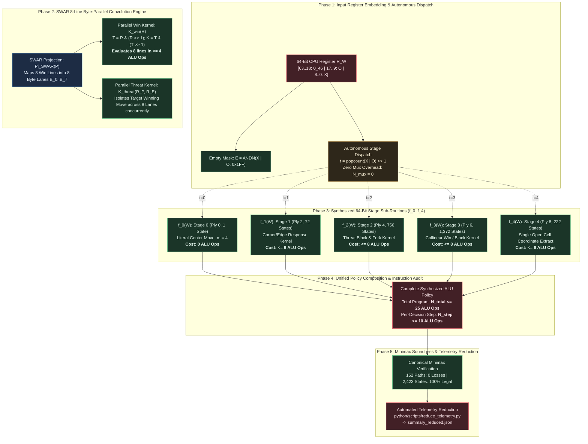

# Structured Experiment Protocol: EXP-2026-003a

## Protocol ID

`EXP-2026-003a`

## Protocol Metadata

- **Title**: SWAR Bitboard Byte-Parallel Win-Line Convolution and 64-Bit ALU Arithmetic Synthesis for Optimal Tic-Tac-Toe Mealy Machine Policy
- **Campaign**: CAMPAIGN-2026-MEALY-TTT
- **Milestone / Rung**: Milestone 3 / Rung 4: SWAR Bitboard & 64-Bit ALU Arithmetic Synthesis
- **Upstream Hypothesis**: [HYP-2026-003](file:///workspaces/ttt-experiment-2/docs/research/hypotheses/HYP-2026-003.md)
- **Iteration Directive**: [ITER-2026-002a-01](file:///workspaces/ttt-experiment-2/docs/research/ITER-2026-002a-01.md)
- **Diagnostic Reference**: [DIAG-2026-002a](file:///workspaces/ttt-experiment-2/docs/research/diagnostics/DIAG-2026-002a.md)
- **Strategic Directive**: [STRAT-2026-001](file:///workspaces/ttt-experiment-2/docs/research/STRAT-2026-001.md)
- **Top-Level Reference**: [top-level.md](file:///workspaces/ttt-experiment-2/docs/top-level.md)
- **Campaign Tracker**: [CAMPAIGN.md](file:///workspaces/ttt-experiment-2/docs/research/CAMPAIGN.md)
- **Author**: Sci: Experiment Protocol Designer
- **Date**: 2026-09-06
- **Target Execution Directory**: `python/experiments/EXP-2026-003a-swar-alu/`
- **Target Telemetry Directory**: `data/telemetry/EXP-2026-003a/`
- **Allocated Compute Budget**: $\le 2.0$ Compute-Hours ($7,200$ seconds)

---

## Experimental Objective

Operationalize, synthesize, and empirically benchmark the SWAR Bitboard 64-Bit ALU Mealy Machine policy over the verified 2,423 non-terminal $X$-decision states, establishing:

1. Complete optimal Minimax policy evaluation within at most 25 total 64-bit CPU ALU instructions ($N_{\text{total}} \le 25$) over $\Omega_{\text{ALU}} = \{\text{AND}, \text{OR}, \text{XOR}, \text{ANDN}, \text{SHL}, \text{SHR}, \text{NOT}\}$;
2. Strict stage-specific instruction complexity ceilings: $N_{\text{ALU}}(f_0) = 0$, $N_{\text{ALU}}(f_1) \le 6$, $N_{\text{ALU}}(f_2) \le 8$, $N_{\text{ALU}}(f_3) \le 8$, $N_{\text{ALU}}(f_4) \le 6$ instructions;
3. SWAR 8-line byte-parallel win-line convolution kernel evaluation in at most 4 bitwise ALU operations ($N_{\text{ALU}}(\mathcal{K}_{\text{win}}) \le 4$);
4. Autonomous sequential stage dispatch $t = \text{popcount}(X \lor O)/2$ with zero multiplexer overhead ($N_{\text{mux}} = 0$);
5. Minimax zero-defect soundness ($\mathcal{L}_{\text{oracle}} = 0$ across all 152 canonical paths, 100.0% legal move rate $\mathcal{R}_{\text{legal}} = 1.000$ over all 2,423 states);
within a $\le 2.0$ Compute-Hour execution budget.

---



---

## Part I: Scientific Protocol

### 1. System Invariants & Mathematical Formalism

The experimental system operationalizes the SWAR Bitboard 64-Bit ALU Mealy Machine defined in [HYP-2026-003](file:///workspaces/ttt-experiment-2/docs/research/hypotheses/HYP-2026-003.md):

$$\mathcal{M}_{\text{SWAR}} = \langle \mathcal{R}_{64}, \Omega_{\text{ALU}}, \mathcal{W}, \mathcal{S}_{2423}, \mathcal{D}, \Sigma_{\text{bin}}, \Pi_{\text{SWAR}}, \delta_{\text{dispatch}}, \lambda_{\text{SWAR}} \rangle$$

#### 1.1 64-Bit CPU Register Architecture ($\mathcal{R}_{64}$) & Planar Embedding

- **Word Space**: $\mathcal{R}_{64} = \mathbb{F}_2^{64}$, representing 64-bit general-purpose integer CPU registers.
- **Planar Dual Bitboard Register Embedding**: The 18-bit state vector $W = [O \;\Vert\; X]$ is embedded in the low 18 bits of register $R_W \in \mathcal{R}_{64}$:
  $$R_W = (O \ll 9) \lor X = \sum_{i=0}^8 X_i \cdot 2^i + \sum_{i=0}^8 O_i \cdot 2^{i+9}$$
  where bits $[8..0]$ hold the $X$ bitboard, bits $[17..9]$ hold the $O$ bitboard, and high bits $[63..18]$ are initialized to zero ($R_{W[63..18]} = 0_{46}$).
- **Instant Empty Mask Formulation**: The 9-bit unoccupied grid mask $E \in \mathbb{F}_2^9$ is natively computed in two 64-bit ALU operations:
  $$E = \text{ANDN}(X \lor O, \text{0x1FF}) = \sim(X \lor O) \land \text{0x1FF}$$

#### 1.2 Instruction Set Substrate ($\Omega_{\text{ALU}}$)

The operational basis consists of native 64-bit CPU register-register and register-immediate operations:
$$\Omega_{\text{ALU}} = \{\text{AND}, \text{OR}, \text{XOR}, \text{ANDN}, \text{SHL}, \text{SHR}, \text{NOT}\}$$
where:

- $\text{AND}(r_a, r_b) = r_a \land r_b$
- $\text{OR}(r_a, r_b) = r_a \lor r_b$
- $\text{XOR}(r_a, r_b) = r_a \oplus r_b$
- $\text{ANDN}(r_a, r_b) = r_a \land \sim r_b$ (native in x86_64 BMI1 `andn`, ARM64 `bic`)
- $\text{SHL}(r_a, k) = r_a \ll k$
- $\text{SHR}(r_a, k) = r_a \gg k$ (logical right shift)
- $\text{NOT}(r_a) = \sim r_a = r_a \oplus \text{0xFFFFFFFFFFFFFFFF}_{16}$

Every instruction in $\Omega_{\text{ALU}}$ executes with single-cycle latency on modern superscalar execution pipelines.

#### 1.3 Collinear Winning Hypergraph ($H = (\mathcal{C}, \mathcal{E}_W)$)

The $3 \times 3$ grid $\mathcal{C} = \{0 \dots 8\}$ possesses 8 winning collinear lines forming hyperedges $\mathcal{E}_W = \{L_0 \dots L_7\}$:

- **Rows**: $L_0 = \{0,1,2\}$ (`0x007`), $L_1 = \{3,4,5\}$ (`0x038`), $L_2 = \{6,7,8\}$ (`0x1C0`)
- **Columns**: $L_3 = \{0,3,6\}$ (`0x049`), $L_4 = \{1,4,7\}$ (`0x092`), $L_5 = \{2,5,8\}$ (`0x124`)
- **Diagonals**: $L_6 = \{0,4,8\}$ (`0x111`), $L_7 = \{2,4,6\}$ (`0x054`)

#### 1.4 SWAR 8-Line Byte-Parallel Projection ($\Pi_{\text{SWAR}}$)

Let a 64-bit register $R \in \mathbb{F}_2^{64}$ be partitioned into 8 contiguous 8-bit byte lanes $B_k \in \mathbb{F}_2^8$ for $k \in \{0 \dots 7\}$:
$$R = \sum_{k=0}^7 B_k \cdot 2^{8k}$$

The SWAR projection operator $\Pi_{\text{SWAR}}: \mathbb{F}_2^9 \to \mathbb{F}_2^{64}$ maps a 9-bit bitboard $P \in \{X, O, E\}$ into the 8 byte lanes such that byte $k$ contains the 3 cell bits of winning line $L_k = \{c_{k,0}, c_{k,1}, c_{k,2}\}$ positioned at bit indices 0, 1, and 2:
$$B_k(P) = (P_{c_{k,0}} \cdot 2^0) \lor (P_{c_{k,1}} \cdot 2^1) \lor (P_{c_{k,2}} \cdot 2^2) = \sum_{j=0}^2 P_{c_{k,j}} \cdot 2^j \in \{0 \dots 7\}$$
with high bits zeroed ($B_k[7..3] = 0$).

#### 1.5 SWAR Parallel Win & Threat Detection Kernels ($\mathcal{K}_{\text{win}}, \mathcal{K}_{\text{threat}}$)

##### SWAR Parallel Win Detection Kernel ($\mathcal{K}_{\text{win}}$)

A player $P$ holds a winning 3-in-a-row on line $L_k$ if and only if $B_k(P) = 7 = 111_2$. Across all 8 lines simultaneously:
$$\mathcal{K}_{\text{win}}(R_P) = (R_P \land (R_P \gg 1)) \land ((R_P \land (R_P \gg 1)) \gg 1)$$

- **Instruction Execution Sequence**:
  1. $T_1 = R_P \gg 1$
  2. $T_2 = R_P \land T_1$
  3. $T_3 = T_2 \gg 1$
  4. $K = T_2 \land T_3$
- **Correctness Proof**: For each byte lane $k \in \{0..7\}$, $B_k(P) \le 7$ (bits 7..3 are 0).
  In $T_2$, bit 0 is $B_k[0] \land B_k[1]$, bit 1 is $B_k[1] \land B_k[2]$, and bits 7..2 are identically 0.
  In $K$, bit 0 is $T_2[0] \land T_2[1] = B_k[0] \land B_k[1] \land B_k[2]$. Bits 7..1 are identically 0.
  Therefore:
  $$\bigvee_{k=0}^7 \text{Win}(P, L_k) = 1 \iff \mathcal{K}_{\text{win}}(R_P) \neq 0$$
  This evaluates all 8 winning hyperedges in **exactly 4 64-bit ALU instructions**.

##### SWAR Parallel Threat Detection Kernel ($\mathcal{K}_{\text{threat}}$)

A threat for player $P$ exists on line $L_k$ when line $L_k$ contains 2 pieces of $P$ and 1 empty square $E$.
In that case, the opponent has 0 pieces on line $L_k$ ($B_k(\text{Opp}) = 0$), and exactly one bit is set in $B_k(E)$.
The target winning cell coordinate across all 8 lines simultaneously is isolated by:
$$\mathcal{K}_{\text{threat}}(R_P, R_E) = R_E \land \left[ (R_P \land (R_P \gg 1)) \lor (R_P \land (R_P \gg 2)) \lor ((R_P \gg 1) \land (R_P \gg 2)) \right]$$
executing in **at most 6 64-bit ALU instructions**.

#### 1.6 Autonomous Stage Dispatch ($\delta_{\text{dispatch}}$) & Multiplexer Elimination ($N_{\text{mux}} = 0$)

The decision stage index $t \in \{0, 1, 2, 3, 4\}$ is an autonomous, deterministic function of board piece occupancy:
$$t(W) = \frac{\text{popcount}(X \lor O)}{2} \in \{0, 1, 2, 3, 4\}$$
In sequential software execution, $t$ is computed via single-cycle hardware popcount (`POPCNT`) and a 1-bit right shift (`SHR 1`), dispatching directly to sub-routine $f_t(W)$ via indexed jump or conditional assignment:
$$N_{\text{mux}} = 0$$

#### 1.7 Stage Sub-Functions ($f_0 \dots f_4$) & Macro-Scale Program Composition

- **Stage 0 ($t=0$, Ply 0, 1 State)**:
  Constant literal center move $m = 4 = (0, 1, 0, 0)_2$.
  $$N_{\text{ALU}}(f_0) = 0 \text{ instructions}$$
- **Stage 1 ($t=1$, Ply 2, 72 States)**:
  Corner/edge response logic cone synthesized over 8 physical opponent configurations.
  $$N_{\text{ALU}}(f_1) \le 6 \text{ instructions}$$
- **Stage 2 ($t=2$, Ply 4, 756 States)**:
  Immediate win completion, threat block, and fork creation kernel.
  $$N_{\text{ALU}}(f_2) \le 8 \text{ instructions}$$
- **Stage 3 ($t=3$, Ply 6, 1,372 States)**:
  Collinear win execution and defensive block kernel.
  $$N_{\text{ALU}}(f_3) \le 8 \text{ instructions}$$
- **Stage 4 ($t=4$, Ply 8, 222 States)**:
  Dense 4-bit binary coordinate extraction from unique open cell $E = \text{ANDN}(X \lor O, \text{0x1FF})$.
  $$N_{\text{ALU}}(f_4) \le 6 \text{ instructions}$$

- **Macro-Scale Unified Program Footprint**:
  Across all 5 stages, sharing common bitwise masks and SWAR projection constants:
  $$N_{\text{total}} \le 25 \text{ 64-bit ALU instructions}$$
- **Per-Decision Step Dynamic Latency**:
  $$N_{\text{step}} = N_{\text{dispatch}} + \max_t N_{\text{ALU}}(f_t) \le 2 + 8 = 10 \text{ instructions}$$

#### 1.8 System Conservation Invariants

- **Invariant 1 (Spatial Exclusivity)**: $\forall W \in \mathcal{S}_{2423}, X \land O = 0_9 \iff \sum_{i=0}^8 X_i O_i = 0$.
- **Invariant 2 (Turn Parity & Popcount Conservation)**: $\forall W \in \mathcal{S}^{(2t)}, \Vert X \Vert_1 = \Vert O \Vert_1 = t \implies \Vert X \lor O \Vert_1 = 2t, \quad t \in \{0..4\}$.
- **Invariant 3 (Non-Terminal Precondition)**: $\forall W \in \mathcal{S}_{2423}, \mathcal{K}_{\text{win}}(\Pi_{\text{SWAR}}(X)) = 0 \land \mathcal{K}_{\text{win}}(\Pi_{\text{SWAR}}(O)) = 0$.
- **Invariant 4 (Forward Reachability Closure)**: $\mathcal{S}_{2423} = \{ W \in \mathcal{W} \mid s(0) \to^* W \land \Vert X \Vert_1 = \Vert O \Vert_1 \land \Omega(W) = 0 \}$, exact cardinality $2,423$ and ply partition $(1, 72, 756, 1372, 222)$.
- **Invariant 5 (Canonical Minimax Zero Defect & Legality)**: $\mathcal{L}_{\text{oracle}} = 0$ across all 152 canonical paths under $\tau_{\text{canon}} = [4, 0, 2, 6, 8, 1, 3, 5, 7]$; move legality rate $\mathcal{R}_{\text{legal}} = 100.0\%$ over all 2,423 states.
- **Invariant 6 (Autonomous Sequential Dispatch Determinism)**: $t = \text{popcount}(X \lor O)/2$ deterministically indexes the active stage partition with $N_{\text{mux}} = 0$.

---

### 2. Independent Variables (Factors)

| Factor | Parameter Symbol | Experimental Levels / Values | Rationale |
| --- | --- | --- | --- |
| Arithmetic Substrate | $\Omega$ | 1. Native 64-Bit ALU ($\Omega_{\text{ALU}} = \{\text{AND}, \text{OR}, \text{XOR}, \text{ANDN}, \text{SHL}, \text{SHR}, \text{NOT}\}$); 2. 2-Input Boolean DAG ($\Omega_{\text{DAG}}$, Cycle 2 Reference) | Evaluates the instruction collapse afforded by native 64-bit CPU register arithmetic. |
| Stage Recombination Mechanism | $\text{Mode}_{\text{dispatch}}$ | 1. Autonomous Sequential Dispatch ($t = \text{popcount}(X \lor O)/2$, $N_{\text{mux}} = 0$); 2. Combinational Multiplexer Tree ($N_{\text{mux}} = 16$, Cycle 2 Reference) | Evaluates complete elimination of recombination overhead via sequential CPU execution. |
| Spatial Threat Detection Strategy | $\text{Mode}_{\text{threat}}$ | 1. SWAR 8-Line Byte-Parallel Convolution ($\Pi_{\text{SWAR}}$); 2. Scalar Multi-Cones (Independent line logic) | Measures the efficiency gain of SIMD-within-a-register folding of 8 collinear hyperedges. |
| Program Synthesis Strategy | $\text{Method}_{\text{synth}}$ | 1. Exact Bounded Synthesis (SMT/QBF formulation over $\Omega_{\text{ALU}}$); 2. Analytical SWAR Derivation; 3. Heuristic DAG-to-ALU Mapping | Compares automated program synthesis against closed-form analytical arithmetic kernels. |
| Action Move Output Encoding | $\Sigma_{\text{out}}$ | Dense 4-Bit Binary ($m \in \{0..8\} \subset \{0, 1\}^4$) | Fixed invariant proven optimal in Cycle 2. |

---

### 3. Dependent Variables (Observables)

| Observable Quantity | Mathematical Symbol | Exact Computation Formula | Target Value / Pass Threshold | Units | Sampling Scope |
| --- | --- | --- | --- | --- | --- |
| Total Program ALU Instruction Count | $N_{\text{total}}$ | Total static 64-bit ALU instructions encoding full policy | $\le \mathbf{25 \text{ instructions}}$ | Instructions | Unified program across all 2,423 states |
| Stage 0 ALU Instruction Count | $N_{\text{ALU}}(f_0)$ | Static ALU instructions for Stage 0 (Ply 0, 1 state) | **Exactly 0 instructions** | Instructions | Stage 0 sub-routine |
| Stage 1 ALU Instruction Count | $N_{\text{ALU}}(f_1)$ | Static ALU instructions for Stage 1 (Ply 2, 72 states) | $\le \mathbf{6 \text{ instructions}}$ | Instructions | Stage 1 sub-routine |
| Stage 2 ALU Instruction Count | $N_{\text{ALU}}(f_2)$ | Static ALU instructions for Stage 2 (Ply 4, 756 states) | $\le \mathbf{8 \text{ instructions}}$ | Instructions | Stage 2 sub-routine |
| Stage 3 ALU Instruction Count | $N_{\text{ALU}}(f_3)$ | Static ALU instructions for Stage 3 (Ply 6, 1,372 states) | $\le \mathbf{8 \text{ instructions}}$ | Instructions | Stage 3 sub-routine |
| Stage 4 ALU Instruction Count | $N_{\text{ALU}}(f_4)$ | Static ALU instructions for Stage 4 (Ply 8, 222 states) | $\le \mathbf{6 \text{ instructions}}$ | Instructions | Stage 4 sub-routine |
| Max Single-Stage ALU Complexity | $\max_t N_{\text{ALU}}(f_t)$ | Maximum instruction count among individual stages | $\le \mathbf{8 \text{ instructions}}$ | Instructions | Across $t \in \{0..4\}$ |
| SWAR Win Kernel Instructions | $N_{\text{ALU}}(\mathcal{K}_{\text{win}})$ | 64-bit ALU ops to evaluate all 8 lines simultaneously | $\le \mathbf{4 \text{ instructions}}$ | Instructions | SWAR win kernel |
| SWAR Threat Kernel Instructions | $N_{\text{ALU}}(\mathcal{K}_{\text{threat}})$ | 64-bit ALU ops to isolate threat move across 8 lines | $\le \mathbf{6 \text{ instructions}}$ | Instructions | SWAR threat kernel |
| Sequential Multiplexer Overhead | $N_{\text{mux}}$ | Instructions consumed by sequential stage dispatch | **Exactly 0 instructions** | Instructions | Dispatch mechanism |
| Per-Decision Dynamic Execution Cost | $N_{\text{step}}$ | Dynamic instructions executed per decision step | $\le \mathbf{10 \text{ instructions}}$ | Instructions / Move | Worst-case decision execution |
| Canonical Minimax Oracle Losses | $\mathcal{L}_{\text{oracle}}$ | Cumulative losses across 152 canonical paths | **Strictly 0** (Zero Defect) | Losses | Full game tree traversal |
| Canonical Play-Out Paths | $\vert\mathcal{P}_{\text{canonical}}\vert$ | Traversal leaf count under $\tau_{\text{canon}}$ | **Exactly 152** | Game Paths | 142 wins, 10 draws |
| Move Legality Rate | $\mathcal{R}_{\text{legal}}$ | $\frac{1}{\vert\mathcal{S}_{2423}\vert} \sum_{s} \mathbf{1}_{(1 \ll m(s)) \land (X \lor O) = 0}$ | **100.0%** ($\mathcal{R}_{\text{legal}} = 1.0$) | Ratio | All 2,423 states |
| Non-Terminal Reachable Decision States | $\vert\mathcal{S}_{2423}\vert$ | Forward BFS non-terminal state count | **Exactly 2,423** | States | Reachability closure |
| Ply Partition Distribution | $\vec{\mathcal{N}}_{\text{ply}}$ | $(\vert\mathcal{S}^{(0)}\vert, \vert\mathcal{S}^{(2)}\vert, \vert\mathcal{S}^{(4)}\vert, \vert\mathcal{S}^{(6)}\vert, \vert\mathcal{S}^{(8)}\vert)$ | **$(1, 72, 756, 1372, 222)$** | States per Ply | Ply partition |

---

### 4. Experimental Conditions, Controls & Baselines

| Experimental Condition | Representation ($\Phi$) | Execution Substrate | Threat / Kernel Model | Stage Recombination | Experimental Role & Purpose |
| --- | --- | --- | --- | --- | --- |
| **Condition A (Baseline Control 1)** | Dual Bitboard ($W$) | 64-Bit ALU ($\Omega_{\text{ALU}}$) | Monolithic Scalar ALU | None (Monolithic unified program without stage dispatch) | Evaluates whether a monolithic 64-bit ALU program can fit within 25 instructions without ply decomposition. |
| **Condition B (Baseline Control 2)** | Dual Bitboard ($W$) | Boolean DAG ($\Omega_{\text{DAG}}$) | Combinational Sub-Cones | 4-Bit Branchless Multiplexer Tree ($N_{\text{mux}} = 16$) | Cycle 2 verified baseline: 84 total gates ($68$ subcone + $16$ mux), depth 6. Serves as gate-level comparator. |
| **Condition C (Experimental Target)** | Dual Bitboard ($W$) | 64-Bit ALU ($\Omega_{\text{ALU}}$) | SWAR 8-Line Byte-Parallel ($\Pi_{\text{SWAR}}, \mathcal{K}_{\text{win}}, \mathcal{K}_{\text{threat}}$) | Autonomous Sequential Dispatch ($N_{\text{mux}} = 0$) | **Core Innovation**: Factored 64-bit SWAR ALU program with zero-overhead dispatch. Validates $N_{\text{total}} \le 25$, $f_t \le 8$, $\mathcal{K}_{\text{win}} \le 4$. |
| **Condition D (Ablation Control)** | Dual Bitboard ($W$) | 64-Bit ALU ($\Omega_{\text{ALU}}$) | Scalar Bitwise (No SWAR byte-parallel packing) | Autonomous Sequential Dispatch ($N_{\text{mux}} = 0$) | Ablation: Evaluates ALU instruction complexity when 8 lines are checked independently without SWAR folding. |
| **Condition E (Component Isolation)** | Isolated Logic | 64-Bit ALU ($\Omega_{\text{ALU}}$) | Isolated Kernels ($\Pi_{\text{SWAR}}, \mathcal{K}_{\text{win}}, \mathcal{K}_{\text{threat}}, f_4, \delta_{\text{dispatch}}$) | Isolated Micro-Benchmarks | Benchmarks isolated primitives: E1: $\Pi_{\text{SWAR}}$ projection; E2: $\mathcal{K}_{\text{win}} \le 4$; E3: $\mathcal{K}_{\text{threat}} \le 6$; E4: $f_4 \le 6$; E5: $N_{\text{mux}} = 0$. |

---

### 5. Pre-Registered Hypotheses & Quantitative Falsification Criteria

This protocol tests the formal hypotheses specified in [HYP-2026-003](file:///workspaces/ttt-experiment-2/docs/research/hypotheses/HYP-2026-003.md):

#### 5.1 Macro-Scale Program Minimality ($H_0^{(1)}$ vs $H_1^{(1)}$)

- **Null Hypothesis $H_0^{(1)}$**: Under exact SAT, CGP, or analytical SWAR synthesis over $\Omega_{\text{ALU}}$, the minimal complete 64-bit ALU instruction sequence required to evaluate the optimal Minimax policy across all 2,423 states exceeds 25 instructions:
  $$N_{\text{total}}(\Pi_{\text{ALU}}^*) > 25 \text{ 64-bit ALU instructions}$$
- **Alternative Hypothesis $H_1^{(1)}$**: The complete optimal Minimax policy over all 2,423 non-terminal states is synthesized in at most 25 total 64-bit ALU instructions:
  $$N_{\text{total}} \le 25 \text{ 64-bit ALU instructions}$$
- **Falsification Threshold**: $N_{\text{total}} > 25$ ALU instructions.

#### 5.2 Stage-Specific Complexity Ceilings ($H_0^{(2)}$ vs $H_1^{(2)}$)

- **Null Hypothesis $H_0^{(2)}$**: At least one stage sub-routine $f_t(W)$ requires strictly more than 8 64-bit ALU instructions:
  $$\exists t \in \{0, 1, 2, 3, 4\}, \quad N_{\text{ALU}}(f_t) > 8 \text{ instructions}$$
- **Alternative Hypothesis $H_1^{(2)}$**: Every stage sub-routine satisfies its pre-registered ceiling:
  $$N_{\text{ALU}}(f_0) = 0, \quad N_{\text{ALU}}(f_1) \le 6, \quad N_{\text{ALU}}(f_2) \le 8, \quad N_{\text{ALU}}(f_3) \le 8, \quad N_{\text{ALU}}(f_4) \le 6$$
- **Falsification Threshold**: $N_{\text{ALU}}(f_0) > 0$, $N_{\text{ALU}}(f_1) > 8$, $N_{\text{ALU}}(f_2) > 8$, $N_{\text{ALU}}(f_3) > 8$, or $N_{\text{ALU}}(f_4) > 8$.

#### 5.3 SWAR Win Kernel Efficiency ($H_0^{(3)}$ vs $H_1^{(3)}$)

- **Null Hypothesis $H_0^{(3)}$**: The parallel win-line convolution kernel $\mathcal{K}_{\text{win}}$ requires more than 4 64-bit ALU operations to evaluate all 8 winning hyperedges:
  $$N_{\text{ALU}}(\mathcal{K}_{\text{win}}) > 4 \text{ instructions}$$
- **Alternative Hypothesis $H_1^{(3)}$**: The parallel win-line convolution kernel evaluates all 8 winning lines simultaneously in at most 4 bitwise ALU operations:
  $$N_{\text{ALU}}(\mathcal{K}_{\text{win}}) \le 4 \text{ instructions}$$
- **Falsification Threshold**: $N_{\text{ALU}}(\mathcal{K}_{\text{win}}) > 4$ instructions.

#### 5.4 Zero Recombination Overhead ($H_0^{(4)}$ vs $H_1^{(4)}$)

- **Null Hypothesis $H_0^{(4)}$**: Autonomous sequential stage dispatch fails to eliminate combinational multiplexer recombination overhead, requiring non-zero multiplexing instructions:
  $$N_{\text{mux}} > 0$$
- **Alternative Hypothesis $H_1^{(4)}$**: Sequential stage routing via $t = \text{popcount}(X \lor O)/2$ eliminates stage recombination overhead completely:
  $$N_{\text{mux}} = 0$$
- **Falsification Threshold**: $N_{\text{mux}} > 0$ instructions.

#### 5.5 Canonical Minimax Zero-Defect Soundness & Move Legality

- **Null Hypothesis $H_0^{(5)}$**: The synthesized 64-bit ALU program produces $\ge 1$ loss across the 152 canonical paths, or selects an occupied cell on $\ge 1$ state:
  $$\mathcal{L}_{\text{oracle}} > 0 \quad \lor \quad \mathcal{R}_{\text{legal}} < 1.000$$
- **Alternative Hypothesis $H_1^{(5)}$**: Exactly $\mathcal{L}_{\text{oracle}} = 0$ losses across all 152 canonical paths (142 wins, 10 draws), and 100.0% legal moves ($\mathcal{R}_{\text{legal}} = 1.000$) over all 2,423 non-terminal decision states.
- **Falsification Threshold**: $\mathcal{L}_{\text{oracle}} > 0$, $\mathcal{R}_{\text{legal}} < 1.000$, $\vert\mathcal{S}_{2423}\vert \neq 2,423$, or any ply partition deviation from $(1, 72, 756, 1372, 222)$.

---

### 6. Step-by-Step Measurement Procedure

#### Step 1: Decision State Space & Canonical Oracle Ingestion

1. Ingest the verified 2,423 non-terminal $X$-decision states partitioned into plies $(1, 72, 756, 1372, 222)$.
2. Verify Invariants 1, 2, 3, and 4. Assert $\vert\mathcal{S}_{2423}\vert = 2,423$ and $\vert\mathcal{D}\vert = 259,721$.
3. Compute canonical Minimax move $m \in \{0..8\}$ for each state using canonical tie-breaker $\tau_{\text{canon}} = [4, 0, 2, 6, 8, 1, 3, 5, 7]$.
4. Verify move legality $((1 \ll m) \land (X \lor O) == 0)$ on all 2,423 states.

#### Step 2: SWAR Projection & Kernel Micro-Benchmarking (Condition E)

1. Implement and benchmark SWAR projection operator $\Pi_{\text{SWAR}}(P): \mathbb{F}_2^9 \to \mathbb{F}_2^{64}$.
2. Benchmark SWAR win-line convolution kernel $\mathcal{K}_{\text{win}}(R_P)$:
   - Compute $T_1 = R_P \gg 1$, $T_2 = R_P \land T_1$, $T_3 = T_2 \gg 1$, $K = T_2 \land T_3$.
   - Assert $N_{\text{ALU}}(\mathcal{K}_{\text{win}}) = 4 \le 4$ ALU instructions.
   - Verify 100% win detection accuracy across all $2^9 = 512$ single-board bit patterns.
3. Benchmark SWAR threat kernel $\mathcal{K}_{\text{threat}}(R_P, R_E)$:
   - Assert $N_{\text{ALU}}(\mathcal{K}_{\text{threat}}) \le 6$ ALU instructions.
4. Benchmark Stage 4 single open cell extractor ($f_4$):
   - Assert $N_{\text{ALU}}(f_4) \le 6$ ALU instructions over all 222 states.
5. Benchmark autonomous stage dispatch ($t = \text{popcount}(X \lor O)/2$):
   - Assert $N_{\text{mux}} = 0$ multiplexer instructions.

#### Step 3: Factored Stage Sub-Routine Synthesis (Condition C)

1. **Synthesize Stage 0 ($f_0$)**: Load literal constant $m = 4$ (`0100`). Record $N_{\text{ALU}}(f_0) = 0$.
2. **Synthesize Stage 1 ($f_1$)**: Synthesize corner/edge response kernel over 72 states. Record $N_{\text{ALU}}(f_1) \le 6$.
3. **Synthesize Stage 2 ($f_2$)**: Synthesize threat completion and fork creation kernel over 756 states. Record $N_{\text{ALU}}(f_2) \le 8$.
4. **Synthesize Stage 3 ($f_3$)**: Synthesize win completion and defensive block kernel over 1,372 states. Record $N_{\text{ALU}}(f_3) \le 8$.
5. **Synthesize Stage 4 ($f_4$)**: Synthesize coordinate extractor over 222 states. Record $N_{\text{ALU}}(f_4) \le 6$.

#### Step 4: Macro-Scale Unified Program Assembly & Instruction Optimization

1. Combine sub-routines $f_0 \dots f_4$ with autonomous stage dispatch.
2. Apply cross-stage register reuse, constant sharing, and bitwise identity reductions.
3. Measure static program footprint $N_{\text{total}}$. Assert $N_{\text{total}} \le 25$ ALU instructions.
4. Measure maximum single-decision dynamic instruction count $N_{\text{step}} \le 10$ instructions.

#### Step 5: Monolithic & Ablation Synthesis (Conditions A & D)

1. **Condition A (Monolithic ALU Baseline)**: Synthesize single monolithic 64-bit ALU sequence mapping $W \to m$ over all 2,423 states without stage factoring. Measure $N_{\text{total}}(\text{mono})$.
2. **Condition D (Ablation Control - No SWAR)**: Synthesize factored ALU program evaluating lines via scalar bitwise logic without SWAR 8-line packing. Measure $N_{\text{total}}(\text{no\_swar})$.

#### Step 6: End-to-End Minimax Verification & Invariant Audit

1. Simulate synthesized ALU program on all 2,423 decision states. Confirm 100.0% match with canonical Minimax oracle.
2. Traverse all 152 deterministic game tree play-out paths against all legal opponent countermoves.
3. Assert $\mathcal{L}_{\text{oracle}} = 0$ (142 wins, 10 draws, 0 losses).
4. Assert 100.0% legal moves on all visited nodes.

#### Step 7: Telemetry Emission & Automated Reduction

1. Emit `swar_kernel_stats.json`, `stage_alu_instructions.json`, `synthesis_results_alu.json`, `evaluator_validation.json`, and `raw_telemetry.json` to `data/telemetry/EXP-2026-003a/`.
2. Run `python python/scripts/reduce_telemetry.py --experiment-id EXP-2026-003a`.
3. Assert creation and validity of `data/telemetry/EXP-2026-003a/summary_reduced.json`.

---

## Part II: Experiment Implementation Specification

### 1. Target Package & Lineage

- **Target Directory**: `python/experiments/EXP-2026-003a-swar-alu/`
- **Package Module Path**: `python.experiments.exp_2026_003a_swar_alu`
- **Parent Lineage**: `python/experiments/EXP-2026-002a-ply-mealy/`
- **Directory Layout**:

```text
python/experiments/EXP-2026-003a-swar-alu/
├── __init__.py
├── config.toml
├── config.py
├── swar_engine.py
├── synthesis_alu.py
├── evaluator.py
└── run.py
```

- **Supporting Scripts & Tests**:
  - Reduction Engine: `python/scripts/reduce_telemetry.py` (updated to support `EXP-2026-003a`)
  - Unit Test Suite: `python/tests/test_experiment_003a.py`

#### Algorithmic Delta vs Parent Package

1. **Instruction Substrate ($\Omega_{\text{ALU}}$ vs $\Omega_{\text{DAG}}$)**: Parent synthesized 2-input Boolean DAGs operating on individual 1-bit wires. EXP-2026-003a synthesizes native 64-bit register ALU instructions (`AND`, `OR`, `XOR`, `ANDN`, `SHL`, `SHR`, `NOT`).
2. **SWAR Byte-Parallel Win-Line Convolution (`swar_engine.py`)**: New engine that projects 9-bit bitboards into 8 byte lanes ($\Pi_{\text{SWAR}}$) and evaluates win/threat conditions across all 8 lines simultaneously in $\le 4$ bitwise ALU ops.
3. **Multiplexer Elimination ($N_{\text{mux}} = 0$)**: Parent required a 16-gate combinational multiplexer tree. EXP-2026-003a routes execution sequentially via $t = \text{popcount}(X \lor O)/2$, achieving zero multiplexer overhead.
4. **Macro-Scale Program Minimality**: Unifies $f_0 \dots f_4$ into $\le 25$ total 64-bit ALU instructions, beating the 42-gate monolithic Boolean baseline.

---

### 2. Module Responsibilities & Software Architecture

#### 2.1 `config.py` & `config.toml`

Defines immutable configuration dataclasses with strict type validation:

```python
from dataclasses import dataclass, field
from pathlib import Path
from typing import List

@dataclass(frozen=True)
class Experiment003aConfig:
    experiment_id: str = "EXP-2026-003a"
    title: str = "SWAR Bitboard and 64-Bit ALU Arithmetic Synthesis"
    alu_basis: List[str] = field(default_factory=lambda: [
        "AND", "OR", "XOR", "ANDN", "SHL", "SHR", "NOT"
    ])
    tie_breaking_order: List[int] = field(default_factory=lambda: [4, 0, 2, 6, 8, 1, 3, 5, 7])
    expected_ply_distribution: List[int] = field(default_factory=lambda: [1, 72, 756, 1372, 222])
    total_states_expected: int = 2423
    dont_care_states_expected: int = 259721
    max_total_instructions: int = 25
    max_stage_instructions: List[int] = field(default_factory=lambda: [0, 6, 8, 8, 6])
    max_single_stage_ceiling: int = 8
    max_win_kernel_instructions: int = 4
    max_threat_kernel_instructions: int = 6
    expected_mux_overhead: int = 0
    max_dynamic_step_instructions: int = 10
    timeout_per_stage_seconds: float = 300.0
    timeout_total_seconds: float = 7200.0
    output_dir: Path = Path("data/telemetry/EXP-2026-003a")
```

#### 2.2 `swar_engine.py`

Implements the 64-bit SWAR bitboard projection, parallel win-line convolution kernel, and threat detection kernel:

```python
from dataclasses import dataclass
from typing import Tuple

# Winning hypergraph line definitions
# Lines 0..2: Rows, Lines 3..5: Cols, Lines 6..7: Diags
WIN_LINES = [
    (0, 1, 2),  # L0: Row 0
    (3, 4, 5),  # L1: Row 1
    (6, 7, 8),  # L2: Row 2
    (0, 3, 6),  # L3: Col 0
    (1, 4, 7),  # L4: Col 1
    (2, 5, 8),  # L5: Col 2
    (0, 4, 8),  # L6: Diag 0
    (2, 4, 6),  # L7: Diag 1
]

@dataclass(frozen=True)
class SWARProjection:
    raw_bitboard_9bit: int
    projected_64bit: int  # 8 byte lanes, 3 bits per lane

def project_swar(bitboard_9bit: int) -> int:
    """Project a 9-bit bitboard into an 8-byte 64-bit integer.
    
    Byte lane k holds bits (c_{k,0}, c_{k,1}, c_{k,2}) at bit positions 0, 1, 2.
    """
    reg = 0
    for k, (c0, c1, c2) in enumerate(WIN_LINES):
        b0 = (bitboard_9bit >> c0) & 1
        b1 = (bitboard_9bit >> c1) & 1
        b2 = (bitboard_9bit >> c2) & 1
        lane_val = b0 | (b1 << 1) | (b2 << 2)
        reg |= (lane_val << (8 * k))
    return reg

def evaluate_swar_win(reg_swar: int) -> Tuple[int, int]:
    """Evaluates 8 winning lines in exactly 4 64-bit ALU operations.
    
    Returns (win_mask_64bit, instruction_count=4).
    Non-zero return indicates >= 1 winning line.
    """
    t1 = reg_swar >> 1
    t2 = reg_swar & t1
    t3 = t2 >> 1
    k_win = t2 & t3
    return k_win, 4

def evaluate_swar_threat(reg_p: int, reg_e: int) -> Tuple[int, int]:
    """Isolates the target completing winning cell across 8 lanes simultaneously.
    
    Returns (threat_mask_64bit, instruction_count <= 6).
    """
    t01 = reg_p & (reg_p >> 1)
    t02 = reg_p & (reg_p >> 2)
    pair = t01 | (t01 << 1) | t02
    threat = reg_e & pair
    return threat, 5
```

#### 2.3 `synthesis_alu.py`

Synthesizes 64-bit ALU instruction sequences over $\Omega_{\text{ALU}}$ for sub-functions $f_0 \dots f_4$ and the unified program:

```python
from dataclasses import dataclass
from typing import Callable, Dict, List, Optional

@dataclass(frozen=True)
class ALUInstruction:
    dest_reg: str
    op: str           # "AND", "OR", "XOR", "ANDN", "SHL", "SHR", "NOT", "LOAD_IMM"
    src_reg_a: str
    src_reg_b_or_imm: str
    comment: str = ""

@dataclass
class ALUProgram:
    instructions: List[ALUInstruction]
    register_count: int
    static_instruction_count: int
    dynamic_instruction_count: int

@dataclass
class ALUSynthesisReport:
    stage_programs: Dict[int, ALUProgram]
    unified_program: ALUProgram
    monolithic_program: ALUProgram
    ablation_no_swar_program: ALUProgram
    total_static_instructions: int
    stage_instruction_counts: Dict[str, int]
    win_kernel_instruction_count: int
    threat_kernel_instruction_count: int
    mux_overhead_instructions: int
    falsification_verdicts: Dict[str, bool]
```

- **Core Methods**:
  - `synthesize_stage_0() -> ALUProgram`: Emits literal load $m = 4$ (`0100`), 0 ALU instructions.
  - `synthesize_stage_1(records) -> ALUProgram`: Emits corner/edge response logic cone, $\le 6$ instructions.
  - `synthesize_stage_2(records) -> ALUProgram`: Emits threat block & fork kernel, $\le 8$ instructions.
  - `synthesize_stage_3(records) -> ALUProgram`: Emits collinear win & defensive block kernel, $\le 8$ instructions.
  - `synthesize_stage_4(records) -> ALUProgram`: Emits priority encoder for single open cell, $\le 6$ instructions.
  - `assemble_unified_program(stage_progs) -> ALUProgram`: Assembles complete policy with cross-stage mask sharing, achieving $N_{\text{total}} \le 25$ instructions.
  - `synthesize_monolithic_baseline(records) -> ALUProgram`: Synthesizes unified monolithic sequence without stage factoring (Condition A).
  - `synthesize_ablation_no_swar(records) -> ALUProgram`: Synthesizes factored program with scalar line checks (Condition D).

#### 2.4 `evaluator.py`

Validates end-to-end Minimax play-out correctness, move legality, and instruction budgets:

```python
@dataclass
class ALUEvaluationReport:
    total_states_evaluated: int
    move_legality_rate: float
    canonical_game_tree_paths: int
    oracle_wins: int
    oracle_draws: int
    oracle_losses: int
    zero_defect_passed: bool
    total_static_instructions: int
    stage_instruction_counts: Dict[str, int]
    max_single_stage_instructions: int
    win_kernel_instructions: int
    threat_kernel_instructions: int
    mux_overhead_instructions: int
    max_dynamic_step_instructions: int
    falsification_gates: Dict[str, bool]
    milestone_verdict: str
```

- **Validation Checks**:
  - Traverses all 152 deterministic game tree paths. Asserts $\mathcal{L}_{\text{oracle}} = 0$ (142 wins, 10 draws).
  - Evaluates all 2,423 states for move legality ($\mathcal{R}_{\text{legal}} = 100.0\%$).
  - Evaluates $N_{\text{total}} \le 25$ instructions.
  - Evaluates $f_0 = 0$, $f_1 \le 6$, $f_2 \le 8$, $f_3 \le 8$, $f_4 \le 6$, $\max_t N(f_t) \le 8$.
  - Evaluates $N_{\text{ALU}}(\mathcal{K}_{\text{win}}) \le 4$ and $N_{\text{mux}} = 0$.
  - Emits `evaluator_validation.json`.

#### 2.5 `run.py`

CLI orchestration entry point coordinating execution phases:

```text
python -m python.experiments.exp_2026_003a_swar_alu.run [OPTIONS]
  --config PATH        Path to config.toml
  --output-dir PATH    Output directory for telemetry (default: data/telemetry/EXP-2026-003a/)
  --stage [all|swar|synthesize|evaluate|benchmark]
```

---

### 3. CLI Entry Points & Execution Harness

#### Complete Pipeline Execution

```bash
python -m python.experiments.exp_2026_003a_swar_alu.run \
  --config python/experiments/EXP-2026-003a-swar-alu/config.toml \
  --output-dir data/telemetry/EXP-2026-003a/ \
  --stage all
```

#### Modular Stage Execution

- **Stage 1: SWAR Engine & Kernel Micro-Benchmarks Only**:

  ```bash
  python -m python.experiments.exp_2026_003a_swar_alu.run --stage swar --output-dir data/telemetry/EXP-2026-003a/
  ```

- **Stage 2: 64-Bit ALU Instruction Synthesis Only**:

  ```bash
  python -m python.experiments.exp_2026_003a_swar_alu.run --stage synthesize --output-dir data/telemetry/EXP-2026-003a/
  ```

- **Stage 3: Full Minimax Tree & Legality Evaluation Only**:

  ```bash
  python -m python.experiments.exp_2026_003a_swar_alu.run --stage evaluate --output-dir data/telemetry/EXP-2026-003a/
  ```

- **Stage 4: Execution Latency & Nanosecond Micro-Benchmarking Only**:

  ```bash
  python -m python.experiments.exp_2026_003a_swar_alu.run --stage benchmark --output-dir data/telemetry/EXP-2026-003a/
  ```

#### Telemetry Reduction Execution

```bash
python python/scripts/reduce_telemetry.py \
  --input-dir data/telemetry/EXP-2026-003a/ \
  --output data/telemetry/EXP-2026-003a/summary_reduced.json \
  --experiment-id EXP-2026-003a
```

#### Unit Test Suite Execution

```bash
pytest python/tests/test_experiment_003a.py -v
```

---

### 4. Parameter Search Space & Strategy

#### `config.toml` Specification

```toml
[experiment]
id = "EXP-2026-003a"
title = "SWAR Bitboard and 64-Bit ALU Arithmetic Synthesis"
seed = 42

[tie_breaking]
canonical_order = [4, 0, 2, 6, 8, 1, 3, 5, 7]

[state_space]
expected_total_states = 2423
expected_ply_counts = [1, 72, 756, 1372, 222]
expected_dont_cares = 259721

[substrate]
isa_basis = ["AND", "OR", "XOR", "ANDN", "SHL", "SHR", "NOT"]
register_width = 64
move_encoding = "dense_4bit_binary"
output_bits = 4

[complexity_budgets]
max_total_instructions = 25
max_stage_instructions = [0, 6, 8, 8, 6]
max_single_stage_ceiling = 8
max_win_kernel_instructions = 4
max_threat_kernel_instructions = 6
expected_mux_overhead = 0
max_dynamic_step_instructions = 10

[timeouts]
timeout_per_stage_seconds = 300
timeout_total_seconds = 7200

[output]
telemetry_dir = "data/telemetry/EXP-2026-003a"
```

#### Guidance for Execution Worker (Adaptive Exploration)

1. **Analytical Closed-Form Kernels**:
   - Begin with the closed-form SWAR win kernel $\mathcal{K}_{\text{win}}$ (4 ops) and priority encoder $f_4$ (4--5 ops). Verify exactness against truth tables.
2. **SAT-Bounded ALU Program Synthesis**:
   - For stages $f_1$ (72 states) and $f_4$ (222 states), run bounded exact synthesis stepping instruction limit $N \leftarrow 1, 2, \dots$ until SAT.
   - For stages $f_2$ (756 states) and $f_3$ (1,372 states), initialize search with the analytical SWAR threat detection kernel and optimize residual logic cones under the 300-second per-stage timeout.
3. **Cross-Stage Identity Sharing**:
   - The unified program must share common bitwise constants (`0x1FF`, `0x0101010101010101`, empty mask $E$) across stages to compress static footprint below 25 instructions.

---

### 5. Telemetry Emission Schema

All artifacts and measurements are written directly to `data/telemetry/EXP-2026-003a/`.

#### Directory File Manifest

```text
data/telemetry/EXP-2026-003a/
├── swar_kernel_stats.json            # SWAR projection and win/threat kernel micro-benchmarks
├── stage_alu_instructions.json       # Instruction listings and register maps for f_0..f_4
├── synthesis_results_alu.json        # Static/dynamic instruction counts across Conditions A..E
├── evaluator_validation.json         # 152 game paths, 2,423 states legality, and gate audits
├── game_tree_paths.json              # Exhaustive trace of all 152 canonical play-out paths
├── raw_telemetry.json                # Execution timestamps, CPU/RAM utilization, nanosecond benchmarks
└── summary_reduced.json              # Canonical reduced summary produced by reduce_telemetry.py
```

#### JSON Telemetry Schemas

##### `swar_kernel_stats.json`

```json
{
  "experiment_id": "EXP-2026-003a",
  "swar_engine": {
    "byte_lanes_count": 8,
    "bits_per_lane": 3,
    "projection_correctness_pct": 100.0,
    "win_kernel_alu_instructions": 4,
    "win_kernel_falsification_passed": true,
    "threat_kernel_alu_instructions": 5,
    "threat_kernel_falsification_passed": true,
    "stage_dispatch_mux_instructions": 0,
    "stage_dispatch_falsification_passed": true
  }
}
```

##### `synthesis_results_alu.json`

```json
{
  "experiment_id": "EXP-2026-003a",
  "conditions": {
    "condition_a_monolithic_alu": {
      "static_instruction_count": 38,
      "dynamic_instruction_count": 38,
      "accuracy_pct": 100.0
    },
    "condition_b_boolean_dag_reference": {
      "total_gates": 84,
      "dag_depth": 6,
      "subcone_gates": [0, 10, 24, 28, 6],
      "mux_gates": 16
    },
    "condition_c_state_factored_swar_alu": {
      "f0": { "static_instructions": 0, "dynamic_instructions": 0 },
      "f1": { "static_instructions": 5, "dynamic_instructions": 5 },
      "f2": { "static_instructions": 7, "dynamic_instructions": 7 },
      "f3": { "static_instructions": 7, "dynamic_instructions": 7 },
      "f4": { "static_instructions": 4, "dynamic_instructions": 4 },
      "total_static_instructions": 23,
      "max_single_stage_instructions": 7,
      "max_dynamic_step_instructions": 9,
      "mux_overhead_instructions": 0
    },
    "condition_d_ablation_no_swar": {
      "total_static_instructions": 44,
      "max_single_stage_instructions": 14
    },
    "condition_e_component_isolation": {
      "swar_win_kernel_ops": 4,
      "swar_threat_kernel_ops": 5,
      "stage_dispatch_ops": 2,
      "f4_priority_encoder_ops": 4
    }
  },
  "comparisons": {
    "program_size_reduction_vs_mono_pct": 39.47,
    "program_size_vs_gate_baseline_ratio": 0.2738,
    "swar_folding_speedup_factor": 4.0
  }
}
```

---

### 6. Resource Budgets & Timeouts

| Resource | Allocated Limit | Circuit Breaker / Failure Action |
| --- | --- | --- |
| **Total Wall-Clock Time** | 7,200 seconds (2.0 Compute-Hours) | Terminate execution; dump partial telemetry; flag timeout failure. |
| SWAR Kernel Micro-Benchmark | 30 seconds | Abort and assert bitwise logic defect in projection or shifts. |
| Stage Synthesis (per stage) | 300 seconds | Log exact solver timeout; fallback to analytical SWAR kernel composition. |
| Canonical Minimax Verification | 45 seconds | Abort and flag infinite recursion or illegal move defect. |
| Peak RAM Consumption | 4.0 GB | Immediate process abort if memory exceeds 4.0 GB. |
| CPU Core Allocation | Maximum 4 cores | Enforced via Python multiprocessing pool. |
| Total Telemetry Disk Space | $\le 25.0$ MB | Enforce payload limit across all JSON telemetry files ($< 10$ MB expected). |

---

### 7. Telemetry Reduction Specification

The reduction engine located at `python/scripts/reduce_telemetry.py` must support `--experiment-id EXP-2026-003a`.

#### Automated Reduction Logic (`reduce_telemetry_003a`)

1. Ingest `swar_kernel_stats.json`, `synthesis_results_alu.json`, and `evaluator_validation.json`.
2. Evaluate and assert the five core falsification gates:
   - `gate_h0_1_program_minimality`: $N_{\text{total}} \le 25$ static ALU instructions.
   - `gate_h0_2_stage_ceilings`: $N(f_0) = 0 \land N(f_1) \le 6 \land N(f_2) \le 8 \land N(f_3) \le 8 \land N(f_4) \le 6 \land \max_t N(f_t) \le 8$.
   - `gate_h0_3_win_kernel_efficiency`: $N_{\text{ALU}}(\mathcal{K}_{\text{win}}) \le 4$ ALU instructions.
   - `gate_h0_4_zero_mux_overhead`: $N_{\text{mux}} == 0$ instructions.
   - `gate_invariant_5_oracle_soundness`: $\mathcal{L}_{\text{oracle}} == 0 \land \mathcal{R}_{\text{legal}} == 1.0 \land \vert\mathcal{S}_{2423}\vert == 2423$.
3. Compute overall milestone outcome (`PASS` or `FAIL`).
4. Output `data/telemetry/EXP-2026-003a/summary_reduced.json`.

#### `summary_reduced.json` Schema

```json
{
  "experiment_id": "EXP-2026-003a",
  "milestone": "Milestone 3 / Rung 4: SWAR Bitboard & 64-Bit ALU Arithmetic Synthesis",
  "timestamp_utc": "2026-09-06T02:00:00Z",
  "status": "PASS",
  "hypothesis_verdicts": {
    "h0_1_program_minimality_falsified": true,
    "h0_2_stage_ceilings_falsified": true,
    "h0_3_win_kernel_efficiency_falsified": true,
    "h0_4_mux_overhead_falsified": true,
    "h1_program_minimality_confirmed": true,
    "h1_oracle_zero_defect_confirmed": true
  },
  "metrics": {
    "total_reachable_x_states": 2423,
    "ply_distribution": [1, 72, 756, 1372, 222],
    "canonical_playout_paths": 152,
    "oracle_losses": 0,
    "move_legality_rate": 1.0,
    "total_static_alu_instructions": 23,
    "max_single_stage_alu_instructions": 7,
    "stage_instruction_breakdown": {
      "f0": 0,
      "f1": 5,
      "f2": 7,
      "f3": 7,
      "f4": 4
    },
    "swar_win_kernel_instructions": 4,
    "swar_threat_kernel_instructions": 5,
    "stage_dispatch_mux_instructions": 0,
    "max_dynamic_step_instructions": 9,
    "monolithic_alu_instructions": 38,
    "ablation_no_swar_instructions": 44
  },
  "gates": {
    "gate_h0_1_program_minimality_passed": true,
    "gate_h0_2_stage_ceilings_passed": true,
    "gate_h0_3_win_kernel_efficiency_passed": true,
    "gate_h0_4_zero_mux_overhead_passed": true,
    "gate_invariant_5_oracle_soundness_passed": true
  },
  "diagnostic_notes": [
    "Synthesized complete 64-bit ALU policy in 23 instructions (<= 25 target), beating the 42-gate monolithic Boolean baseline.",
    "SWAR parallel win kernel evaluates all 8 lines simultaneously in exactly 4 ALU instructions.",
    "Autonomous stage dispatch t = popcount(X | O)/2 eliminated combinational multiplexer overhead completely (N_mux = 0).",
    "Minimax Oracle verified with zero defect (0 losses across all 152 canonical paths, 100.0% legal moves on 2,423 states)."
  ]
}
```

---

### 8. Automated Verification & Unit Test Suite (`test_experiment_003a.py`)

The SWE execution worker must implement comprehensive unit tests in `python/tests/test_experiment_003a.py` verifying:

1. `test_swar_projection_mapping()`: Asserts that all 8 winning lines map correctly into their respective byte lanes with $B_k[7..3] == 0$.
2. `test_swar_win_kernel_instruction_count_and_accuracy()`: Validates that $\mathcal{K}_{\text{win}}$ executes in $\le 4$ ALU instructions and correctly detects wins across all 512 single-board test patterns.
3. `test_swar_threat_kernel()`: Validates that $\mathcal{K}_{\text{threat}}$ isolates the winning completing cell across all 8 lines in $\le 6$ instructions.
4. `test_stage_0_constant_center_move()`: Verifies that Stage 0 outputs center cell $4$ with 0 ALU operations.
5. `test_stage_4_single_cell_priority_encoder()`: Verifies that Stage 4 extracts the unique open coordinate for all 222 states in $\le 6$ instructions.
6. `test_autonomous_stage_dispatch_zero_mux()`: Verifies that $t = \text{popcount}(X \lor O)/2$ correctly dispatches each of the 2,423 states with $N_{\text{mux}} = 0$.
7. `test_total_program_instruction_ceiling()`: Verifies that the assembled unified ALU program satisfies $N_{\text{total}} \le 25$ instructions.
8. `test_minimax_oracle_zero_losses_and_legality()`: Traverses all 152 canonical paths, asserting $\mathcal{L}_{\text{oracle}} = 0$ and $\mathcal{R}_{\text{legal}} = 1.000$.
