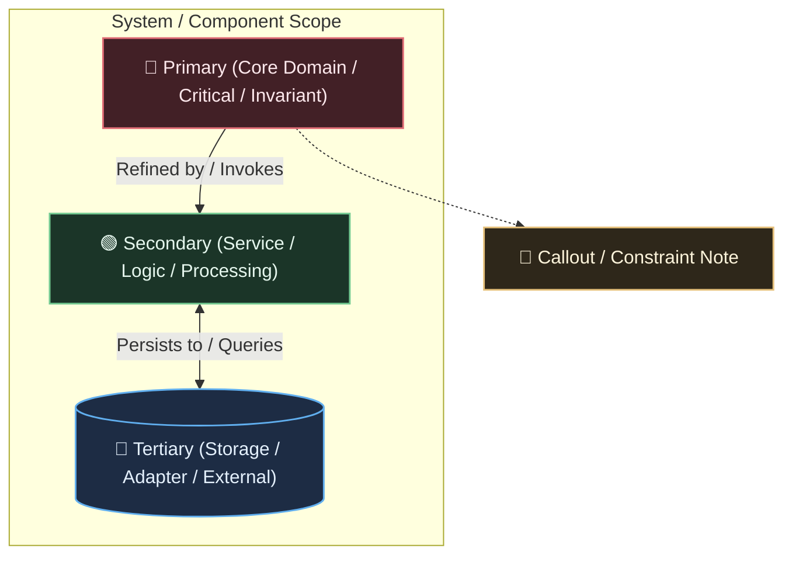

# Mermaid Diagram Template (Dark Theme)

This is a copy-pasteable boilerplate template for new Mermaid diagrams, configured with the gentle RGB dark base theme.

## Quick Specialization Guide

1. **Semantic Roles**:
   - `:::primary` (Red): Core domain logic, invariants, critical root components, entrypoints.
   - `:::secondary` (Green): Application services, processing pipelines, transformers, workers.
   - `:::tertiary` (Blue): Datastores, caches, external APIs, adapters, I/O boundaries.
   - `:::note` (Amber): Security constraints, validation guards, architectural callouts.
2. **Layout Direction**:
   - Change `flowchart TD` (top-to-bottom) to `flowchart LR` (left-to-right) for data pipelines.
3. **Labels**:
   - Always wrap node labels in double quotes (`"..."`) when using parentheses, colons, or HTML tags (e.g. ` ` for multiline text).

For full details, color palette breakdown, specialization instructions, and diagram type examples (Sequence, State, Class, Architecture), see the [Mermaid Style Guide](mermaid-style-guide.md).
