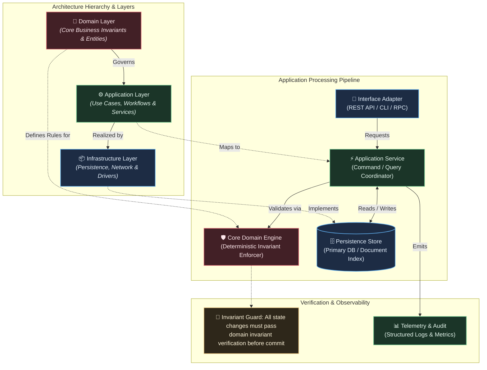
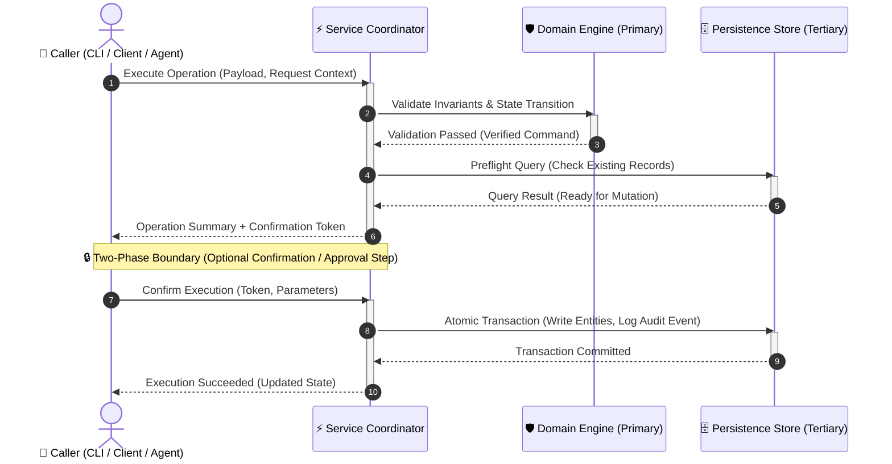
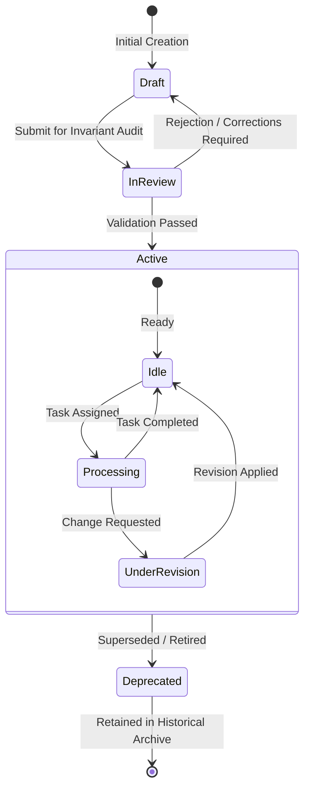
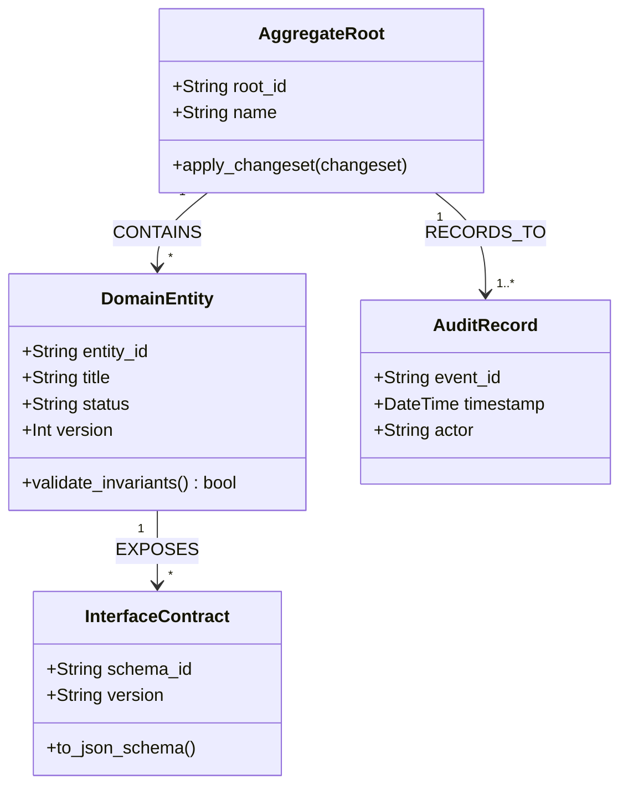
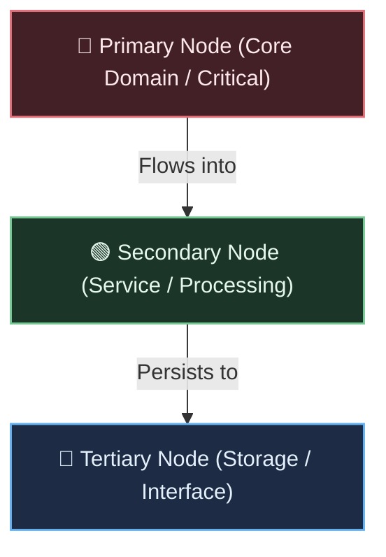

# Mermaid Diagram Style Guide & Dark Theme Specification

This guide defines the visual identity, theme configuration, and authoring rules for Mermaid diagrams across repositories using this template. Adhering to these standards ensures consistent, readable, and aesthetically pleasing diagrams in dark-mode documentation environments (GitHub dark mode, VitePress, Docusaurus, MkDocs, Obsidian).

---

## 1. Design Philosophy & Color Palette

This theme uses Mermaid's `base` theme engine configured specifically for dark backgrounds. It employs a **gentle RGB tri-color system** (muted red, green, and blue) complemented by warm amber callouts and slate neutral layers. This avoids harsh neon saturation while maintaining high contrast (WCAG AAA compliant) and clear semantic hierarchy.

### Color Palette Reference

| Role | Name | Fill Hex | Border Hex | Text Hex | Recommended Semantic Usage |
| :--- | :--- | :--- | :--- | :--- | :--- |
| **Canvas** | Dark Canvas | `#161922` | `#33394a` | `#e2e8f0` | Diagram canvas background and base contrast layer |
| **Default Node** | Dark Slate | `#1e2230` | `#434c5e` | `#e2e8f0` | Standard components, general pipeline steps, neutral entities |
| **Primary** | Gentle Red (Rosewood) | `#422026` | `#e06c75` | `#fde8ec` | **Core Domain & Invariants**, critical logic, state roots, entry points, mutation boundaries |
| **Secondary** | Gentle Green (Forest Sage) | `#1b3528` | `#73c991` | `#e6f7ee` | **Application & Processing Services**, business logic, pipeline workers, active coordinators |
| **Tertiary** | Gentle Blue (Royal Slate) | `#1d2c44` | `#61afef` | `#e4f0fc` | **Infrastructure & Storage**, databases, caches, external APIs, protocols, integration adapters |
| **Subgraph / Cluster** | Deep Panel | `#13161f` | `#373e51` | `#94a3b8` | Subsystem boundaries, module clusters, layer containers, workspace packages |
| **Note / Callout** | Muted Amber | `#2e271a` | `#e5c07b` | `#fdf4db` | Constraints, validation rules, security boundaries, human review points |
| **Lines & Edges** | Soft Steel | — | `#8892b0` | `#cbd5e1` | Directed links, relation annotations, lifelines |

### Semantic Mapping Patterns

When applying these semantic roles to your specific architecture, consider these common patterns:

- **Clean / Hexagonal Architecture**:
  - `Primary` (Red): Entities, Aggregates, Core Domain Invariants
  - `Secondary` (Green): Use Cases, Application Services, Command Handlers
  - `Tertiary` (Blue): Adapters, Repositories, Database Drivers, External APIs
- **Client-Server / Microservices**:
  - `Primary` (Red): API Gateway, Ingress Controller, Authentication / Authorization Boundary
  - `Secondary` (Green): Internal Microservices, Background Workers, Event Handlers
  - `Tertiary` (Blue): Datastores (SQL/NoSQL/Graph), Message Queues, Third-Party APIs
- **Data & Processing Pipelines**:
  - `Primary` (Red): Source Ingestion, Validation Rules, Schema Enforcement
  - `Secondary` (Green): Transformation Engines, Compute Kernels, Enrichment Steps
  - `Tertiary` (Blue): Sinks, Analytical Storage, Export Targets, Metrics

---

## 2. Base Theme Directive

To apply this theme to any Mermaid diagram, place the following `%%{init: ...}%%` directive at the very top of the ` ```mermaid ` block:

```text
%%{init: {
  'theme': 'base',
  'themeVariables': {
    'darkMode': true,
    'background': '#161922',
    'mainBkg': '#1e2230',
    'nodeBorder': '#434c5e',
    'textColor': '#e2e8f0',
    'fontFamily': 'ui-sans-serif, system-ui, -apple-system, BlinkMacSystemFont, "Segoe UI", Roboto, "Helvetica Neue", Arial, sans-serif',
    'fontSize': '14px',
    'lineColor': '#8892b0',
    'primaryColor': '#422026',
    'primaryTextColor': '#fde8ec',
    'primaryBorderColor': '#e06c75',
    'secondaryColor': '#1b3528',
    'secondaryTextColor': '#e6f7ee',
    'secondaryBorderColor': '#73c991',
    'tertiaryColor': '#1d2c44',
    'tertiaryTextColor': '#e4f0fc',
    'tertiaryBorderColor': '#61afef',
    'clusterBkg': '#13161f',
    'clusterBorder': '#373e51',
    'noteBkgColor': '#2e271a',
    'noteTextColor': '#fdf4db',
    'noteBorderColor': '#e5c07b',
    'edgeLabelBackground': '#1a1d27',
    'actorBkg': '#1e2230',
    'actorBorder': '#61afef',
    'actorTextColor': '#e2e8f0',
    'actorLineColor': '#6c7693',
    'signalColor': '#8892b0',
    'signalTextColor': '#e2e8f0',
    'labelBoxBkgColor': '#1e2230',
    'labelBoxBorderColor': '#434c5e',
    'labelTextColor': '#e2e8f0',
    'loopTextColor': '#e2e8f0',
    'altBackground': '#13161f',
    'activationBkgColor': '#2d3548',
    'activationBorderColor': '#61afef',
    'sequenceNumberColor': '#0f1117'
  }
}}%%
```

---

## 3. Explicit Class Definitions (`classDef`)

For flowcharts and graph diagrams where nodes need explicit thematic classification (e.g., highlighting Core Domain vs Services vs Storage, or defining distinct component roles), use the following standard class definitions:

```text
classDef primary fill:#422026,stroke:#e06c75,stroke-width:1.5px,color:#fde8ec;
classDef secondary fill:#1b3528,stroke:#73c991,stroke-width:1.5px,color:#e6f7ee;
classDef tertiary fill:#1d2c44,stroke:#61afef,stroke-width:1.5px,color:#e4f0fc;
classDef note fill:#2e271a,stroke:#e5c07b,stroke-width:1.5px,color:#fdf4db;
classDef muted fill:#181b24,stroke:#373e51,stroke-width:1px,color:#94a3b8;
```

### Applying Classes to Nodes

- **Inline class syntax**: `NodeID["Label"]:::primary`
- **Class assignment statement**: `class Node1,Node2 secondary;`

---

## 4. Comprehensive Example Diagrams

### 4.1 Architecture & Layered Flowdown Diagram (Flowchart)

This example illustrates a system decomposition and layered processing pipeline using the gentle RGB color system:

- **Red (Primary)**: Core Domain & Invariant Engine
- **Green (Secondary)**: Application Services & Processing Pipeline
- **Blue (Tertiary)**: External Interfaces & Storage Layer
- **Amber (Note)**: Architectural Constraints & Verification Guards



---

### 4.2 Sequence Diagram (Multi-Party Interaction)

Demonstrates callers, service coordinators, core domain validators, and persistence actors:



---

### 4.3 State Transition Diagram (Lifecycle Management)

Demonstrates state progression, nested states, and terminal audit branches:



---

### 4.4 Domain Model & Entity Relationship (Class Diagram)



---

## 5. Authoring Rules & Best Practices

When writing Mermaid diagrams for this project:

1. **Include Theme Directive**: Always place the standard `%%{init: ...}%%` directive at the top of every diagram block.
2. **Quote Node Labels with Special Characters**:
   - Always quote labels containing parentheses, brackets, colons, or linebreaks:
     - ✅ `NODE["Core Domain (Invariant Engine)"]`
     - ❌ `NODE[Core Domain (Invariant Engine)]`
3. **Use HTML Line Breaks**: Use `<br/>` for multiline text inside node labels, and `<i>...</i>` or `<b>...</b>` for formatting.
4. **Choose Semantic Layout Directions**:
   - `flowchart TD` / `flowchart TB`: Use for top-down hierarchy (decomposition, layer flowdown, decision trees).
   - `flowchart LR`: Use for left-to-right pipelines (dataflow, ETL, request/response cycle).
5. **Edge Labels & Connectors**:
   - Solid arrows (`-->|Label|`) for direct data flow, execution calls, or strong dependencies.
   - Dotted arrows (`-.->|Label|`) for validation checks, soft references, or indirect realizations.
   - Bidirectional arrows (`<-->|Label|`) for query/response channels or synchronous protocol exchanges.
   - Open links (`---`) for non-directional associations or groupings.
6. **Recommended Icon & Emoji Semantics**:
   - 🎯 `Core Domain / High-Level Goal`
   - 🛡️ `Security / Invariant Guard / Validator`
   - ⚡ `Service / Worker / Active Pipeline`
   - ⚙️ `Engine / Processor / Logic Component`
   - 🗄️ `Database / Storage / Repository`
   - 📄 `Interface Contract / Schema / API`
   - 📊 `Telemetry / Metrics / Audit Log`
   - 📌 `Callout / Rule Note`

---

## 6. Guidance for Specialization & Customization

When specializing this template for your project:

### Step 1: Map Your Project's Modules to Semantic Classes

Define which parts of your codebase correspond to the three primary roles:

| Palette Class | What to map in your project | Examples |
| :--- | :--- | :--- |
| `primary` (Gentle Red) | The critical core that must remain invariant | `src/core`, domain models, state machines, validation rules |
| `secondary` (Gentle Green) | The active business logic and services | `src/services`, background workers, CLI commands, web handlers |
| `tertiary` (Gentle Blue) | External boundary adapters and storage | SQL/NoSQL drivers, REST/gRPC clients, file I/O, cloud SDKs |
| `note` (Muted Amber) | Architectural constraints, security rules | Concurrency invariants, authentication guards, fallback policies |

### Step 2: Organize Documentation Diagrams

Recommended locations for project diagrams:

- **System Architecture**: `docs/architecture/overview.md` (high-level system overview)
- **Architecture Decision Records**: `docs/adr/ADR-XXXX.md` (context, proposed design, state transitions)
- **Data Model Specifications**: `docs/models/` or `docs/schema/` (class and entity relationship diagrams)
- **Workflow & Protocols**: `docs/workflows/` (sequence and lifecycle diagrams)

### Step 3: Palette Customization (Optional)

If your organization uses a specific brand accent (e.g. teal or purple), you can adjust `themeVariables` in the `%%{init: ...}%%` block:

- Keep dark background colors (`#161922`, `#1e2230`, `#13161f`) to maintain dark theme compatibility.
- Ensure any replacement text/border colors maintain high contrast against `#1e2230` (minimum 4.5:1 ratio for normal text).

---

## 7. Quick-Start Starter Template

Copy and paste the template below to start a new diagram:


